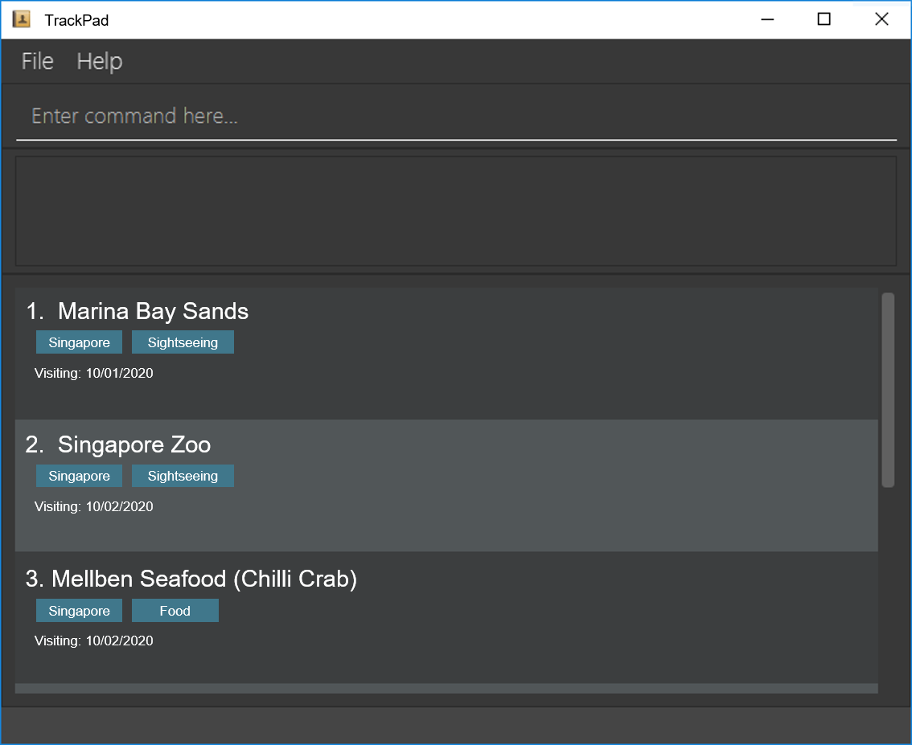

**TrackPad**

**Introduction**

* TrackPad is a desktop application developed for travelholics to track their past and future travel plans.

**Site Map**

* [User Guide](docs/UserGuide.md)

* [Developer Guide](docs/DeveloperGuide.md)

* [About Us](docs/AboutUs.md)

* Contact Us

**Acknowledgements**

* This project is based on the AddressBook-Level3 project created by the [SE-EDU initiative](https://se-education.org) 

* Libraries used:
