* Table of Contents
{:toc}

## **1. Introduction**

TrackPad is an app for users to create and store itineraries, to facilitate the planning of their dream vacation!
This document includes the various design choices, architecture and implementation features of TrackPad. This document 
is targeted towards developers who want to contribute to and extend our TrackPad app.

## **2. Setting up, getting started**

Follow the [_link_](SettingUp.md) to set up your environment and get started in creating pull requests for TrackPad. 

<!--Refer to the guide [_Setting up and getting started_](SettingUp.md).-->

## **3. Design**

This section discusses the current design pattern used by TrackPad. It explains the current architecture of TrackPad. 
Then, there is a more in depth explanation on the design of the Ui, model and storage functionality. 

### 3.1 Architecture

<i>Figure 1. Architecture Class Diagram</i>
 

Figure 1 explains the high-level design of the App. Given below is a quick overview of each component.

:bulb: **Tip:** The `.puml` files used to create diagrams in this document can be found in the [diagrams](https://github.com/AY2021S1-CS2103T-T09-3/tp/blob/master/docs/diagrams/) folder. Refer to the [_PlantUML Tutorial_ at se-edu/guides](https://se-education.org/guides/tutorials/plantUml.html) to learn how to create and edit diagrams.

**`Main`** has two classes called [`Main`](https://github.com/AY2021S1-CS2103T-T09-3/tp/blob/master/src/main/java/seedu/address/Main.java) and [`MainApp`](https://github.com/AY2021S1-CS2103T-T09-3/tp/blob/master/src/main/java/seedu/address/MainApp.java). It is responsible for,
* At app launch: Initializes the components in the correct sequence, and connects them up with each other.
* At shut down: Shuts down the components and invokes cleanup methods where necessary.

[**`Commons`**](#36-common-classes) represents a collection of classes used by multiple other components.

The rest of the App consists of four components.

* [**`UI`**](#32-ui): The UI of the App.
* [**`Logic`**](#33-logic): The command executor.
* [**`Model`**](#34-model): Holds the data of the App in memory.
* [**`Storage`**](#35-storage): Reads data from, and writes data to, the hard disk.

Each of the four components,

* defines its *API* in an `interface` with the same name as the Component.
* exposes its functionality using a concrete `{Component Name}Manager` class (which implements the corresponding API `interface` mentioned in the previous point.

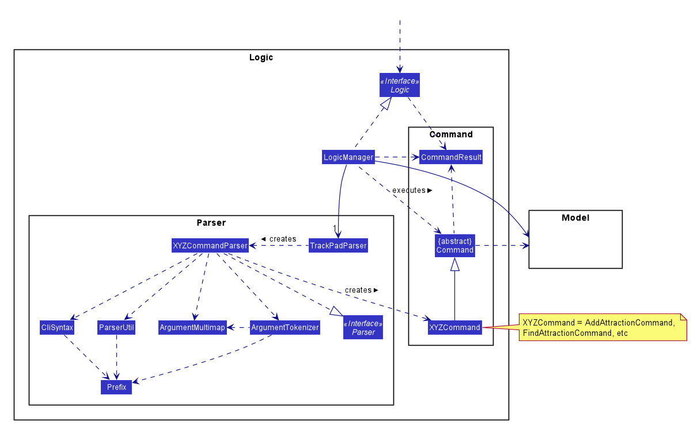

<i>Figure 2. Class Diagram of the Logic Component</i>
 

For example, the `Logic` component (seen from Figure 2 above) defines its API in the `Logic.java` interface and exposes its functionality using the `LogicManager.java` class which implements the `Logic` interface.

**How the architecture components interact with each other**

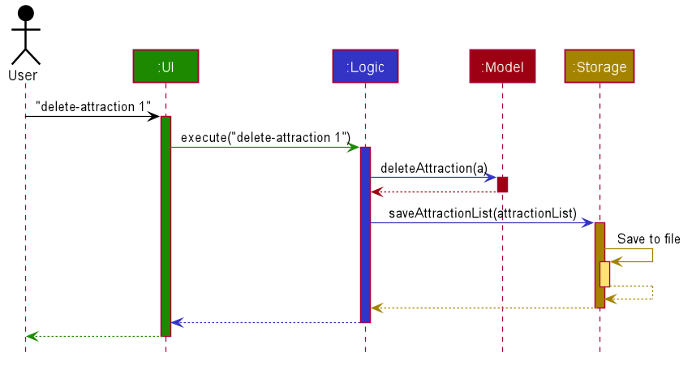

<i>Figure 3. Sequence Diagram of the various components</i>
 

Figure 3 above shows how the components interact with each other for the scenario where the user issues the command `delete-attraction 1`.

The sections below give more details of each component.

### 3.2 UI

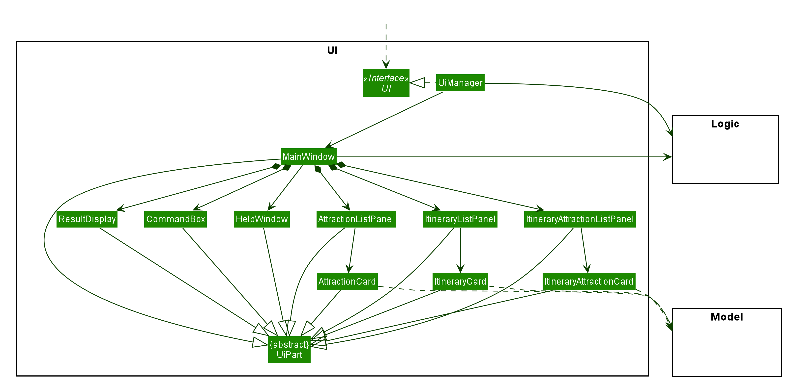

<i>Figure 4. Structure of the Ui Component, Ui Class Diagram</i>
 

**API** :
[`Ui.java`](https://github.com/AY2021S1-CS2103T-T09-3/tp/blob/master/src/main/java/seedu/address/ui/Ui.java)

The UI consists of a `MainWindow` that is made up of parts e.g.`CommandBox`, `ResultDisplay`, `AttractionListPanel`, `ItineraryListPanel` etc. All these, including the `MainWindow`, inherit from the abstract `UiPart` class.

The `UI` component uses JavaFx UI framework. The layout of these UI parts are defined in matching `.fxml` files that are in the `src/main/resources/view` folder. For example, the layout of the [`MainWindow`](https://github.com/AY2021S1-CS2103T-T09-3/tp/blob/master/src/main/java/seedu/address/ui/MainWindow.java) is specified in [`MainWindow.fxml`](https://github.com/AY2021S1-CS2103T-T09-3/tp/blob/master/src/main/resources/view/MainWindow.fxml)

The `UI` component,

* Executes user commands using the `Logic` component.
* Listens for changes to `Model` data so that the UI can be updated with the modified data.

This design is similar to the Architectural design of TrackPad, whereby different `UiParts` are encapsulated in the `MainWindow java` controller class. This allows the `Logic` to minimise interaction with the `UI`, since the `MainWindow` manages the changes to any `UiPart` classes that result from the execution in the `Logic` component.

### 3.3 Logic

<i>Figure 5. Structure of the Logic Component, Logic Class Diagram</i>
 

**API** :
[`Logic.java`](https://github.com/AY2021S1-CS2103T-T09-3/tp/blob/master/src/main/java/seedu/address/logic/Logic.java)

1. `Logic` in Figure 5 receives the user command.
1. It uses the `TrackPadParser` class to parse the command.
1. This results in a `Command` object which is executed by the `LogicManager`.
1. The command execution can affect the `Model` (e.g. adding an attraction).
1. The result of the command execution is encapsulated as a `CommandResult` object which is passed back to the `Ui`.
1. In addition, the `CommandResult` object can also instruct the `Ui` to perform certain actions, such as displaying help to the user.

Given below is the Sequence Diagram for interactions within the `Logic` component for the `execute("delete-attraction 1")` API call.

<i>Figure 6. Interactions inside the Logic Component for the <code>delete-attraction 1</code> Command</i>
 

:information_source: **Note:** The lifeline for `DeleteCommandParser` should end at the destroy marker (X) but due to a limitation of PlantUML, the lifeline reaches the end of diagram.

### 3.4 Model

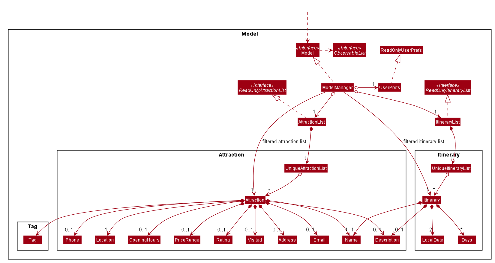

<i>Figure 7. Structure of the Model Component, Model Class Diagram</i>
 

**API** : [`Model.java`](https://github.com/AY2021S1-CS2103T-T09-3/tp/blob/master/src/main/java/seedu/address/model/Model.java)

The `Model` component shown in Figure 7,
* stores a `UserPref` object that represents the user’s preferences.
* stores an `AttractionList` object that is a list of all the attractions in TrackPad.
* stores an `ItineraryList` object that is a list of all the itineraries in TrackPad.
* stores an `ItineraryAttractionList` object that is a list of all the attractions in the current selected itinerary.
* exposes two unmodifiable `ObservableList<Attraction>` and `ObservableList<Itinerary>` that can be 'observed' e.g. the UI can be bound to the lists so that the UI automatically updates when the data in the lists change.
* does not depend on any of the other three components.

:information_source: **Note:** 
An alternative (arguably, a more OOP) model is given below. It has a `Tag` list in the `TrackPad`, which `Attraction` references. This allows `TrackPad` to only require one `Tag` object per unique `Tag`, instead of each `Attraction` needing their own `Tag` object.
 

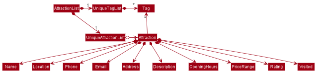

<i>Figure 8. Structure of an alternative Model Component, Alternative Model Class Diagram</i>
 

### 3.5 Storage

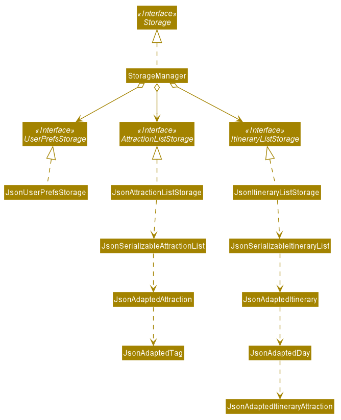

<i>Figure 9. Structure of the Storage Component, Storage Class Diagram</i>
 

**API** : [`Storage.java`](https://github.com/AY2021S1-CS2103T-T09-3/tp/blob/master/src/main/java/seedu/address/storage/Storage.java)

The `Storage` component shown in Figure 9,
* saves `UserPref` objects containing user preferences in json format and read it back.
* saves `AttractionList` objects containing attraction data in json format and read it back.
* saves `ItineraryList` objects containing itinerary data in json format and read it back.

### 3.6 Common classes

Classes used by multiple components are in the `seedu.address.commons` package.

## **4. Implementation**

This section describes some noteworthy details on the implementation of some core TrackPad features.

### 4.1 Attraction Model

#### 4.1.1 Current Implementation

The `Attraction` class helps users to keep track of all the details of their tourist attractions added in TrackPad.
The class diagram for `Attraction` is shown below:

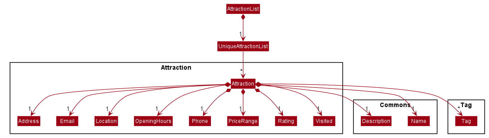

<i>Figure 10. The Attraction Class Diagram</i>
 

Each `Attraction` contains the following fields: `Name`, `Description`, `Address`, `Email`, `Location`, `OpeningHours`,
`Phone`, `PriceRange`, `Rating`, `Visited` and `Tag`. Only `Name` and `Location` are compulsory fields, the rest are all optional.
An attraction can have any number of `Tag`s.

#### 4.1.2 Design Considerations

**Aspect: How attractions are determined to be the same as another**

* **Alternative 1:** Compare the `Name`, `Phone` and `Email` of the attractions and 2 attractions
  are the same if all 3 fields are equal.
  * Pros: Do not need to change the implementation which was given to us by AddressBook3.
  * Cons: The fields `Phone` and `Email` are optional, so the basis for comparison is inconsistent as it 
    depends on how many fields are provided for each attraction in TrackPad.

* **Alternative 2 (Current Choice):** Compare the `Name` and `Location` of the attractions and 2 attractions are 
  the same if both fields are equal.
  * Pros: `Name` and `Location` are the only fields which are compulsory, so comparing them will provide
    consistent results as all the attractions in TrackPad have these 2 fields filled up.
  * Cons: `Name` and `Location` are case-sensitive, so comparing attractions with the same name/location with different
    cases will result in the attractions to be determined as different attractions, which might not be ideal.

Reason for choosing Alternative 2: Our team decided to modify the existing code to suit our current implementation
of the fields better, rather than just leaving it as it is.

### 4.2 Add Attraction Feature

The add attraction feature allows users to add attractions with the compulsory fields `Name` and `Location`, and 
the optional fields `Description`, `Address`, `Email`, `OpeningHours`, `Phone`, `PriceRange`, `Rating`, `Visited` and `Tag`.

#### 4.2.1 Current Implementation

**Step 1.** The user launches the application.
 
**Step 2.** The user types in `add-attraction n/River Safari l/Singapore a/80 Mandai Lake Rd` to add a new attraction. This attraction does not already exist in the app. 

**Step 3.** `LogicManager` passes the input to `TrackPadParser`, which in turn recognises the input as an `AddAttractionCommand` and passes the input to `AddAttractionCommandParser`. 

**Step 4.** `AddAttractionCommandParser` parses the input and constructs a new `AddAttractionCommand` containing a new `Attraction` with the specified fields.

**Step 5.** `LogicManager` executes the new `AddAttractionCommand`. This calls `Model` to add the new `Attraction` to its `AttractionList`.

**Step 6.** After the new `Attraction` is successfully added, `AddAttractionCommand` returns a `CommandResult` for the Ui to display. 

The following sequence diagram shows how the `add-attraction` operation works:

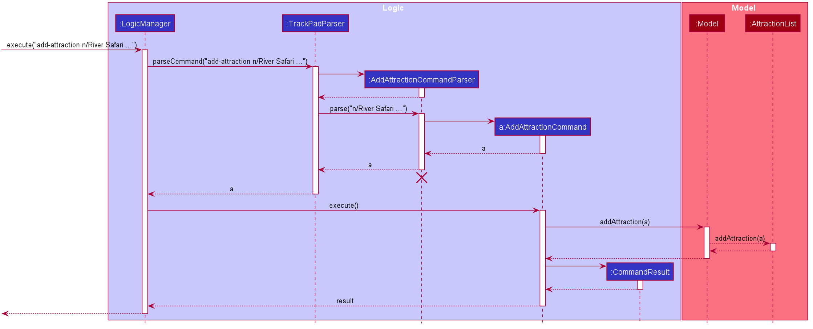

<i>Figure 11. The sequence diagram of <code>add-attraction</code></i>
 

#### 4.2.2 Design Considerations

**Aspect: How the command word of AddAttractionCommand is derived**

* **Alternative 1:** add-a
  * Pros: Simple and short. The user will spend less time typing this command into the command box.
  * Cons: Less intuitive, and the user will have to remember this specific command everytime he wants to add an attraction.

* **Alternative 2 (Current choice):** add-attraction
  * Pros: More intuitive, so the user is more likely to get the correct command everytime when adding attractions.
  * Cons: The user will have to spend more time typing this command.

Reason for choosing Alternative 2: Given that our target audience are fast typists, a slightly longer word may not
require a longer typing time after the users are used to typing this command in the long run.

### 4.3 Mark Attraction as Visited Feature

The `markVisited-attraction` command allows users to quickly mark attractions as visited, without having to use the `edit-attraction` command.
This command is implemented as it allows users to quickly and conveniently mark the attractions they have visited, so they can focus on visiting other attractions that they have not visited.

#### 4.3.1 Current Implementation

The current implementation allows the users to mark the attraction as visited, based on its index position in the current attraction list.
This index could be different depending whether the whole attraction list is shown, or the filtered attraction list from the `find-attraction` command is currently shown in the GUI.
If the index is invalid or the attraction has already been visited before, an error message will be displayed and there will be no changes to the attraction list.

The following activity diagram shows how `markVisited-attraction` works:
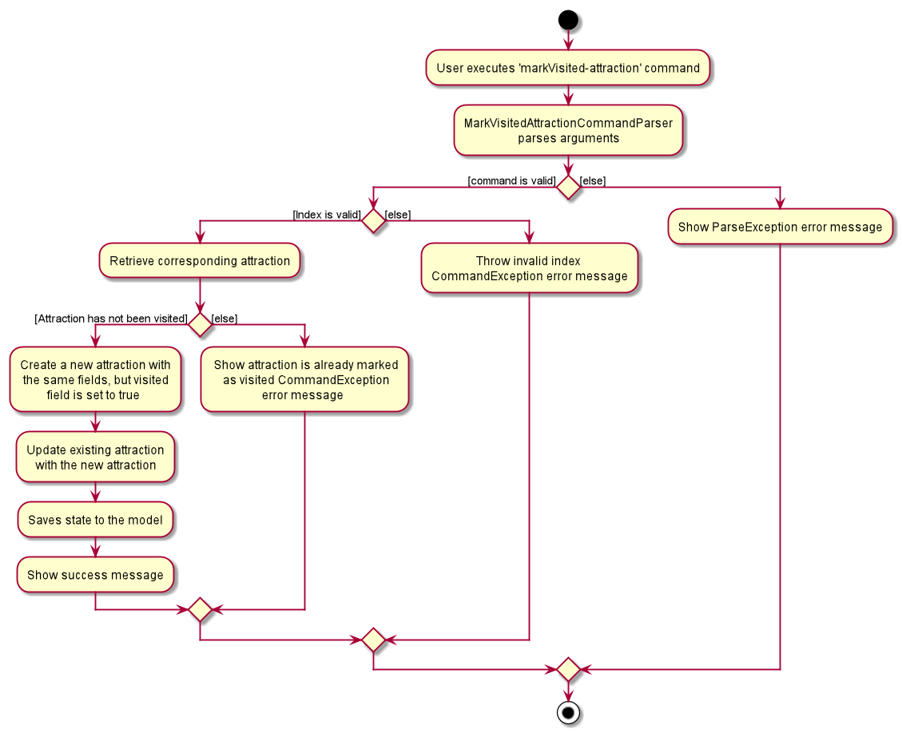

<i>Figure 12. The activity diagram of <code>markVisited-attraction</code></i>
 

We will use the above activity diagram as shown in Figure 12 to explain how the `markVisited-attraction` command is executed in detail.
We assume no error is encountered, and the attraction that is selected to be marked as visited is not visited yet.

**Step 1.** The user types in `markVisited-attraction 1`.

**Step 2.** `MarkVisitedCommand` is created.

**Step 3.** `MarkVisitedCommand` executes the `getFilteredAttractionList()` and returns `lastShownList`.

**Step 4.** `Model` then executes `get(index)` which creates `Attraction`, which is the original selected attraction in `lastShownList`.

**Step 5.** `MarkVisitedCommand` then executes `createMarkVisitedAttraction()`, which creates a new `Attraction` that is identical to the original attraction, except its `Visited` field is set to true.

**Step 6.** `MarkVisitedCommand` then sets the original attraction to the updated one, via `setAttraction()`, and it also updates the state of the model with `updateFilteredAttractionList()`.

**Step 7.** `MarkVisitedCommand` then creates a new `CommandResult`, which contains the success message that is shown to the user when the command is executed successfully.

The whole sequence of events is outlined in the sequence diagram shown below.

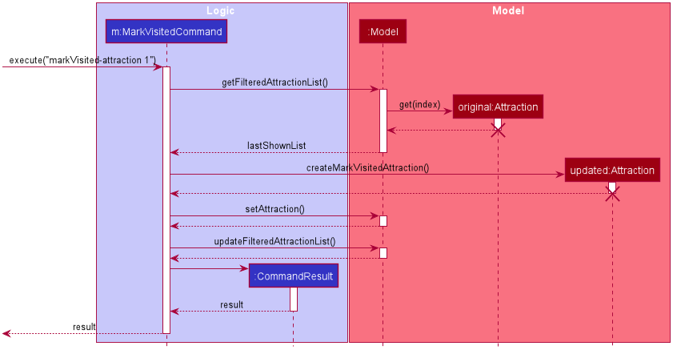

<i>Figure 13. The sequence diagram of <code>markVisited-attraction 1</code></i>
 

#### 4.3.2 Design Considerations

**Aspect: How the attraction is updated**

* **Alternative 1:** Use the `edit-attraction` command to handle marking the attraction as visited, since it can also edit the `Visited` field.
 * Pros: Less new code will need to be written, since we can reuse most of the code from `edit-attraction`.
 * Cons: Functionality of `markVisited-attraction` could change if `edit-attraction` changes functionality in a future update. Excessive coupling.

* **Alternative 2 (Current Choice):** Create a new `markVisited-attraction` command and parser to handle specifically this command.
 * Pros: Less inputs for the user, which makes the command shorter and more convenient.
 * Cons: More lines of code. More test cases required.
 
Reason for choosing alternative 2: Easier to extend to marking several attractions in one command in a future version, by inputting several indexes at once. This would be complicated to 
handle within `edit-attraction` since each attraction could be edited in several fields, and the user input would become unnecessarily complicated.

### 4.4 Itinerary Model

#### 4.4.1 Current Implementation

The `Itinerary` class helps users keep track of the details of their trips and the attractions they want to visit. 
The class diagram for `Itinerary` is shown below:

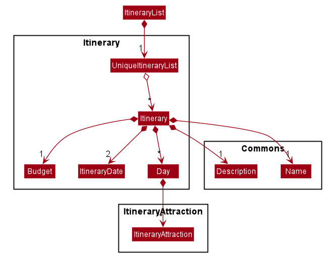

<i>Figure 14. The Itinerary Class Diagram</i>
 

Each `Itinerary` contains `Name`, `Description`, `Budget`, `startDate` and `endDate`. Both `startDate` and `endDate` 
are of the `ItineraryDate` class. Additionally, to store the attractions that users want to visit, each `Itinerary` 
contains a list of `Day`s, and each `Day` contains a list of `ItineraryAttraction`s that belong to that day. 

#### 4.4.2 Design Considerations

**Aspect: How the location field of `Itinerary` is derived**

* **Alternative 1:** Have a field for location that the user has to manually specify alongside `Name`, `startDate`, `endDate` etc.
  * Pros: Simple and intuitive for the user to specify. 
  * Cons: Would not update accordingly if the user adds attractions that are not in the specified location. 
  It would also get complicated for the user to add and edit multiple locations in a certain order. 

* **Alternative 2 (Current choice):** Get the locations from the current `ItineraryAttraction`s in the `Itinerary`. 
  * Pros: The user neither has to worry about adding, editing and deleting locations, nor making sure they are correct order as 
  it is done automatically. 
  * Cons: The itinerary would not have any specified locations unless the user adds an `ItineraryAttraction`, 
  which might not be intuitive to users. 
  
Reason for choosing Alternative 2: If we were to go with Alternative 1, we would have to provide additional ways for 
users visiting multiple locations to change the order of the locations they are visiting, and possibly provide checks 
to ensure that the locations of attractions that users want to add into an itinerary matches the locations of the itinerary. 
We believe that this would be a more frustrating experience for users. Therefore, we decided on generating locations 
automatically from the itinerary attractions that the users have added to their itineraries instead. 
  
**Aspect: How `ItineraryAttraction`s are stored with their visiting days**

* **Alternative 1:** Have `day visiting` as a field in `ItineraryAttraction`, together with its other fields like `startTime`, `endTime` etc. 
Then, have `Itinerary` directly store the `ItineraryAttraction`s. 
  * Pros: Simple to implement and specify. 
  * Cons: Harder to separate the `ItineraryAttraction`s into the different days. More checks needed to display the correct `ItineraryAttraction`s in the correct days.

* **Alternative 2 (Current choice):** Store `ItineraryAttraction`s in separate `Day`s in `Itinerary`, without having a `day visiting` field for `ItineraryAttraction`.
  * Pros: `ItineraryAttraction`s are clearly divided into the different days. Easier to get the `ItineraryAttraction`s on a specific day. 
  * Cons: More methods and classes needed, which complicates things. 
  
Reason for choosing Alternative 2: Since we are creating itineraries that have their contained itinerary attractions 
separated by day, we think that it will be easier to do so if the itinerary attractions are in their respective days. If 
not, any time we need to get itinerary attractions by days, some sorting or checking would be needed. 
  
### 4.5 Add Itinerary Feature

The `add-itinerary` command allows users to add new itineraries into TrackPad. 
To add an `Itinerary`, users must specify the compulsory fields `Name`, `startDate` and `endDate`, and may specify the optional fields `Description` and `Budget`. 

#### 4.5.1 Current Implementation

The `AddItineraryCommand` class handles the execution of `add-itinerary` operations. The `AddItineraryCommandParser` class helps to parse user inputs 
into new `AddItineraryCommand`s for execution.

Itineraries with the same `Name`, `startDate` and `endDate` are considered duplicates, and cannot be added if a duplicate already exists in the app. 
If the user tries to add a duplicate itinerary, a `CommandException` will be thrown, and the user will be reminded that the itinerary already exists in the app. 
Additionally, the `startDate` cannot be after the `endDate`. If the user attempts to add an itinerary with `startDate` after the `endDate`, 
a `ParseException` will be thrown to remind the user of the date constraints. 

The following steps illustrate the successful execution of an `add-itinerary` command: 

**Step 1.** The user launches the application. 

**Step 2.** The user types in `add-itinerary n/Japan Trip sd/12-12-2020 ed/18-12-2020 d/fun in Japan b/1000` to add a new itinerary. This itinerary does not already exist in the app. 

**Step 3.** `LogicManager` passes the input to `TrackPadParser`, which in turn recognises the input as an `AddItineraryCommand` and passes the input to `AddItineraryCommandParser`. 

**Step 4.** `AddItineraryCommandParser` parses the input and constructs a new `AddItineraryCommand` containing a new `Itinerary` with the specified fields.

**Step 5.** `LogicManager` executes the new `AddItineraryCommand`. This calls `Model` to add the new `Itinerary` to its `ItineraryList`.

**Step 6.** After the new `Itinerary` is successfully added, `AddItineraryCommand` returns a `CommandResult` for the Ui to display. 

The following sequence diagram shows how the `add-itinerary` operation above works:

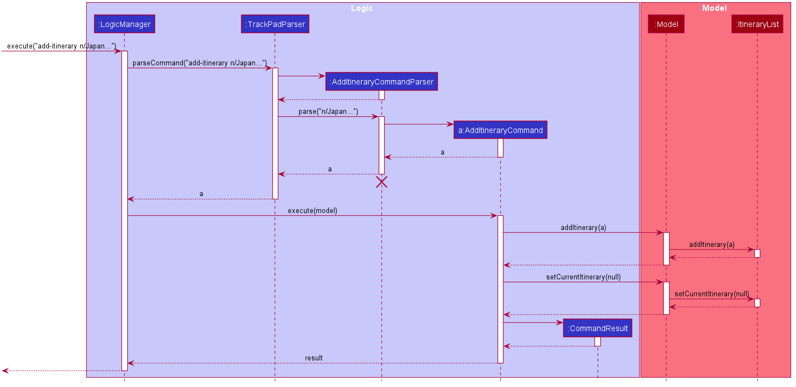

<i>Figure 15. The sequence diagram of <code>add-itinerary</code></i>
 

To summarise, the following activity diagram shows what happens when a user executes an `add-itinerary` command, including errors:

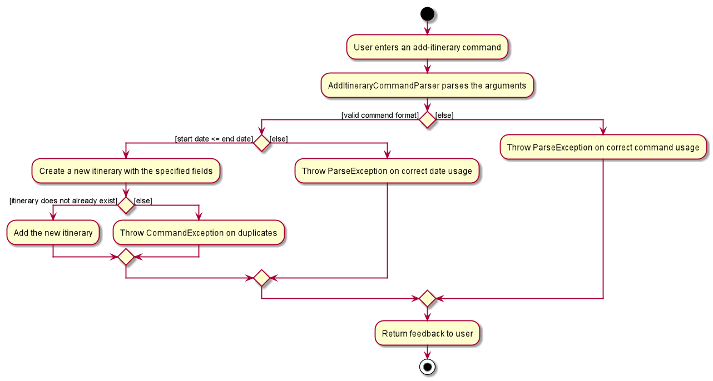

<i>Figure 16. The activity diagram of <code>add-itinerary</code></i>
 

#### 4.5.2 Design Considerations

**Aspect: Whether to make start and end date compulsory**

* **Alternative 1 (Current choice):** Making start and end dates compulsory.
  * Pros: Easier to implement and organise `ItineraryAttraction`s. 
  * Cons: Less flexible for users who do not want to add dates or are unsure of the dates yet. 

* **Alternative 2:** Making start and end dates optional.
  * Pros: More flexible for users who do not want to add dates or are unsure of the dates yet. 
  * Cons: Requires more functionality to handle adding and deleting the dates. For example, both dates must be either present or absent, 

Reason for choosing Alternative 1: Start date and end date must come in pairs. Users accidentally adding or deleting only 
one of the dates might be frustrated by repeated error messages. Also, we would need to implement additional functionalities 
to handle how to add attractions with and without dates. For example, we would probably have to handle users adding itinerary 
attractions with specified days to itineraries without a date range, and determine different ways to store and display 
itinerary attractions for itineraries without dates. Therefore, we decided to go with the first alternative for a simplified process. 

### 4.6 Edit Itinerary Feature

TrackPad allows users to edit itineraries that have already been added.

Any of the following fields of an itinerary can be edited:
* `Name`
* `startDate`
* `endDate`
* `Description`
* `Budget`

#### 4.6.1 Current Implementation

The `EditItineraryCommand` class handles the execution of edit itinerary operations. The `EditItineraryCommandParser` class helps 
to parse a user’s input before creating the correct `EditItineraryCommand`.

TrackPad uses the `EditItineraryDescriptor` class to facilitate edit operations. 
An `EditItineraryDescriptor` is a temporary bridge that holds the newly-edited fields of an itinerary.

**Step 1.** The user types in `edit-itinerary 1 sd/10-11-2020` to edit the `startDate` of the first itinerary in the `Itineraries` panel.

**Step 2.** `LogicManager` passes the input to `TrackPadParser`, which in turn recognises the input as an `EditItineraryCommand` and passes the input to `EditItineraryCommandParser`. 

**Step 3.** `EditItineraryCommandParser` parses the input, constructing a new `EditItineraryDescriptor` object from the input, containing the updated fields of the itinerary.

**Step 4.** `EditItineraryCommandParser` constructs a new `EditCommand` with the `EditItineraryDescriptor` object.

**Step 5.** `LogicManager` executes the `EditItineraryCommand`, creating a new `editedItinerary` object from the fields of the `EditItineraryDescriptor` object and the target itinerary.

**Step 6.** This calls `Model` to replace the target itinerary with the `editedItinerary` object.

**Step 7.** After the target itinerary is replaced, `EditItineraryCommand` returns a `CommandResult` for the Ui to display.

The following sequence diagram shows how the `edit-itinerary` operation works:

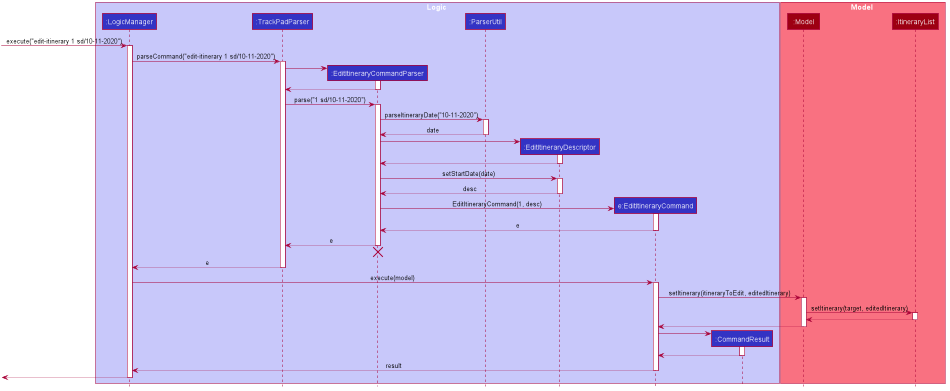

<i>Figure 17 The sequence diagram of <code>edit-itinerary</code></i>
 

The following activity diagram summarizes what happens when a user executes an `edit-itinerary` command:

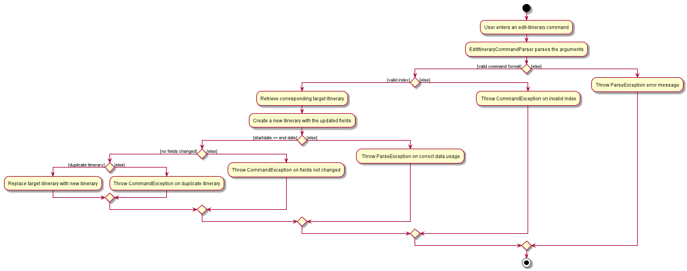

<i>Figure 18 The activity diagram of <code>edit-itinerary</code></i>
 

#### 4.6.2 Design Considerations

**Aspect: Using `edit-itinerary` to edit fields of `Itinerary` only**

* **Alternative 1 (Current choice):** `edit-itinerary` is only able to edit the fields of the itinerary
  * Pros: Shorter and simpler `ItineraryAttraction` commands, where the commands only deal with the fields of the `ItineraryAttractions`
  and do not access the fields of `Itinerary`.
  * Cons: Different set of commands to edit the fields of `Itinerary` and `ItineraryCommands`, may not be user friendly.

* **Alternative 2:** `edit-itinerary` is able to edit the fields of the `ItineraryAttractions`
  * Pros: Lesser commands for the user to deal with.
  * Cons: This command could be confusing to users.

Reason for choosing Alternative 1: Takes into account users are more likely to use more `ItineraryAttraction` commands compared
to `EditItinerary` commands. It also reduces the complexity of the code in `ItineraryAttractions` by only dealing with the
fields of `ItineraryAttractions` and do not access the fields of `Itinerary`.

### 4.7 Find Itinerary Feature

The find itinerary feature allows users to find itineraries using keywords.

#### 4.7.1 Current Implementation

The `FindItineraryCommand` class handles the execution of find itinerary operations. The `FindItineraryCommandParser` class helps 
to parse a user’s input before creating the correct `FindItineraryCommand`.

**Step 1.** The user types in `find-itinerary Korea` to find itineraries with the keyword Korea.

**Step 2.** `LogicManager` passes the input to `TrackPadParser`, which in turn recognises the input as an `FindItineraryCommand` and passes the input to `FindItineraryCommandParser`. 

**Step 3.** In `FindItineraryCommandParser`, the string input is extracted as a predicate and used to create a `FindItineraryCommand`.

**Step 4.** This calls `Model` to filter the itineraries list based on the given predicate.

**Step 5.** After the itineraries list is replaced, `FindItineraryCommand` returns a `CommandResult` for the Ui to display.

The following sequence diagram shows how the `find-itinerary` operation works:

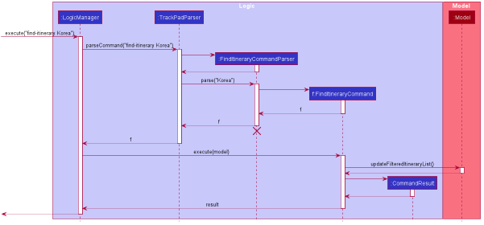

<i>Figure 19 The sequence diagram of <code>find-itinerary</code></i>
 

The following activity diagram summarizes what happens when a user executes an `find-itinerary` command:

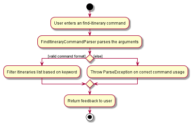

<i>Figure 20 The activity diagram of <code>find-itinerary</code></i>
 

#### 4.7.2 Design Considerations

**Aspect: How the command word of `find-itinerary` is derived**

* **Alternative 1 (Current choice): `find-itinerary`** 
  * Pros: More intuitive, follows the format of the `find-attraction` command.
  * Cons: More time spent typing the command.

* **Alternative 2: `find-i`** 
  * Pros: Simple and faster to type.
  * Cons: Less intuitive, users might have to remember the correct command when finding their itineraries.

Reason for choosing Alternative 1: Given that the find command for attractions is `find-attraction`, 
`find-itinerary` ensures that the command format is consistent and more intuitive to the users.

### 4.8 Select Itinerary Feature

The select itinerary feature allows users to select itineraries before using ItineraryAttraction commands.

#### 4.8.1 Current Implementation

**Step 1.** The user types in `select-itinerary 2` to select the second itinerary in the `Itineraries` panel.

**Step 2.** `LogicManager` passes the input to `TrackPadParser`, which in turn recognises the input as an `SelectItineraryCommand` and passes the input to `SelectItineraryCommandParser`. 

**Step 3.** In `SelectItineraryCommandParser`, the string input parsed to an index and used to create a `SelectItineraryCommand`.

**Step 4.** The itinerary corresponding to the index is retrieved in `SelectItineraryCommand` and this calls on `Model` to set the current itinerary 
using the itinerary retrieved.

**Step 5.** After the itinerary is set, `SelectItineraryCommand` returns a `CommandResult` for the Ui to display.

The following sequence diagram shows how the `select-itinerary` operation works: 

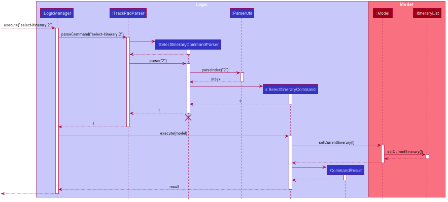

<i>Figure 21 The sequence diagram of <code>select-itinerary</code></i>
 

The following activity diagram summarizes what happens when a user executes an `select-itinerary` command:

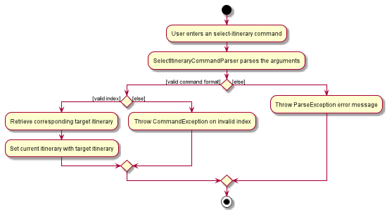

<i>Figure 22 The activity diagram of <code>select-itinerary</code></i>
 

#### 4.8.2 Design Considerations

**Aspect: Having `select-itinerary` as a stand alone command**

* **Alternative 1 (Current choice):** Use the `select-itinerary` command to set the current itinerary to perform
`ItineraryAttraction` commands.
  * Pros: Shorter and simpler `ItineraryAttraction` commands.
  * Cons: Users are unable to edit multiple itineraries at once without switching the target itinerary.

* **Alternative 2:** Having itinerary attraction commands to specify the target itinerary
  * Pros: Users will be able to edit multiple itineraries at once without switching the target itinerary.
  * Cons: More complexity of code in the `ItineraryAttraction` features having to access both the `Attraction` and
  `Itinerary` lists to look for the target attractions and itineraries. 

Reason for choosing Alternative 1: Takes into account users are more likely to use more `ItineraryAttraction` commands
within a single itinerary. It also reduces the complexity of the code in `ItineraryAttraction` features.

### 4.9 Itinerary Attraction Model
This is a subclass of `Attraction` that goes into the `List<Day>` that resides in `Itinerary`. 

#### 4.9.1 Itinerary Attraction Implementation

`ItineraryAttraction` extends `Attraction`. It is a `Attraction` with 2 extra fields, `startTime` and `endTime`. 
It is stored internally as an `List<Day>`. Additionally, it implements the following operations:

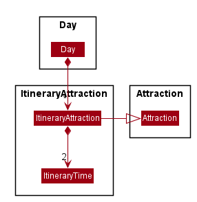

<i>Figure 23. The ItineraryAttraction Class Diagram</i>
 

`ItineraryAttraction` is an `Attraction` and contains `startTime` and `endTime`.

#### 4.9.2 Design Considerations

**Aspect: Inheritance or composition**

* **Alternative 1 (current choice):** `ItineraryAttraction` inherits `Attraction`.
  * Pros: Allows it to be treated as an `Attraction` allowing `ItineraryAttraction` access to getters for `Attraction` without redefining it.
  * Cons: Does not provide reference to original `Attraction`. Changes in original `Attraction` is not reflected in this `ItineraryAttraction`.

* **Alternative 2:** `ItineraryAttraction` would compose `Attraction`
  * Pros: Easy to implement by just adding an `Attraction` field.
  * Cons: Would require many getters to access fields inside `Attraction`.
  
Reasons:
* If we choose composition, we would need to `itineraryAttraction.getAttraction().getField()`.
* If we choose inheritance, we can just do `itineraryAttraction.getField()`.
* We choose inheritance to allow easier access to fields in an `Attraction`.

**Aspect: Constructor**

* **Alternative 1 (current choice):** constructor takes in an `Attraction`.
  * Pros: It is neater and simpler to use attraction as parameter to create an `ItineraryAttraction` object.
  * Cons: New methods and test cases have to be written to test this behaviour, instead of adapting from `Attraction`.
  
* **Alternative 2:** constructor takes in all the fields of `Attraction`.
  * Pros: Can reuse codes from attractions.
  * Cons: Makes the codes very messy and long.
  
Reason: Alternative 2 will have higher chances of bugs. Attraction objects are currently passed around instead of the 
individual fields, so it simplifies and shortens the codes and reduces likelihood of bugs.

### 4.10 Adding Itinerary Attraction

#### 4.10.1 Adding Itinerary Attraction Implementation
The feature allows users to select an `Attraction` from the attraction list and add it into their selected itinerary, 
with a start and end time.

The following activity diagram shows a simplified add-itinerary-attraction operation:
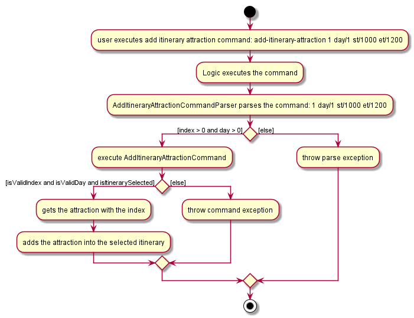

<i>Figure 24. The activity diagram of <code>add-itinerary-attraction</code></i>
 

**Assumes:**
1. The user launches the application.
2. Selected a valid itinerary with more than 1 day.
3. Attractions lists has more than 1 attractions.

**Step 1.** The user types in `add-itinerary-attraction 1 day/1 st/1000 et/1200` to add a new attraction to the selected 
itinerary and the timing does not clash with any exisiting attractions in the itinerary. 

**Step 2.** `LogicManager` passes the input to `TrackPadParser`, which in turn recognises the input as an `AddItineraryattractionCommand` and passes the input to `AddItineraryAttractionCommandParser`. 

**Step 3.** `AddItineraryAttractionCommandParser` parses the input and constructs a new `AddItineraryAttractionCommand` containing a new `ItineraryAttraction` with the specified fields.

**Step 4.** `LogicManager` executes the new `AddItineraryAttractionCommand`. This calls `Model` to add the new `ItineraryAttraction` to the itinerary specified.

**Step 5.** After the new `ItineraryAttraction` is successfully added, `AddItineraryAttractionCommand` returns a `CommandResult` for the Ui to display. 

The following sequence diagram shows how the `add-itinerary-attraction` operation works:

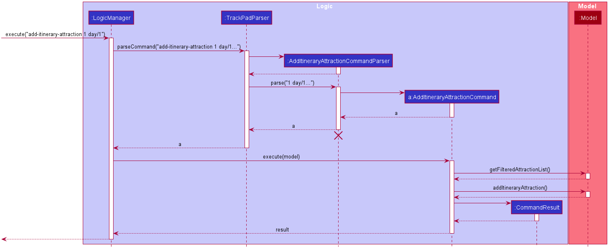

<i>Figure 25. The sequence diagram of <code>add-itinerary-attraction 1 day/1 st/1000 et/1200.</code></i>
 

#### 4.10.2 Design Considerations

**Aspect: Command keyword**

* **Alternative 1 (current choice):** `add-itinerary-attraction` is used to execute `AddItineraryAttractionCommand`. 
  * Pros: This command is distinct from the `add-attraction` command, `add-itinerary-attraction`, reduces ambiguity.
  * Cons: It is long command to type and users may be confused with the difference to `add-attraction`.

* **Alternative 2:**  `add-attraction` is used to execute `AddItineraryAttractionCommand`.
  * Pros: This is short and the same as the normal command, users has fewer commands to remember.
  * Cons: This command could be confusing to users and could cause careless users to add commands into the attraction lists instead of the itinerary.
  
Reason: Alternative 2 was not used because TrackPad has no way to know which command the user wants to execute, there is
no way to show the command usage should the user type something wrong. As TrackPad's audience are fast typists, 
these few words makes little difference to execution speed of the commands. Hence, alternative 1 was implemented.

### 4.11 UI Model

#### 4.11.1 Current Implementation

The current UI involves many inherited classes from `AttractionCard`, `ItineraryListCard` and `ItineraryAttractionCard`. 
This is because TrackPad supports optional fields, and with the current code, the `Label` in the FXML files will be created regardless
whether the field is filled or not. Thus, it leaves many empty spaces in the GUI if the user adds an attraction without most of the optional fields.

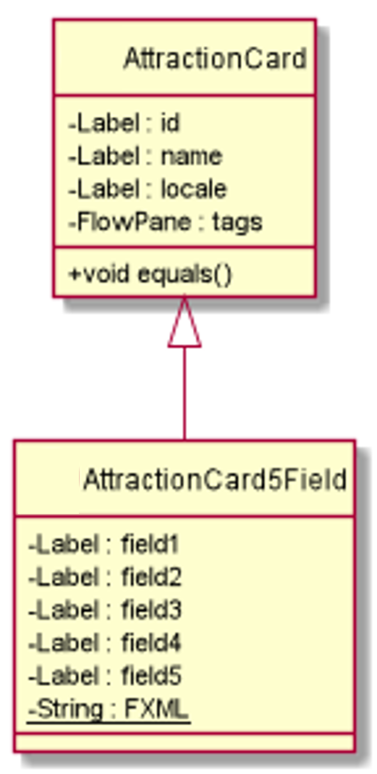

<i>Figure 26. The class diagram for one of the child of `AttractionCard`</i>
 

Figure 26 shows an example of the current implementation of the `AttractionCard`. Compulsory fields, such as `name` and `locale`
are present in the parent class since all attractions have those fields. In `AttractionListPanel`, the number of filled fields 
will be determined in the corresponding `Attraction`, via the `getNumOfFilledFields()` method, and the appropriate child will be used to 
create the card. This way, we can avoid any unnecessary gaps found in the boxes due to missing fields.

#### 4.11.2 Design Considerations

**Aspect: Method of Implementation**

* **Alternative 1:** Only one `AttractionCard` is used to create the attraction cards. 
 * Pros: Lesser code required, and no need for so many children classes.
 * Cons: Empty lines will be seen in the GUI.
 
* **Alternative 2 (Current Choice):** Several `AttractionCard` child classes are used to create the corresponding attraction cards. 
 * Pros: Fixes the issue of empty lines being seen, by not creating redundant labels from the different FXML files.
 * Cons: Many classes are created. Some code repetition.
 
Reason for choosing Alternative 2: The final app GUI should look pleasant and attractive to the users. By removing those empty lines, it makes
the interface look more neat and organised. However, this is not yet an ideal solution and a better solution could be looked for 
in the future versions beyond v1.4. A possible combination of the above 2 alternatives could be possible to implement this functionality
with less repetitive code.
 

## **5. Documentation, logging, testing, configuration, dev-ops**

This section shows the various standards TrackPad adheres to.

* [Documentation guide](Documentation.md)
* [Testing guide](Testing.md)
* [Logging guide](Logging.md)
* [Configuration guide](Configuration.md)
* [DevOps guide](DevOps.md)

## **Appendix A: Product Scope**

**Target user profile**:

* travelholics who love traveling and keeping track of their trips
* travelled to many different places before
* plans to travel to other countries in the future
* has a need to manage a significant number of tourist attractions
* prefer desktop apps over other types
* can type fast
* prefers typing to mouse interactions
* is reasonably comfortable using CLI apps

**Value proposition**: 
* manage information for trips and tourist attractions faster than a typical mouse/GUI driven app
* keeps track of different tourist attractions visited by the user
* allows creation of itineraries to track future travels
* customisable shortcuts that the user can set for frequently used commands

## **Appendix B: User Stories**

Priorities: High (must have) - `* * *`, Medium (nice to have) - `* *`, Low (unlikely to have) - `*`

| Priority | As a …​                     | I want to …​                                                                    | So that I can…​                                              |
| -------- | ------------------------------ | ---------------------------------------------------------------------------------- | --------------------------------------------------------------- |
| `* * *`  | person planning for my travel	| add tourist attractions	                                                         | keep track of tourist attractions I want to visit
| `* * *`  | person planning for my travel	| delete tourist attractions	                                                     | remove tourist attractions that I might not want to visit
| `* * *`  | person planning for my travel	| find tourist attractions from my list                                              | quickly search for a specific tourist attraction
| `* * *`  | person planning for my travel	| see a list of all the tourist attractions	                                         | get a look at all my tourist attractions at one go
| `* * *`  | person planning for my travel  | clear all tourist attractions from my plan                                         | reset the list of attractions
| `* * *`  | person planning for my travel	| edit the information in my tourist attractions	                                 | update my attractions with new information

| Priority | As a …​                     | I want to …​                                                                    | So that I can…​                                              |
| -------- | ------------------------------ | ---------------------------------------------------------------------------------- | --------------------------------------------------------------- |
| `* * *`  | person planning for my travel	| tag tourist attractions in different categories like food, sightseeing, activities | distinguish between the different kinds of tourist attractions
| `* * *`  | person planning for my travel	| add locations / addresses to my attractions                                        | know where the attraction is located and how to get there
| `* * *`  | person planning for my travel	| add descriptions to my attractions                                                 | know roughly what the attraction is about when viewing them
| `* * *`  | person planning for my travel	| add contact details such as email and phone number to my attractions               | know how to contact them if I need
| `* * *`  | new user	                    | find the user guide easily	                                                     | know what I can do with the app
| `* *`    | person planning for my travel  | create multiple itineraries for different trips	                                 | plan for all my different travelling trips
| `* *`    | person planning for my travel  | add descriptions to my itineraries such as trip details                            | ensure I have all the correct trip information in one place
| `* *`    | person planning for my travel  | add dates to my itineraries                                                        | plan when the trip will take place

| Priority | As a …​                     | I want to …​                                                                    | So that I can…​                                              |
| -------- | ------------------------------ | ---------------------------------------------------------------------------------- | --------------------------------------------------------------- |
| `* *`    | person planning for my travel  | add attractions to my itineraries                                                  | plan which attractions to visit
| `* *`    | person planning for my travel  | delete attractions from my itineraries                                             | remove attractions I do not want to visit anymore
| `* *`    | person planning for my travel  | edit attractions in my itineraries                                                 | update the attractions I am planning to visit in my itineraries
| `* *`    | person planning for my travel  | specify the times at which I visit an attraction within an itinerary               | plan when to visit the attractions
| `* *`    | new user	                    | see the app with sample data	                                                     | see what kind of data the app can store
| `*`      | person planning for my travel	| add opening hours to my attractions                                                | know when to visit
| `*`      | person planning for my travel	| add the estimated price range to my attractions                                    | know which attractions to choose to match my budget
| `*`      | person planning for my travel	| add the estimated budget to my itineraries                                         | plan how much to spend on each trip

| Priority | As a …​                     | I want to …​                                                                    | So that I can…​                                              |
| -------- | ------------------------------ | ---------------------------------------------------------------------------------- | --------------------------------------------------------------- |
| `*`      | person currently traveling	    | mark tourist attractions as visited / not visited                                  | know which attractions I missed
| `*`      | person who had already traveled | give ratings to my attractions                                                    | keep track of which tourist attractions were enjoyable

## **Appendix C: Use Cases**

(For all use cases below, the **System** is the `TrackPad` and the **Actor** is the `user`, unless specified otherwise)
      
**Use case: UC01 - Add a tourist attraction**

**MSS**

1. User requests to add a tourist attraction.
2. User provides the fields of the tourist attraction to be added.
3. TrackPad adds the tourist attraction and shows a success message.

   Use case ends.
      
**Extensions**

* 2a. A field provided for the tourist attraction is invalid.

    * 2a1. TrackPad shows an error message.
    
      Use case resumes at step 2.

* 2b. The tourist attraction to be added already exists in the list of attractions.

    * 2b1. TrackPad shows an error message.
    
      Use case resumes at step 2.

**Use case: UC02 - Edit a tourist attraction**

**MSS**

1. User requests to edit a tourist attraction.
2. User provides the index of the tourist attraction to be edited.
3. User provides the fields of the tourist attraction to be edited.
4. TrackPad edits the fields and shows a success message.

   Use case ends.
    
**Extensions**

* 2a. The index provided does not exist in the attractions list.

    * 2a1. TrackPad shows an error message.
    
      Use case resumes at step 2.

* 3a. The new field provided for the tourist attraction is invalid.

    * 3a1. TrackPad shows an error message.
    
      Use case resumes at step 3.
      
* 3b. The new field provided for the tourist attraction is the same as the current one.

    * 3b1. TrackPad shows an error message.
    
      Use case resumes at step 3.

**Use case: UC03 - Delete a tourist attraction**

**MSS**

1. User requests to delete a tourist attraction.
2. User provides the index of the tourist attraction to be deleted.
3. TrackPad deletes the tourist attraction and shows a success message.

   Use case ends.
    
**Extensions**
  
* 2a. The index provided does not exist in the attractions list.

    * 2a1. TrackPad shows an error message.
    
      Use case resumes at step 2.
      
**Use case: UC04 - Mark a tourist attraction as visited**

**MSS**

1. User requests to mark a tourist attraction as visited.
2. User provides the index of the tourist attraction to be marked as visited.
3. TrackPad marks the tourist attraction as visited and shows a success message.

   Use case ends.
    
**Extensions**
  
* 2a. The index provided does not exist in the attractions list.

    * 2a1. TrackPad shows an error message.
    
      Use case resumes at step 2.

* 2b. The attraction that corresponds to the inputted index is already visited.

    * 2b1. TrackPad shows an error message.
    
      Use case resumes at step 2.
      
**Use case: UC05 - Find a tourist attraction**

**MSS**

1. User requests to find a tourist attraction.
2. User provides the keyword he is looking for.
3. TrackPad shows a list of all the tourist attractions that match the keyword.

   Use case ends.
    
**Extensions**

* 3a. There are no tourist attractions that matches the keyword.

    * 3a1. TrackPad shows an empty list of attractions.
    
      Use case ends.

**Use case: UC06 - List all tourist attractions**

**MSS**

1.  User requests to list all tourist attractions.
2.  TrackPad shows a list of all tourist attractions.

    Use case ends.

**Extensions**

* 2a. The list is empty.

  Use case ends.
 
**Use case: UC07 - Clear all tourist attractions**

**MSS**

1.  User requests to delete all tourist attractions in the list.
2.  TrackPad deletes all tourist attractions in the list.

    Use case ends.

**Extensions**

* 2a. The list is empty.

  Use case ends.
      
**Use case: UC08 - Add an itinerary**

**MSS**

1.  User requests to add an itinerary.
2.  User provides the fields of the itinerary to be added.
3.  TrackPad adds the itinerary.

    Use case ends.
      
**Extensions**

* 2a. The given format for the itinerary is invalid.

    * 2a1. TrackPad shows an error message.
    
      Use case resumes at step 2.
      
* 2b. The itinerary already exists in the list of itineraries.

    * 2b1. TrackPad shows an error message.
    
      Use case resumes at step 2.

**Use case: UC09 - Edit an itinerary**

**MSS**

1.  User requests to list itineraries.
2.  TrackPad shows a list of itineraries.
3.  User requests to edit a specific itinerary in the list.
4.  TrackPad edits the itinerary.

    Use case ends.
      
**Extensions**

* 2a. The list is empty.
      
  Use case ends.
      
* 3a. The format is invalid. 

    * 3a1. TrackPad shows an error message.
      
      Use case resumes at step 3.
  
* 3b. The given index is invalid.

    * 3b1. TrackPad shows an error message.
    
      Use case resumes at step 3.
      
* 3c. The new field(s) provided for the itinerary is the same as the current one.

    * 3c1. TrackPad shows an error message.
    
      Use case resumes at step 3.
      
**Use case: UC10 - Delete an itinerary**

**MSS**

1.  User requests to list itineraries.
2.  TrackPad shows a list of itineraries.
3.  User requests to delete a specific itinerary in the list.
4.  TrackPad deletes the itinerary.

    Use case ends.
    
**Extensions**

* 2a. The list is empty.
      
  Use case ends.
  
* 3a. The given index is invalid.

    * 3b. TrackPad shows an error message.
    
      Use case resumes at step 3.
      
**Use case: UC11 - Find an itinerary**

**MSS**

1.  User requests to find an itinerary.
2.  TrackPad shows a list of itineraries matching the keyword entered.

    Use case ends.
    
**Extensions**

* 2a. The list is empty.

  Use case ends.
    
* 3a. The given keyword is not found.

    * 3a1. TrackPad shows an error.

      Use case ends.
      
**Use case: UC12 - List all itineraries**

**MSS**

1.  User requests to list all itineraries.
2.  TrackPad shows a list of all itineraries.

    Use case ends.
    
**Extensions**

* 2a. The list is empty.

  Use case ends.
  
**Use case: UC13 - Select an itinerary**

**MSS**

1.  User requests to list itineraries.
2.  TrackPad shows a list of itineraries.
3.  User requests to select a specific itinerary in the list.
4.  TrackPad selects the itinerary.

    Use case ends.
    
**Extensions**

* 2a. The list is empty.
      
  Use case ends.
  
* 3a. The given index is invalid.

    * 3a1. TrackPad shows an error message.
    
      Use case resumes at step 2.
    
**Use case: UC14 - Clear all itineraries**

**MSS**

1.  User requests to delete all itineraries in the list.
2.  TrackPad deletes all itineraries in the list.

    Use case ends.

**Extensions**

* 2a. The list is empty.

  Use case ends.
  
**Use case: UC15 - Add a tourist attraction into selected itinerary**

**MSS**
1. User <u>selects an itinerary (UC13)</u>.
2. User requests to add an attraction into the selected itinerary. 
3. User provides the fields of the attraction to be added. 
4. TrackPad adds the tourist attraction into the selected itinerary and shows a success message.

   Use case ends.
      
**Extensions**

* 3a. A field provided for the tourist attraction is invalid.

    * 3a1. TrackPad shows an error message.
    
      Use case resumes at step 3.

* 3b. The attraction added has conflicting timing in the itinerary.

    * 3b1. TrackPad shows an error message.
    
      Use case resumes at step 3.

**Use case: UC16 - Edit a tourist attraction in selected itinerary**

**MSS**
1. User <u>selects an itinerary (UC13)</u>.
2. User requests to edit a tourist attraction in the selected itinerary.
3. User provides the index and day of the tourist attraction to be edited.
4. User provides the fields of the tourist attraction to be edited.
5. TrackPad edits the fields and shows a success message.

   Use case ends.
    
**Extensions**

* 3a. The index or day provided does not exist in the selected itinerary.

    * 3a1. TrackPad shows an error message.
    
      Use case resumes at step 3.

* 4a. The new field provided for the tourist attraction is not in the correct format.

    * 4a1. TrackPad shows an error message.
    
      Use case resumes at step 4.
      
* 4b. The new field provided for the tourist attraction is the same as the current one.

    * 4b1. TrackPad shows an error message.
    
      Use case resumes at step 4.

**Use case: UC17 - Delete a tourist attraction in selected itinerary**

**MSS**
1. User <u>selects an itinerary (UC13)</u>.
2. User requests to delete a tourist attraction from the selected itinerary.
3. User provides the index and day of the tourist attraction to be deleted.
4. TrackPad deletes the tourist attraction and shows a success message.

   Use case ends.
    
**Extensions**
* 3a. The index and day provided does not exist in the itinerary.

    * 3a1. TrackPad shows an error message.
    
      Use case resumes at step 3.

**Use case: UC18 - Viewing help**

**MSS**
1. User requests for help in TrackPad.
2. User provides the command for help
3. TrackPad directs the user to TrackPad user guide.

   Use case ends.
    
**Extensions**
* 2a. There is a typo in the command.

    * 2a1. TrackPad shows an error message.
        
         Use case resumes at step 2.
              
**Use case: UC19 - Exiting the program**

**MSS**

1. User wishes to exit TrackPad.
2. User enters the command to exit.
3. TrackPad closes.

    Use case ends.
    
**Extensions**

* 2a. User clicks the exit button on the top right of the window.

    Use case resumes at step 3.
    
* 2b. User clicks the exit button, located under the File tab.

    Use case resumes at step 3.
          
**Use case: UC20 - Saving the data**

**MSS**

1. User wishes to save current data in TrackPad.
2. User enters any valid command.
3. Data in TrackPad is updated and saved.

    Use case ends.
    
**Extensions**

* 2a. User enters an invalid command.

    Use case ends.
    
* *a. At any time, user chooses to terminate and close the program.

    Use case resumes at step 3.
    

## **Appendix D: Non-Functional Requirements**

1.  The product should be able to hold up to 1000 tourist attractions/itineraries/days without a noticeable sluggishness in performance for typical usage.
2.  A user with above average typing speed for regular English text (i.e. not code, not system admin commands) should be able to accomplish most of the tasks faster using commands than using the mouse.
3.  The user interface should be intuitive enough for users who are not IT-savvy.
4.  The product is not required to recommend new tourist attractions which are not inputted by the user.
5.  The product should be free to download and use.
6.  The system should work on any _mainstream OS_ as long as it has Java `11` or above installed.
7.  The system should work on both 32-bit and 64-bit environments.
8.  The system should respond within five seconds.
9.  The project is expected to be a brown-field project.
10.  The progress of the project is expected to adhere to the schedule provided on the module website.

## **Appendix E: Glossary**

* **Mainstream OS**: Windows, Linux, Unix, OS-X

## **Appendix F: Instructions for Manual Testing**

Given below are instructions to test the app manually.

**F1 Launch and shutdown**

1. Initial launch.

   1. Download the jar file and copy into an empty folder.

   2. Double-click the jar file Expected: Shows the GUI with a set of sample contacts. The window size may not be optimum.

2. Saving window preferences.

   1. Resize the window to an optimum size. Move the window to a different location. Close the window.

   2. Re-launch the app by double-clicking the jar file. 
       Expected: The most recent window size and location is retained.

**F2 Adding a tourist attraction**

1. Adding a tourist attraction.

   1. Prerequisites: No attraction in TrackPad has both the name 'Zoo' and the location 'Singapore'.
   
   2. Test case: `add-attraction n/Zoo l/Singapore` 
      Expected: New attraction added to the bottom of the attractions list. 
      Details of the added attraction shown in the status message.

   3. Test case: `add-attraction n/Zoo` 
      Expected: No attraction added. Error details shown in the status message.

   4. Other incorrect add-attraction commands to try: `add-attraction n/Zoo l/Singapore p/+6591234567`, 
      `add-attraction n/NAME l/LOCATION` (where both the NAME and LOCATION are the same as another attraction in TrackPad) 
      Expected: Similar to previous.

      
**F3 Editing a tourist attraction**

1. Editing a tourist attraction while all the attractions in TrackPad are shown in the attractions list.

   1. Prerequisites: List all attractions using the `list-attraction` command.

   2. Test case: `edit-attraction 1 p/999` 
      Expected: Phone number of first attraction edited to 999. Details of the edited attraction shown in the status message.

   3. Test case: `edit-attraction 0 p/999` 
      Expected: No attraction edited. Error details shown in the status message.

   4. Other incorrect edit-attraction commands to try: `edit-attraction 1 r/5.1`,
      `edit-attraction 1 n/NAME` (where NAME is the same as the current name of the first attraction) 
      Expected: Similar to previous.
      
**F4 Deleting a tourist attraction**

1. Deleting a tourist attraction while all the attractions in TrackPad are shown in the attractions list.

   1. Prerequisites: List all attractions using the `list-attraction` command.

   2. Test case: `delete-attraction 1` 
      Expected: First attraction deleted from the list. Details of the deleted attraction shown in the status message.

   3. Test case: `delete-attraction 0` 
      Expected: No attraction deleted. Error details shown in the status message.

   4. Other incorrect delete-attraction commands to try: `delete-attraction`, 
      `delete-attraction x` (where x is larger than the list size) 
      Expected: Similar to previous.

**F5 Marking an attraction as Visited**

1. Marking an attraction as Visited while all attractions are being shown

   1. Prerequisites: There is at least one attraction present in the attraction list of TrackPad.

   2. Test case: `markVisited-attraction 1` 
   
      1. Scenario 1: First attraction does not have the purple Visited tag. 
      Expected: First attraction marked as visited on the list. Details of the attraction shown in the status message.  
      
      1. Scenario 2: First attraction already has the purple Visited tag. 
      Expected: First attraction remains unchanged. Error message shown in the result box.

   3. Test case: `markVisited-attraction 0` 
      Expected: No attraction marked as visited. Error details shown in the result box.
      
   4. Other incorrect markVisited commands to try: `markVisited-attraction`, `markVisited-attraction x` (where x is larger than the list size, or less than 0) 
      Expected: Similar to previous.

**F6 Finding a tourist attraction**

1. Finding a tourist attraction while all the attractions in TrackPad are shown in the attractions list.

   1. Prerequisites: List all attractions using the `list-attraction` command. Attractions Jurong Bird Park and Snow City are in the attractions list.

   2. Test case: `find-attraction jurong` 
      Expected: Attractions Jurong Bird Park and Snow City shown in the attractions list. Number of attractions listed shown in the status message.

   3. Test case: `find-attraction #$%` 
      Expected: Empty attractions list shown. "0 attractions listed!" shown in the status message.
 

     
**F7 Listing attractions**

1. Listing all attractions currently stored in TrackPad

   1. Prerequisites: None.

   2. Test case: `list-attraction` 
      Expected: All attractions that are currently stored in the app will be displayed in the Attractions panel.
      
   3. Test case: `list-attraction 1` 
      Expected: Everything typed after the space following the command will be ignored, and list-attraction command will be executed successfully.

**F8 Clearing attractions**

1. Clears all attractions currently stored in TrackPad

   1. Prerequisites: None.

   2. Test case: `clear-attraction` 
      Expected: All attractions that are currently stored in the app will be deleted. An empty attractions panel will be shown.
      
   3. Test case: `clear-attraction 1` 
      Expected: Everything typed after the space following the command will be ignored, and clear-attraction command will be executed successfully.

**F9 Adding an itinerary**

1. Adding an itinerary

   1. Prerequisites: No itinerary in TrackPad has the name `Thailand Trip`, start date `01-08-2020` and end date `03-08-2020`.

   2. Test case: `add-itinerary n/Thailand Trip sd/01-08-2020 ed/03-08-2020` 
      Expected: An itinerary with the specified name, start date and end date added to the itinerary list. 
      Details of the added itinerary shown in the status message.

   3. Test case: `add-itinerary ` 
      Expected: No itinerary added. Error details shown in the status message.

   4. Other incorrect add itinerary commands to try: 
     * Missing compulsory fields (e.g. missing end date): `add-itinerary n/Germany sd/03-02-2020 b/100` 
        Expected: Similar to 3.
     * Invalid format for fields (e.g. invalid start date format): `add-itinerary n/Germany sd/03 02 2020 ed/06-02-2020` 
        Expected: Similar to 3.
        
**F10 Editing an itinerary**

1. Editing an itinerary

   1. Prerequisites: At least one itinerary exists for editing.

   2. Test case: `edit-itinerary 1 n/Japan trip` 
      Expected: The name of the first itinerary changed to `Japan trip`.
      Details of the edited itinerary shown in the status message.

   3. Test case: `edit-itinerary 0 n/Japan trip` 
      Expected: No itinerary edited. Error details shown in the status message.

   4. Other incorrect edit itinerary commands to try: 
     * Missing fields: `edit-itinerary 1` 
        Expected: Similar to 3.
     * Invalid format for fields (e.g. invalid start date format): `edit-itinerary 1 sd/03 02 2020` 
        Expected: Similar to 3.
     * No change in fields: `edit-itinerary 1 n/Germany` when the name is already `Germany` 
        Expected: Similar to 3.

        
**F11 Deleting an itinerary**

1. Deleting an itinerary while all the itineraries in TrackPad are shown in the itineraries list

   1. Prerequisites: List all itineraries using the `list-itinerary` command. Multiple itineraries in the list.

   2. Test case: `delete-itinerary 1` 
      Expected: First itinerary deleted from the list. Details of the deleted itinerary shown in the status message.

   3. Test case: `delete-itinerary 0` 
      Expected: No itinerary deleted. Error details shown in the status message.

   4. Other incorrect delete commands to try:
    * Missing index: `delete-itinerary` 
      Expected: Similar to 3
    * Invalid index: `delete-itinerary x`, where x is larger than the list size  
      Expected: Similar to 3
      
**F12 Finding an itinerary**

1. Finding an itinerary

   1. Prerequisites: TrackPad contains an itinerary with the name `Singapore Tour`. No other itinerary contains `Singapore Tour`.

   2. Test case: `find-itinerary Singapore Tour` 
      Expected: The itinerary with the name `Singapore Tour` found. 

   3. Test case: `find-itinerary` 
      Expected: No itinerary found. Error details shown in the status message.
  

    
**F13 Listing itineraries**

1. Listing all itineraries currently stored in TrackPad

   1. Prerequisites: None.

   2. Test case: `list-itinerary` 
      Expected: All itineraries that are currently stored in the app will be displayed in the Itineraries panel.
      
   3. Test case: `list-itinerary 3` 
      Expected: Everything typed after the space following the command will be ignored, and list-itinerary command will be executed successfully.

**F14 Selecting an itinerary**

1. Selecting an itinerary while all itineraries are being shown

   1. Prerequisites: List all itineraries using the `list-itinerary` command. Multiple itineraries in the list.

   2. Test case: `select-itinerary 1` 
      Expected: First itinerary is selected from the list. Details of the selected itinerary shown in the status message.

   3. Test case: `select-itinerary 0` 
      Expected: No itinerary is selected. Error details shown in the status message.

   4. Other incorrect select commands to try:
    * Missing index: `select-itinerary` 
      Expected: Similar to 3
    * Invalid index: `select-itinerary x`, where x is larger than the list size  
      Expected: Similar to 3

      
**F15 Clearing itineraries**

1. Clears all itineraries currently stored in TrackPad

   1. Prerequisites: None.

   2. Test case: `clear-itinerary` 
      Expected: All itineraries that are currently stored in the app will be deleted. An empty Itineraries panel will be shown.
      
   3. Test case: `clear-itinerary 2` 
      Expected: Everything typed after the space following the command will be ignored, and clear-itinerary command will be executed successfully.
  
**F16 Adding an attraction into itinerary**

1. Adding an attraction into an itinerary

    1. Prerequisites:  
        * At least 1 attraction in attractions lists.
        * At least 1 itinerary in itineraries lists.
        * An Itinerary must be selected using the `select-itinerary 1` command.
    
    2. Test case: `add-itinerary-attraction 1 day/1 st/1000 et/1400`
        1. Scenario 1: First attraction of day 1 also happened somewhere between 1000H - 1400H.  
        Expected: Error message warning of timing clash between the 2 attractions.
        
        2. Scenario 2: Day 1 of itinerary between 1000H - 1400H is empty.  
        Expected: Adds attraction into the selected itinerary. Details of the added attraction shown in the status message.
        
    3. Test case: `add-itinerary-attraction`  
        Expected: No attraction added. Error details shown in the status message.
        
    3. Other incorrect add itinerary attraction commands to try:
        * Missing compulsory fields (e.g. missing end time): `add-itinerary-attraction 1 day/1 st/1000`  
        Expected: Similar to 3.
        * Invalid format for fields (e.g. not a valid time): `add-itinerary-attraction 1 day/1 st/1000 et/2400`  
        Expected: Similar to 3.

**F17 Editing an attraction in an itinerary**

1. Editing an existing attraction in an itinerary.

    1. Prerequisites: Same as F16.
    
    2. Test case: `edit-itinerary-attraction 1 day/1 op/1000-1100`  
        Expected: Change the opening time of the first attraction in the selected itinerary to `1000-1100`.

    3. Test case: `edit-itinerary-attraction 2 day`
        Expected: No attraction edited. Error details shown in the error message.
        
    4. Other incorrect edit itinerary attraction commands to try:
        * Missing fields: `edit-itinerary-attraction 2 day/3 `
        Expected: Similar to 3.
        * Invalid format (e.g. invalid opening time format): `edit-itinerary-attraction 1 day/1 op/1200 to 1300`  
        Expected: Similar to 3.
        * No change in fields: `edit-itinerary-attraction 1 day/2 st/1000` when the start time is already `1000`  
        Expected: Similar to 3.

**F18 Deleting an attraction from an itinerary**

1. Deleting an attraction in an itinerary.

    1. Prerequisites: Same as F16.
    
    2. Test case: `delete-itinerary-attraction 1 day/2`  
        Expected: Deletes first attraction of day 1 is deleted from the itinerary.
    
    3. Other incorrect delete commands to try:
    * Missing index: `delete-itinerary-attraction day/2`  
    Expected: No attraction deleted. Error details shown in the error message.
    * Invalid index: `delete-itinerary-attraction NaN day/2`
    Expected: Similar to previous.
    * Missing day: `delete-itinerary-attraction 1`  
    Expected: Similar to previous.
    * Invalid day: `delete-itinerary-attraction 1 day/NaN `
    Expected: Similar to previous.

**F19 Viewing help**

1. Viewing help

    1. Prerequisites: None. 
        
    2. Test case: `help`  
        Expected: TrackPad shows a dialog box with a working url to TrackPad's online user guide.
        
    3. Test case: `help uselessString`  
        Expected: TrackPad still shows a dialog box, ignores the extra string after help.

**F20 Exiting the program**

1. Exits and shutdowns the program

   1. Prerequisite: None.
   
   2. Test case: `exit` 
      Expected: TrackPad shuts down.
   
**F21 Saving data**

1. Dealing with missing data files

   1. Prerequisites: Launch TrackPad, enter at least one valid command, then exit the app. 
   
   2. Test case: In the folder where you saved the app, go to the `data` folder. Delete `attractionlist.json`. Launch TrackPad again. 
   Expected behavior: TrackPad launches with a sample list of attractions to replace the missing attractions file. After entering a valid command, a new `attractionlist.json` file with the current attractions will be created. 
   
   3. Test case: In the folder where you saved the app, go to the `data` folder. Delete `itinerarylist.json`. Launch TrackPad again. 
   Expected behavior: TrackPad launches with a sample list of itineraries to replace the missing itineraries file. After entering a valid command, a new `itinerarylist.json` file with the current itineraries will be created. 
   
2. Dealing with corrupted data files

   1. Prerequisites: Launch TrackPad, enter at least one valid command, then exit the app. 
      
   2. Test case: In the folder where you saved the app, go to the `data` folder. Open `attractionlist.json`, delete some portions of it and save. Launch TrackPad again. 
   Expected behavior: TrackPad launches with an empty list of attractions to replace the corrupted attractions file. After entering a valid command, a new `attractionlist.json` file with the current attractions will be created. 
      
   3. Test case: In the folder where you saved the app, go to the `data` folder. Open `itinerarylist.json`, delete some portions of it and save. Launch TrackPad again. 
   Expected behavior: TrackPad launches with an empty list of itineraries to replace the corrupted itineraries file. After entering a valid command, a new `itinerarylist.json` file with the current itineraries will be created. 

## **Appendix G: Effort**

Our project was harder than Address Book Level 3(AB3) because while AB3 deals with one entity, TrackPad deals with several
entities, including Attractions, Itineraries as well as Itinerary Attractions. 

Initially, we had to refactor most of the code to change all instances of Person to Attraction and AddressBook to TrackPad. 
We also had to change the test cases, and since we were still unfamiliar with the many lines of code AB3 had, we had a 
hard time figuring out why some of them failed.

After which, we had to implement Itinerary into the app and make it work similarly enough to Attraction, but still function 
differently from it. We spent much time and effort deciding on how itineraries, and the attractions they contain are supposed 
to work and the fields they should have, which resulted in our current implementations of Itinerary and ItineraryAttraction. 
With the new additions, quite some time was spent on deciding which command words we want to use for each new command, since 
the new commands can sound similar to existing ones. Afterwards, we had to more than double the number of Command classes 
and their parsers to support the new commands, and also add many test cases to ensure their correctness. All of these took out 
a lot of our time and effort in implementing. 

In addition, the Ui had to be able to retrieve itinerary attractions. And this has to be done in a different way from attractions and itineraries,
since there is one global list for attractions and itineraries, but there are multiple lists of itinerary attractions. This mean
time and effort had to be spent in figuring out a new way of sending this information to the UI panels. The itinerary panel also had to 
be able to switch to itinerary attractions panel, and switch back whenever the appropriate command was called, so this was not 
easy to implement too.
