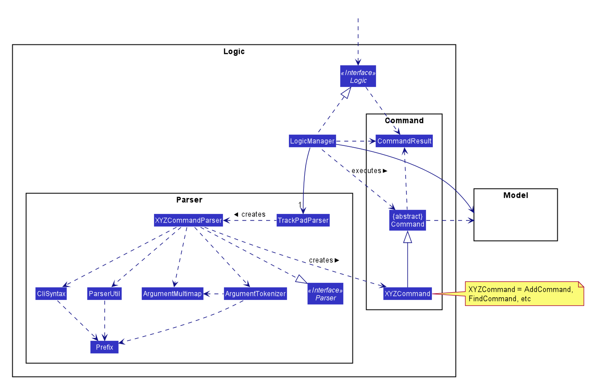
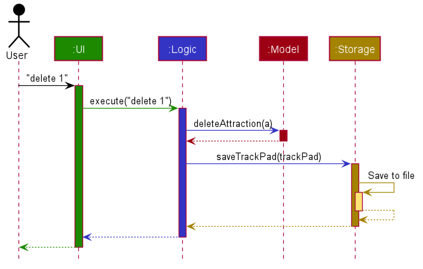
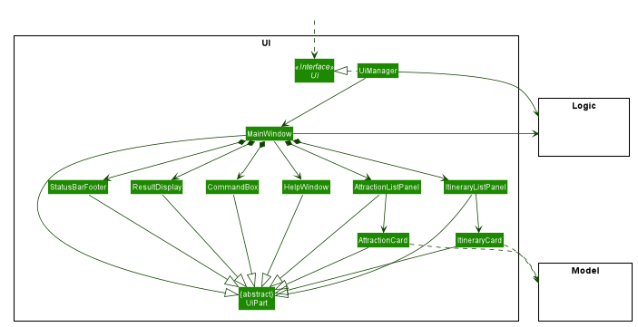

* Table of Contents
{:toc}

--------------------------------------------------------------------------------------------------------------------

## **1. Setting up, getting started**

Refer to the guide [_Setting up and getting started_](SettingUp.md).

--------------------------------------------------------------------------------------------------------------------

## **2. Design**

### 2.1 Architecture

Figure 2.1.1 Architecture Class Diagram
 

Figure 2.1.1 explains the high-level design of the App. Given below is a quick overview of each component.

:bulb: **Tip:** The `.puml` files used to create diagrams in this document can be found in the [diagrams](https://github.com/AY2021S1-CS2103T-T09-3/tp/blob/master/docs/diagrams/) folder. Refer to the [_PlantUML Tutorial_ at se-edu/guides](https://se-education.org/guides/tutorials/plantUml.html) to learn how to create and edit diagrams.

**`Main`** has two classes called [`Main`](https://github.com/AY2021S1-CS2103T-T09-3/tp/blob/master/src/main/java/seedu/address/Main.java) and [`MainApp`](https://github.com/AY2021S1-CS2103T-T09-3/tp/blob/master/src/main/java/seedu/address/MainApp.java). It is responsible for,
* At app launch: Initializes the components in the correct sequence, and connects them up with each other.
* At shut down: Shuts down the components and invokes cleanup methods where necessary.

[**`Commons`**](#26-common-classes) represents a collection of classes used by multiple other components.

The rest of the App consists of four components.

* [**`UI`**](#22-ui-component): The UI of the App.
* [**`Logic`**](#23-logic-component): The command executor.
* [**`Model`**](#24-model-component): Holds the data of the App in memory.
* [**`Storage`**](#25-storage-component): Reads data from, and writes data to, the hard disk.

Each of the four components,

* defines its *API* in an `interface` with the same name as the Component.
* exposes its functionality using a concrete `{Component Name}Manager` class (which implements the corresponding API `interface` mentioned in the previous point.

Figure 2.1.2 Class Diagram of the Logic Component
 

For example, the `Logic` component (seen from Figure 2.1.2 above) defines its API in the `Logic.java` interface and exposes its functionality using the `LogicManager.java` class which implements the `Logic` interface.

**How the architecture components interact with each other**

Figure 2.1.3 Sequence Diagram of the various components
 

Figure 2.1.3 above shows how the components interact with each other for the scenario where the user issues the command `delete 1`.

The sections below give more details of each component.

### 2.2 UI component

**API** :
[`Ui.java`](https://github.com/AY2021S1-CS2103T-T09-3/tp/blob/master/src/main/java/seedu/address/ui/Ui.java)

Figure 2.2.1 Structure of the Ui Component, Ui Class Diagram
 

The UI consists of a `MainWindow` that is made up of parts e.g.`CommandBox`, `ResultDisplay`, `AttractionListPanel`, `StatusBarFooter` etc. All these, including the `MainWindow`, inherit from the abstract `UiPart` class.

The `UI` component uses JavaFx UI framework. The layout of these UI parts are defined in matching `.fxml` files that are in the `src/main/resources/view` folder. For example, the layout of the [`MainWindow`](https://github.com/AY2021S1-CS2103T-T09-3/tp/blob/master/src/main/java/seedu/address/ui/MainWindow.java) is specified in [`MainWindow.fxml`](https://github.com/AY2021S1-CS2103T-T09-3/tp/blob/master/src/main/resources/view/MainWindow.fxml)

The `UI` component,

* Executes user commands using the `Logic` component.
* Listens for changes to `Model` data so that the UI can be updated with the modified data.

This design is similar to the Architectural design of TrackPad, whereby different UiParts are encapsulated in the MainWindow java controller class. This allows the Logic to minimise interaction with the UI, since the MainWindow manages the changes to any UiPart classes that result from the execution in the Logic component.

### 2.3 Logic component

Figure 2.3.1 Structure of the Logic Component, Logic Class Diagram
 

**API** :
[`Logic.java`](https://github.com/AY2021S1-CS2103T-T09-3/tp/blob/master/src/main/java/seedu/address/logic/Logic.java)

1. `Logic` in Figure 2.3.1 receives the user command.
1. It uses the `TrackPadParser` class to parse the command.
1. This results in a `Command` object which is executed by the `LogicManager`.
1. The command execution can affect the `Model` (e.g. adding an attraction).
1. The result of the command execution is encapsulated as a `CommandResult` object which is passed back to the `Ui`.
1. In addition, the `CommandResult` object can also instruct the `Ui` to perform certain actions, such as displaying help to the user.

Given below is the Sequence Diagram for interactions within the `Logic` component for the `execute("delete-attraction 1")` API call.

Figure 2.3.2 Interactions inside the Logic Component for the `delete-attraction 1` Command
 

:information_source: **Note:** The lifeline for `DeleteCommandParser` should end at the destroy marker (X) but due to a limitation of PlantUML, the lifeline reaches the end of diagram.

### 2.4 Model component

Figure 2.4.1 Structure of the Model Component, Model Class Diagram
 

**API** : [`Model.java`](https://github.com/AY2021S1-CS2103T-T09-3/tp/blob/master/src/main/java/seedu/address/model/Model.java)

The `Model` component shown in Figure 2.4.1,
* stores a `UserPref` object that represents the user’s preferences.
* stores an `AttractionList` object that is a list of all the attractions in TrackPad.
* stores an `ItineraryList` object that is a list of all the itineraries in TrackPad.
* exposes two unmodifiable `ObservableList<Attraction>` and `ObservableList<Itinerary>` that can be 'observed' e.g. the UI can be bound to the lists so that the UI automatically updates when the data in the lists change.
* does not depend on any of the other three components.

:information_source: **Note:** An alternative (arguably, a more OOP) model is given below. It has a `Tag` list in the `TrackPad`, which `Attraction` references. This allows `TrackPad` to only require one `Tag` object per unique `Tag`, instead of each `Attraction` needing their own `Tag` object.
 

Figure 2.4.2 Structure of an alternative Model Component, Alternative Model Class Diagram
 

### 2.5 Storage component

Figure 2.5.1 Structure of the Storage Component, Storage Class Diagram
 

**API** : [`Storage.java`](https://github.com/AY2021S1-CS2103T-T09-3/tp/blob/master/src/main/java/seedu/address/storage/Storage.java)

The `Storage` component shown in Figure 2.5.1,
* saves `UserPref` objects containing user preferences in json format and read it back.
* saves `AttractionList` objects containing attraction data in json format and read it back.
* saves `ItineraryList` objects containing itinerary data in json format and read it back.

### 2.6 Common classes

Classes used by multiple components are in the `seedu.address.commons` package.

--------------------------------------------------------------------------------------------------------------------
## **3. Implementation**
*To be added*

<!--
This section describes some noteworthy details on how certain features are implemented.

### 3.1 \[Proposed\] Undo/redo feature

#### 3.1.1 Proposed Implementation

The proposed undo/redo mechanism is facilitated by `VersionedTrackPad`. It extends `TrackPad` with an undo/redo history, stored internally as an `trackPadStateList` and `currentStatePointer`. Additionally, it implements the following operations:

* `VersionedTrackPad#commit()` — Saves the current TrackPad state in its history.
* `VersionedTrackPad#undo()` — Restores the previous TrackPad state from its history.
* `VersionedTrackPad#redo()` — Restores a previously undone TrackPad state from its history.

These operations are exposed in the `Model` interface as `Model#commitTrackPad()`, `Model#undoTrackPad()` and `Model#redoTrackPad()` respectively.

Given below is an example usage scenario and how the undo/redo mechanism behaves at each step.

Step 1. The user launches the application for the first time. The `VersionedTrackPad` will be initialized with the initial TrackPad state, and the `currentStatePointer` pointing to that single TrackPad state.

Step 2. The user executes `delete 5` command to delete the 5th attraction in the TrackPad. The `delete` command calls `Model#commitTrackPad()`, causing the modified state of the TrackPad after the `delete 5` command executes to be saved in the `trackPadStateList`, and the `currentStatePointer` is shifted to the newly inserted TrackPad state.

Step 3. The user executes `add n/David …​` to add a new attraction. The `add` command also calls `Model#commitTrackPad()`, causing another modified TrackPad state to be saved into the `trackPadStateList`.

:information_source: **Note:** If a command fails its execution, it will not call `Model#commitTrackPad()`, so the TrackPad state will not be saved into the `trackPadStateList`.

Step 4. The user now decides that adding the attraction was a mistake, and decides to undo that action by executing the `undo` command. The `undo` command will call `Model#undoTrackPad()`, which will shift the `currentStatePointer` once to the left, pointing it to the previous TrackPad state, and restores the TrackPad to that state.

:information_source: **Note:** If the `currentStatePointer` is at index 0, pointing to the initial TrackPad state, then there are no previous TrackPad states to restore. The `undo` command uses `Model#canUndoTrackPad()` to check if this is the case. If so, it will return an error to the user rather
than attempting to perform the undo.

The following sequence diagram shows how the undo operation works:

:information_source: **Note:** The lifeline for `UndoCommand` should end at the destroy marker (X) but due to a limitation of PlantUML, the lifeline reaches the end of diagram.

The `redo` command does the opposite — it calls `Model#redoTrackPad()`, which shifts the `currentStatePointer` once to the right, pointing to the previously undone state, and restores the TrackPad to that state.

:information_source: **Note:** If the `currentStatePointer` is at index `trackPadStateList.size() - 1`, pointing to the latest TrackPad state, then there are no undone TrackPad states to restore. The `redo` command uses `Model#canRedoTrackPad()` to check if this is the case. If so, it will return an error to the user rather than attempting to perform the redo.

Step 5. The user then decides to execute the command `list`. Commands that do not modify the TrackPad, such as `list`, will usually not call `Model#commitTrackPad()`, `Model#undoTrackPad()` or `Model#redoTrackPad()`. Thus, the `trackPadStateList` remains unchanged.

Step 6. The user executes `clear`, which calls `Model#commitTrackPad()`. Since the `currentStatePointer` is not pointing at the end of the `trackPadStateList`, all TrackPad states after the `currentStatePointer` will be purged. Reason: It no longer makes sense to redo the `add n/David …​` command. This is the behavior that most modern desktop applications follow.

The following activity diagram summarizes what happens when a user executes a new command:

#### 3.1.2 Design consideration

##### 3.1.2.1 Aspect: How undo & redo executes

* **Alternative 1 (current choice):** Saves the entire TrackPad.
  * Pros: Easy to implement.
  * Cons: May have performance issues in terms of memory usage.

* **Alternative 2:** Individual command knows how to undo/redo by
  itself.
  * Pros: Will use less memory (e.g. for `delete`, just save the attraction being deleted).
  * Cons: We must ensure that the implementation of each individual command are correct.

_{more aspects and alternatives to be added}_

### 3.2 \[Proposed\] Data archiving

_{Explain here how the data archiving feature will be implemented}_

-->
--------------------------------------------------------------------------------------------------------------------

## **4. Documentation, logging, testing, configuration, dev-ops**

* [Documentation guide](Documentation.md)
* [Testing guide](Testing.md)
* [Logging guide](Logging.md)
* [Configuration guide](Configuration.md)
* [DevOps guide](DevOps.md)

--------------------------------------------------------------------------------------------------------------------

## **5. Appendix: Requirements**

### 5.1 Product scope

**Target user profile**:

* travelholics who love traveling and keeping track of their trips
* travelled to many different places before
* plans to travel to other countries in the future
* has a need to manage a significant number of tourist attractions
* prefer desktop apps over other types
* can type fast
* prefers typing to mouse interactions
* is reasonably comfortable using CLI apps

**Value proposition**: 
* manage information for trips and tourist attractions faster than a typical mouse/GUI driven app
* keeps track of different tourist attractions visited by the user
* allows creating an itinerary to track future travels
* customisable shortcuts that the user can set for frequently used commands

### 5.2 User stories

Priorities: High (must have) - `* * *`, Medium (nice to have) - `* *`, Low (unlikely to have) - `*`

#### 5.2.1 Planning

| Priority | As a …​                     | I want to …​                                                                    | So that I can…​                                              |
| -------- | ------------------------------ | ---------------------------------------------------------------------------------- | --------------------------------------------------------------- |
| `* * *`  | person planning for my travel	| add tourist attractions	                                                         | keep track of tourist attractions I want to visit
| `* * *`  | person planning for my travel	| delete tourist attractions	                                                     | remove tourist attractions that I might not want to visit
| `* * *`  | person planning for my travel	| find tourist attractions from my list	                                             | quickly search for a specific tourist attraction
| `* * *`  | person planning for my travel	| show list of all the tourist attractions	                                         | get a look of all the travel attractions at one go
| `* * *`  | person planning for my travel  | clear all tourist attractions from my plan                                         | reset the list
| `* * *`  | person planning for my travel	| add descriptions for tourist attractions	                                         | note down more information about it
| `* * *`  | person planning for my travel	| add dates on which I will visit the tourist attractions	                         | know when I will visit the tourist attraction
| `* * *`  | person planning for my travel	| label the country of the tourist attraction	                                     | sort the attractions by country
| `* * *`  | person planning for my travel	| label the city of the tourist attraction	                                         | sort the attractions by city
| `* * *`  | person planning for my travel	| tag tourist attractions in different categories like food, sightseeing, activities | distinguish between the different kinds of tourist attractions

#### 5.2.2 More informative list

| Priority | As a …​                     | I want to …​                                   | So that I can…​                                                     |
| -------- | ------------------------------ | ------------------------------------------------- | ---------------------------------------------------------------------- |
| `* *`    | person planning for my travel	| add ratings for tourist attractions	            | keep track of which tourist attractions were enjoyable
| `* *`    | person planning for my travel	| to add opening hours for tourist attractions  	| keep track of when each tourist attraction is open
| `* *`    | person planning for my travel	| add price range for tourist attractions       	| estimate the costs of visiting the tourist attraction
| `* *`    | person planning for my travel	| see the total expenditure range for the trip	    | understand the amount to bring for the trip or to adjust the budget
| `* *`    | person planning for my travel	| prioritise the different tourist attractions	    | know which ones I would want to visit first if there is a lack of time
| `* *`    | person planning for my travel	| sort the attractions by their various parameters	| easily skim the attractions I am interested in
| `* *`    | person planning for my travel	| search attractions by tag                     	| easily skim the attractions I am interested in

#### 5.2.3 Advanced planning

| Priority | As a …​                              | I want to …​                                                                          | So that I can…​                                     |
| -------- | --------------------------------------- | ---------------------------------------------------------------------------------------- | ------------------------------------------------------ |
| `* *`    | travelholic planning for my travel    	 | create multiple travel plans for different countries	                                    | separate my different travelling trips
| `* *`    | forgetful person planning for my travel | add overall trip information such as flight and hotel details, essential country info	| ensure I have all the correct information in one place
| `* *`    | forgetful person planning for my travel | create a checklist of things I want to pack	                                            | not forget the things I should bring when packing
| `* *`    | person planning for my travel           | add the length of my trip                                                                | plan for the dates I can visit my tourist attractions

#### 5.2.4 Traveling

| Priority | As a …​                 | I want to …​                                   | So that I can…​                                     |
| -------- | -------------------------- | ------------------------------------------------- | ------------------------------------------------------ |
| `* *`    | person currently traveling	| mark tourist attractions as visited / not visited | know which attractions I missed

#### 5.2.5 Budgeting

| Priority | As a …​                     | I want to …​                                               | So that I can…​                        |
| -------- | ------------------------------ | ------------------------------------------------------------- | ------------------------------------------|
| `* *`    | person planning for my travel	| set a budget for each tourist attraction beforehand	        | carefully plan my budget beforehand
| `* *`    | person currently travelling	| record how much I have spent at each tourist attraction   	| check if I am still within my budget
| `* *`    | person currently travelling	| record how much money I spent in a day	                    | check if I am still within my budget
| `* *`    | person currently travelling	| know how much money I can spend in my remaining days per day	| check if I am still within my budget

#### 5.2.6 The user is a beginner

| Priority | As a …​                                 | I want to …​                | So that I can…​                                                     |
| -------- | ------------------------------------------ | ------------------------------ | ---------------------------------------------------------------------- |
| `*`      | new user	| find the user guide easily	                                 | know what TrackPad is
| `*`      | new user	| know the features of the app	                                 | know what I can do on TrackPad
| `*`      | new user	| know what commands I can type in the app	                     | know what I can do on TrackPad
| `*`      | new user	| know what is the expected outcome of the commands            	 | ensure that I am using the app correctly
| `*`      | new user	| see the app with sample data	                                 | see what TrackPad is capable of doing

#### 5.2.7 The user is a seasoned expert

| Priority | As a …​                                 | I want to …​                | So that I can…​                                                     |
| -------- | ------------------------------------------ | ------------------------------ | ---------------------------------------------------------------------- |
| `*`      | user who uses the app often	| have advanced time-saving features	| reduce time typing
| `*`      | user who uses the app often	| store my data properly all the time	| keep track of everything I have added from the start

#### 5.2.8 Quality of life features

| Priority | As a …​                                 | I want to …​                | So that I can…​                                                     |
| -------- | ------------------------------------------ | ------------------------------ | ---------------------------------------------------------------------- |
| `*`      | user that likes to customise how my apps look	| change the theme of the app between light and dark	| personalise the app to my liking
| `*`      | user that often makes mistakes                 | when typing	quickly undo / redo things that I typed	| ensure the things I type are accurate
| `*`      | user that often makes spelling mistakes	    | quickly correct my spelling	                        | ensure the things I type are accurate
| `*`      | impatient user	                                | create shortcuts for commonly used commands	        | save time 
| `*`      | fast typist	                                | use my keyboard only to input things into the program	| add items more efficiently
| `*`      | lazy person	                                | I want auto complete feature	                        | save time 
| `*`      | someone who is afraid of programs	            | I want to be guided for each step	                    | make sure that I am on the right track
| `*`      | user with many tourist attractions in the app	| I want to search by multiple parameters at a time	    | quickly find the information I need
| `*`      | user with many tourist attractions in the app	| I want to search by multiple tags at a time	        | quickly find the information I need
| `*`      | user with many tourist attractions in the app	| I want to search by excluding certain parameters	    | quickly find the information I need

### 5.3 Use cases

(For all use cases below, the **System** is the `TrackPad` and the **Actor** is the `user`, unless specified otherwise)
      
**Use case: Add a tourist attraction**

**MSS**

1.  User requests to add a tourist attraction
2.  TrackPad adds the tourist attraction

    Use case ends.
      
**Extensions**

* 2a. The given format for tourist attraction is invalid.

    * 2a1. TrackPad shows an error message.
    
      Use case resumes at step 1.

**Use case: Delete a tourist attraction**

**MSS**

1.  User requests to list tourist attractions
2.  TrackPad shows a list of tourist attractions
3.  User requests to delete a specific tourist attraction in the list
4.  TrackPad deletes the tourist attraction

    Use case ends.
    
**Extensions**

* 2a. The list is empty.
      
  Use case ends.
      
* 2b. The format is invalid. 
      
  Use case ends.
  
* 3a. The given index is invalid.

    * 3a1. TrackPad shows an error message.
    
      Use case resumes at step 2.
      
**Use case: Find a tourist attraction**

**MSS**

1.  User requests to find a tourist attraction
2.  TrackPad shows a list of tourist attractions matching the keyword entered

    Use case ends.
    
**Extensions**

* 2a. The list is empty.

  Use case ends.
    
* 3a. The given keyword is not found.

    * 3a1. TrackPad shows an error.

      Use case ends.

**Use case: List all tourist attractions**

**MSS**

1.  User requests to list all tourist attractions
2.  TrackPad shows a list of all tourist attractions

    Use case ends.

**Extensions**

* 2a. The list is empty.

  Use case ends.
 

**Use case: Clear all tourist attractions**

**MSS**

1.  User requests to delete all tourist attractions in the list
2.  TrackPad deletes all tourist attractions in the list

    Use case ends.

**Extensions**

* 2a. The list is empty.

  Use case ends.

* 3a. Error deleting list from storage

    * 3a1. TrackPad shows an error.

      Use case ends.

### 5.4 Non-Functional Requirements

1.  The product should be able to hold up to 1000 tourist attractions without a noticeable sluggishness in performance for typical usage.
2.  A user with above average typing speed for regular English text (i.e. not code, not system admin commands) should be able to accomplish most of the tasks faster using commands than using the mouse.
3.  The user interface should be intuitive enough for users who are not IT-savvy.
4.  The product is not required to recommend new tourist attractions which are not inputted by the user.
5.  The product should be free to download and use.
6.  The system should work on any _mainstream OS_ as long as it has Java `11` or above installed.
7.  The system should work on both 32-bit and 64-bit environments.
8.  The system should respond within five seconds.
9.  The project is expected to be a brown-field project.
10.  The progress of the project is expected to adhere to the schedule provided on the module website.

### 5.5 Glossary

* **Mainstream OS**: Windows, Linux, Unix, OS-X

--------------------------------------------------------------------------------------------------------------------

## **6. Appendix: Instructions for manual testing**

Given below are instructions to test the app manually.

:information_source: **Note:** These instructions only provide a starting point for testers to work on;
testers are expected to do more *exploratory* testing.

### 6.1 Launch and shutdown

1. Initial launch

   1. Download the jar file and copy into an empty folder

   1. Double-click the jar file Expected: Shows the GUI with a set of sample contacts. The window size may not be optimum.

1. Saving window preferences

   1. Resize the window to an optimum size. Move the window to a different location. Close the window.

   1. Re-launch the app by double-clicking the jar file. 
       Expected: The most recent window size and location is retained.

### 6.2 Deleting an attraction

1. Deleting an attraction while all attractions are being shown

   1. Prerequisites: List all attractions using the `list` command. Multiple attractions in the list.

   1. Test case: `delete 1` 
      Expected: First contact is deleted from the list. Details of the deleted contact shown in the status message. Timestamp in the status bar is updated.

   1. Test case: `delete 0` 
      Expected: No attraction is deleted. Error details shown in the status message. Status bar remains the same.

   1. Other incorrect delete commands to try: `delete`, `delete x`, `...` (where x is larger than the list size) 
      Expected: Similar to previous.

### 6.3 Saving data

1. Dealing with missing/corrupted data files

   1. _{explain how to simulate a missing/corrupted file, and the expected behavior}_

