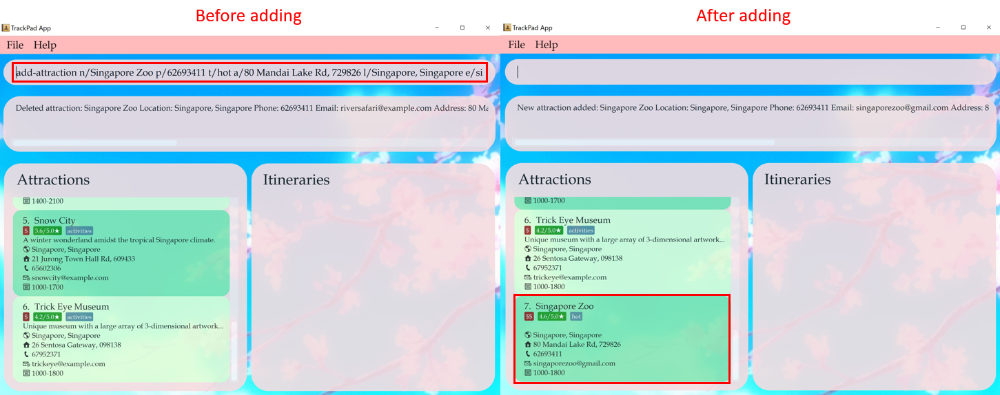
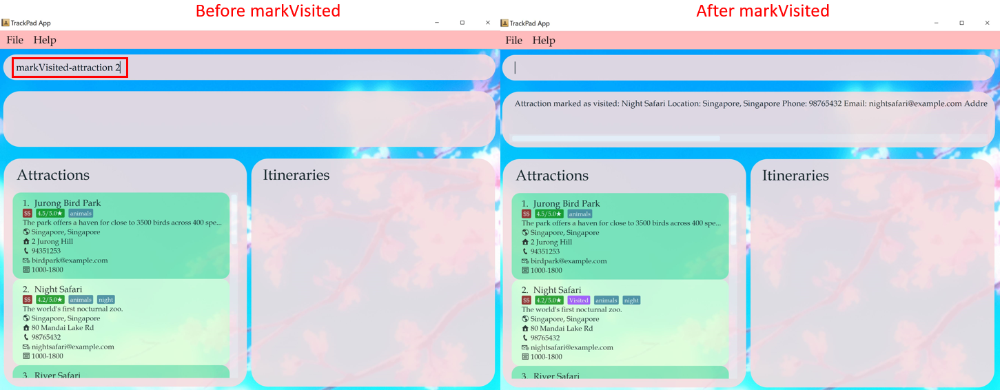
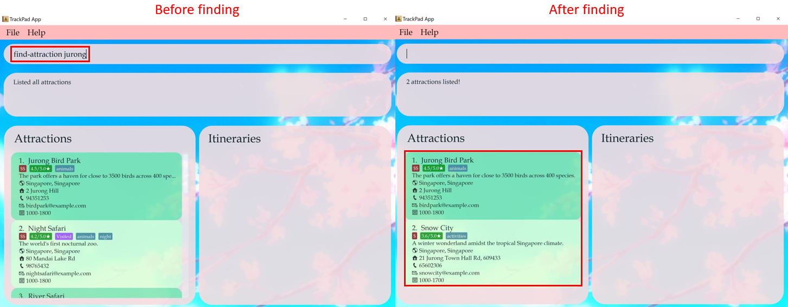
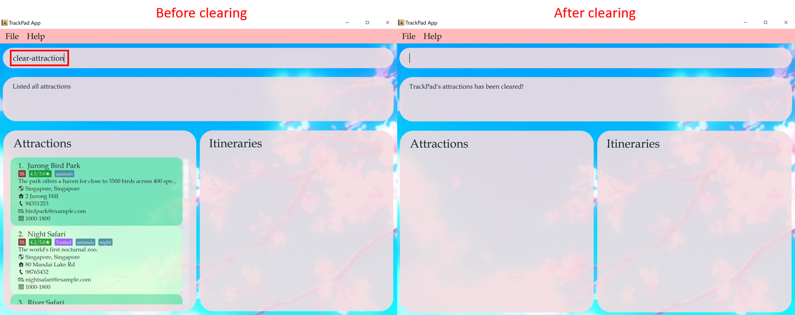

* Table of Contents
{:toc}

--------------------------------------------------------------------------------------------------------------------

## 1. Introduction (York Tat)
TrackPad (TP) is a **desktop app for planning your trips and tracking tourist attractions, optimized for use via a Command Line Interface** (CLI) while still having the benefits of a
Graphical User Interface (GUI). TP is built for people who love to travel, and store all their itineraries in a structured format in one single app.
Our commands are **intuitive** and utilise full words, making them sound more natural and verbose than short forms, so it's **easier** for you to remember.
If you can type fast, TP can get your itinerary planned faster than traditional GUI apps.

--------------------------------------------------------------------------------------------------------------------

## 2. About This Document (York Tat)
Welcome to the TrackPad User Guide!

We at TrackPad believe that tracking your attractions and planning your trips should be both **easy and fuss-free**.
We understand how **messy** it can be when it comes to keeping track of your travel itineraries, which can get frustrating.

That's why here at TrackPad, we have come up with a **simple yet useful** guide to help you get started with using TrackPad.
Minimal prior technical knowledge is needed in order to use TrackPad so try out TrackPad now to make your travel planning **easier and faster**!

--------------------------------------------------------------------------------------------------------------------

## 3. Getting Started (Robin)

Here are the steps to download TrackPad and start using it immediately!

1. Ensure you have Java `11` or above installed in your Computer.

1. Download the latest `trackpad.jar` from [here](https://github.com/AY2021S1-CS2103T-T09-3/tp/releases).

1. Copy the file to the folder you want to use as the _home folder_ for your TrackPad.

1. Double-click the file to start the app. An application similar to Figure 1 should appear in a few seconds. Here's how your app should look like!
    Note how the app contains data on Rediscover Singapore attractions.   
   
   
<i>Figure 1. The Ui of TrackPad</i>

1. Type the command in the command box and press Enter to execute it. Let's try it out by adding Gardens by the Bay into the app.
    Type in `add-attraction n/Gardens by the Bay l/Singapore, Singapore a/18 Marina Gardens Dr, 018953 r/4.7` ! Your application should
    look like this when you scroll to the bottom of the attraction list.

    
    
<i>Figure 2. Adding Gardens by the Bay</i>

1. Oh no, you forgot to add the opening hours for Gardens by the Bay. No worries! By using the
   `edit-attraction 11 op/0500-0200` , we can edit the 11th attraction to add the opening hours from 5am to 2am.

   
   
<i>Figure 3. Editing Gardens by the Bay to add Opening Hours</i>

1. Now, you want to create a one day itinerary to visit the Gardens by the Bay. Easy! Just type in
   `add-itinerary n/Walk in the Park sd/01-01-2021 ed/01-01-2021 d/Appreciate Singapore's flora and fauna`

   
   
<i>Figure 4. Adding the new itinerary</i>

1. To add Gardens by the Bay into the itinerary you just created, select the itinerary you want to add the attraction into,
   by `select-itinerary 2`.

    
    
<i>Figure 5. Selecting the itinerary</i>

    
1. If you want to visit Gardens by the Bay from 10am to 2pm on the first day of your trip, type
   `add-itinerary-attraction 11 day/1 st/1000 et/1400`.

   
   
<i>Figure 6. Adding Gardens by the Bay into the itinerary</i>

 
1. You are done! Feel free to add more attractions into the itinerary, or read on to discover other commands that will
   give you more control over TrackPad, such as [`find-attraction`](#425-finding-a-tourist-attraction--find-attraction)
   and [`delete-attraction`](##423-deleting-a-tourist-attraction---delete-attraction)!

--------------------------------------------------------------------------------------------------------------------

## 4. Features

In this section, we will go into the details of all the features available for you to use after
installing TrackPad. These features are split into 4 subsections, Attraction Features (4.2),
Itinerary Features (4.3), Itinerary Attraction Features (4.4) and Miscellaneous Features (4.5).

### 4.1 Command Format (Yuxuan)

**:information_source: Notes about the command format:** 

* Words in `UPPER_CASE` are the fields to be supplied by you. 
  e.g. in `add-attraction n/ATTRACTION`, `ATTRACTION` is a field which can be used as `add-attraction n/USS`.

* Fields in square brackets are optional. 
  e.g `n/ATTRACTION [t/TAG]` can be used as `n/USS t/28 OCT` or as `n/USS`.

* Fields with `…`​ after them can be used multiple times or not used at all. 
  e.g. `[t/TAG]…​` can be used as ` ` (not used), `t/Singapore`, `t/friend t/family` etc.

* If a field cannot be used multiple times, and you supply 2 or more of the same field, the app takes only the last specified field. 
  e.g. if you type `add-attraction n/USS n/Marina Bay Sands l/Singapore, Singapore`, which contains 2 names, "USS" and "Marina Bay Sands", only "Marina Bay Sands" is taken.

* Parameters can be in any order. 
  e.g. if the command specifies `n/ATTRACTION p/PHONE_NUMBER`, `p/PHONE_NUMBER n/ATTRACTION` is also acceptable.

### 4.2 Attraction Features (York Tat)

Attractions are the core building blocks of TrackPad and are required to populate your itineraries!
The table below shows a summary of the commands in this section.

Action | Format, Examples
--------|------------------
**[Add attraction](#421-adding-a-tourist-attraction-add-attraction)** | `add-attraction n/ATTRACTION_NAME l/LOCATION [d/DESCRIPTION] [p/PHONE_NUMBER] [e/EMAIL] [a/ADDRESS] [op/OPENING_HOURS] [pr/PRICE_RANGE] [r/RATING] [v/VISITED] [t/TAG]…​`   e.g. `add n/Singapore Zoo p/62693411 t/hot a/80 Mandai Lake Rd, 729826`
**[Edit attraction](#422-editing-a-tourist-attraction-edit-attraction)** | `edit-attraction INDEX [n/NAME] [p/PHONE_NUMBER] [e/EMAIL] [a/ADDRESS] [t/TAG]…​`  e.g. `edit 2 n/Singapore Zoo e/zoo@example.com`
**[Delete attraction](#423-deleting-a-tourist-attraction--delete-attraction)** | `delete-attraction INDEX`  e.g. `delete 3`
**[Mark Visited attraction](#424-marking-a-tourist-attraction-as-visited-markvisited-attraction)** | `markVisited-attraction INDEX`  e.g. `markVisited-attraction 2`
**[Find attraction](#425-finding-a-tourist-attraction-find-attraction)** | `find-attraction KEYWORD [MORE_KEYWORDS]`  e.g. `find Zoo`
**[List attractions](#426-listing-all-tourist-attractions--list-attraction)** | `list-attraction`
**[Clear all attractions](#427-clearing-all-attractions--clear-attraction)** | `clear-attraction`

#### 4.2.1 Adding a tourist attraction: `add-attraction`

Adds a tourist attraction to the current list of attractions. Each attraction must contain a name and a location.
Additionally, use the optional fields (as listed below) to include more information for your attractions.

Format (Minimal): `add-attraction n/ATTRACTION_NAME l/LOCATION`

Format (All fields): `add-attraction n/ATTRACTION_NAME l/LOCATION [d/DESCRIPTION] [p/PHONE_NUMBER] [e/EMAIL] [a/ADDRESS]
[op/OPENING_HOURS] [pr/PRICE_RANGE] [r/RATING] [v/VISITED] [t/TAG]…​`

| Compulsory fields | Description |
|---|---|
| **ATTRACTION_NAME** | Contains only letters and numbers and should not be blank |
| **LOCATION** | Can take any value, we recommend the format: `CITY, COUNTRY` |

| Optional fields | Description |
|---|---|
| **DESCRIPTION** | Can take any value |
| **PHONE_NUMBER** | Contains only numbers and be at least 3 digits long with no spaces in between |
| **EMAIL** | Takes the format `local-part@domain` |
| **ADDRESS** | Postal address of the attraction, can take any value |
| **OPENING_HOURS** | Takes the format `opening time - closing time`, both in the 24H format `HHMM-HHMM` |
| **PRICE_RANGE** | Takes one of the following ranges: `LOW`, `MEDIUM` or `HIGH` |
| **RATING** | Takes a number between `0.0` to `5.0` |
| **VISITED** | Takes either `TRUE` if visited or `FALSE` otherwise |
| **TAG** | Contains only letters and numbers |

:information_source: **Note:**
The opening time of an attraction can be more than it's the closing time, for those
which operates overnight.

:bulb: **Tip:**
An attraction can have any number of tags.

Examples:
* `add-attraction n/USS a/8 Sentosa Gateway, 098269 l/Singapore, Singapore`
* `add-attraction n/Singapore Zoo p/62693411 t/hot a/80 Mandai Lake Rd, 729826 l/Singapore, Singapore e/singaporezoo@gmail.com
op/1000-1800 pr/MEDIUM r/4.6 v/FALSE`  

<i>Figure 2. The result of <code>add-attraction n/Singapore Zoo p/62693411 t/hot a/80 Mandai Lake Rd, 729826 l/Singapore, Singapore e/singaporezoo@gmail.com
op/1000-1800 pr/MEDIUM r/4.6 v/FALSE</code></i>

:information_source: **Note:**
Multiple attractions of the same name and location cannot be added into the current list of attractions.

:warning: **Warning:**
The names and locations of attractions are case sensitive.
`add-attraction n/Singapore Zoo l/Singapore` followed by
`add-attraction n/singapore zoo l/singapore` will create two different attractions in the same list.

#### 4.2.2 Editing a tourist attraction: `edit-attraction`

Edits a tourist attraction in the current list of attractions.

Format: `edit-attraction INDEX [n/ATTRACTION_NAME] [l/LOCATION] [d/DESCRIPTION] [p/PHONE_NUMBER] [e/EMAIL] [a/ADDRESS]
[op/OPENING_HOURS] [pr/PRICE_RANGE] [r/RATING] [v/VISITED] [t/TAG]…​`

* Edits the attraction at the specified `INDEX` shown in the attractions panel.
* Field entries are the same as the `add-attraction` command.
* Any field can be changed by inputting its corresponding prefix in the command.
    * Example: `add-attraction n/MBS l/Singapore, Singapore r/4.3` in an attraction list followed by
    `edit-attraction 1 r/4.6` changes the rating of the 1st attraction in the list from `4.3` to `4.6`. 
    
    
<i>Figure 3. The result of <code>edit-attraction 1 r/4.6</code></i>

* New fields can be added to current attractions.
    * Example: `edit-attraction 1 pr/MEDIUM t/hotel` adds the price range of MBS as `MEDIUM` and adds an `hotel` tag.  
    
    
<i>Figure 4. The result of <code>edit-attraction 1 pr/MEDIUM t/hotel</code></i>

:information_source: **Note:**
You can use `edit-attraction INDEX prefix/ ` to remove existing optional fields.

:warning: **Warning:**
Editing the tag of an attraction does not add on to its existing tags. Rather, it replaces all existing tags with the
new tags you’re specifying.

#### 4.2.3 Deleting a tourist attraction : `delete-attraction`

Deletes a tourist attraction from the current list of attractions.

Format: `delete-attraction INDEX`

* Deletes the attraction at the specified `INDEX` shown in the attractions panel.

Examples:
* `list-attraction` followed by `delete-attraction 1` deletes the 1st attraction in the TrackPad.  

<i>Figure 5. The result of <code>delete-attraction 1</code></i>

* `find-attraction animals` followed by `delete-attraction 2` deletes the 2nd tourist attraction in the results of the `find-attraction` command.

#### 4.2.4 Marking a tourist attraction as visited: `markVisited-attraction`

Marks a tourist attraction in the current list of attractions as visited.

Format: `markVisited-attraction INDEX`

* Marks the attraction at the specified `INDEX` shown in the attractions panel as visited.
* Any attraction can be marked visited, even if the attraction was already visited.

Examples:
* `markVisited-attraction 2` marks the 2nd attraction in the TrackPad as visited.  

  
<i>Figure 6. The result of <code>markVisited-attraction 2</code></i>

* Typing `markVisited-attraction 2` again will show that the 2nd attraction in the TrackPad is visited.

#### 4.2.5 Finding a tourist attraction: `find-attraction`

Finds any tourist attraction which contains the keyword(s).

Format: `find-attraction KEYWORD [MORE_KEYWORDS]`

* The search is case-insensitive. e.g `singapore zoo` will match `Singapore Zoo`.
* The order of the keywords does not matter. e.g. `Zoo Singapore` will match `Singapore Zoo`.
* Only the attractions in the list of attractions will be searched.
* Only full words will be matched e.g. `Sento` will not match `Sentosa`.

Examples:
* `find-attraction jurong` returns `Jurong Bird Park` and `Snow City`  

<i>Figure 7. The result of <code>find-attraction jurong</code></i>

#### 4.2.6 Listing all tourist attractions : `list-attraction`

Shows a list of all the tourist attractions. Use this command to reset the view of the Attractions panel, as
certain commands (`find-attraction`) can alter the view of the Attractions panel.

Format: `list-attraction` 

<i>Figure 8. The result of <code>list-attraction</code></i>

:information_source: **Note:**
`list-attraction` will work even if there are extra characters behind the command.
Eg. `list-attraction abcd` will behave like `list-attraction`.

#### 4.2.7 Clearing all attractions : `clear-attraction`

Clears all tourist attractions.

Format: `clear-attraction`

:warning: **Warning:**
`clear-attraction` will remove all the attractions stored in TrackPad.
This action is irreversible and should be used with caution.

 

<i>Figure 9. The result of <code>clear-attraction</code></i>

### 4.3 Itinerary Features

Itineraries help track the details of your trip, as well as the attractions you plan on visiting. 

The table below shows a summary of the commands in this section.

Action | Format, Examples
--------|------------------
**[Add itinerary](#431-adding-a-new-itinerary-add-itinerary)** | `add-itinerary n/ITINERARY sd/START_DATE ed/END_DATE [d/DESCRIPTION] [b/BUDGET]`   e.g. `add-itinerary n/Japan holiday sd/15-01-2019 ed/30-01-2019 d/with friends b/4000`
**[Edit itinerary](#432-editing-an-itinerary-edit-itinerary)** | `edit-itinerary INDEX [n/NAME] [sd/START_DATE] [ed/END_DATE] [d/DESCRIPTION] [b/BUDGET]`  e.g. `edit-itinerary 2 n/Singapore journey sd/05-06-2019`
**[Delete itinerary](#433-deleting-an-itinerary-delete-itinerary)** | `delete-itinerary INDEX`  e.g. `delete-itinerary 3`
**[Find itinerary](#434-finding-an-itinerary-find-itinerary)** | `find-itinerary KEYWORD [MORE_KEYWORDS]`  e.g. `find-itinerary Korea`
**[List itineraries](#435-listing-all-itineraries-list-itinerary)** | `list-itinerary`
**[Select itinerary](#436-selecting-an-itinerary-select-itinerary)** | `select-itinerary INDEX`  e.g. `select-itinerary 3`
**[Clear all itineraries](#437-clearing-all-itineraries--clear-itinerary)** | `clear-itinerary`

Read on to find out more!

#### 4.3.1 Adding a new itinerary: `add-itinerary`

Adds a new itinerary to the current list of itineraries.

Format: `add-itinerary n/ITINERARY_NAME sd/START_DATE ed/END_DATE [d/DESCRIPTION] [b/BUDGET]`

| Compulsory fields | Description |
|---|---|
| **ITINERARY_NAME** | Takes only letters and numbers and should not be blank |
| **START_DATE** | Takes the format `dd-mm-yyyy` and should not be after the end date |
| **END_DATE** | Takes the format `dd-mm-yyyy` and should not be before the start date |

| Optional fields | Description  |
|---|---|
| **DESCRIPTION** | Takes any value |
| **BUDGET** | Takes only a non-negative number up to two decimal places |

:information_source: **Note:**
The budget for the trip should not be more than 15 digits, including the decimal places (if any).

Example:

Let's say you want to add an itinerary for a trip to Europe with your friends. 
 
1. Enter `add-itinerary n/Europe Trip sd/01-12-2020 ed/20-12-2020 d/with friends b/4000` into the app.  

   
   
<i>Figure 10a. Before entering <code>add-itinerary n/Europe Trip sd/01-12-2020 ed/20-12-2020 d/with friends b/4000</code></i>

2. Note how your new itinerary appears in the `Itineraries` section of the app. 

   
   
<i>Figure 10b. After entering <code>add-itinerary n/Europe Trip sd/01-12-2020 ed/20-12-2020 d/with friends b/4000</code></i>

 

:warning: **Warning:**
The names of itineraries are case sensitive.
`add-itinerary n/japan trip sd/20-12-2020 ed/30-12-2020` followed by
`add-itinerary n/Japan Trip sd/20-12-2020 ed/30-12-2020` will create two different itineraries in the same list.

:information_source: **Note:**
Multiple itineraries of the same name, start date and end date cannot be added into the list of itineraries.

#### 4.3.2 Editing an itinerary: `edit-itinerary`

Edits an itinerary from the current list of itineraries.

Format: `edit-itinerary INDEX [n/NAME] [sd/START_DATE] [ed/END_DATE] [d/DESCRIPTION] [b/BUDGET]`

* Edits the itinerary at the specified `INDEX` shown in the itinerary panel.
* Field entries are the same as the [`add-itinerary`](#431-adding-a-new-itinerary-add-itinerary) command.
* Any field can be changed by inputting its corresponding prefix in the command.

Example:

Let's say after adding a second itinerary that starts on `01-12-2020`, you want to change the start date to `06-12-2020`. 

1. Enter `edit-itinerary 2 sd/06-12-2020` into the app.

    
    
<i>Figure 11a. Before entering <code>edit-itinerary 2 sd/06-12-2020</code></i>

2. Note how the start date of the second itinerary has changed from `01-12-2020` to `06-12-2020`.

    
    
<i>Figure 11b. After entering <code>edit-itinerary 2 sd/06-12-2020</code></i>

:information_source: **Note:**
You can use `edit-itinerary INDEX prefix/ ` to remove existing optional fields.

#### 4.3.3 Deleting an itinerary: `delete-itinerary`

Deletes an itinerary from the current list of itineraries.

Format: `delete-itinerary INDEX`

* Deletes the itinerary at the specified `INDEX` shown in the itinerary panel.

Example:

Let's say you do not want to store the first itinerary in the app anymore, and you want to delete it.

1. Enter `delete-itinerary 1` into the app. 

    
    
<i>Figure 12a. Before entering <code>delete-itinerary 1</code></i>

2. Note how your first itinerary has been deleted, and there is now one less itinerary. 

    
    
<i>Figure 12b. After entering <code>delete-itinerary 1</code></i>

#### 4.3.4 Finding an itinerary: `find-itinerary`

Finds itineraries from the current list of itineraries which contain the keyword(s).

Format: `find-itinerary KEYWORD [MORE_KEYWORDS]`

* The search is case-insensitive. e.g `japan` will match `Japan`
* The order of the keywords does not matter. e.g. `Okinawa Japan` will match `Japan Okinawa`
* Every [itinerary field](#431-adding-a-new-itinerary-add-itinerary) will be searched, as well as the fields of all the [itinerary attractions](#44-itinerary-attraction-features) in the itinerary.
* Only full words will be matched e.g. `Jap` will not match `Japan`

Example:

Let's say you want to look for all the itineraries that contain the keyword `Europe`.

1. Enter `find-itinerary Europe`
    
    
<i>Figure 13a. Before entering <code>find-itinerary Europe</code></i>

2. Note how only the itinerary with `Europe` in its name is displayed. 

    
    
<i>Figure 13b. After entering <code>find-itinerary Europe</code></i>

#### 4.3.5 Listing all itineraries: `list-itinerary`

Shows all itineraries. Use this command to reset the view of the Itineraries panel, as 
certain commands ([`find-itinerary`](#434-finding-an-itinerary-find-itinerary), [`select-itinerary`](#436-selecting-an-itinerary-select-itinerary)) can alter the view of the Itineraries panel. 

Format: `list-itinerary` 

Example: 

After finding an itinerary, you want to go back to seeing all your itineraries. 

1. Enter `list-itinerary` into the app. 

    
    
<i>Figure 14a. Before entering <code>list-itinerary</code></i>

2. Note how all your itineraries are displayed again.

    
    
<i>Figure 14b. After entering <code>list-itinerary</code></i>

:information_source: **Note:**
`list-itinerary` will work even if there are extra characters behind the command.
Eg. `list-itinerary abcd` will behave like `list-itinerary`.

#### 4.3.6 Selecting an itinerary: `select-itinerary`

Selects an itinerary to be shown in detail, from the current list of itineraries. 
In detailed view, you can see a timetable of the attractions in the itinerary. 
For more information on how to add, edit, and delete attractions in an itinerary, see [Itinerary Attraction Features](#44-itinerary-attraction-features).

Format: `select-itinerary INDEX`

* Selects the itinerary at the specified `INDEX` shown in the itinerary panel.

:bulb: **Tip:**
To go back to seeing the list of itineraries, use `list-itinerary`.

Example:

Let's say you want to view the attractions you want to visit in your first itinerary. 

1. Enter `select-itinerary 1` into the app. 

    
    
<i>Figure 15a. Before entering <code>select-itinerary 1</code></i>

2. Note how the itinerary panel has changed to show a detailed view of the attractions in the itinerary. 

    
    
<i>Figure 15b. After entering <code>select-itinerary 1</code></i>

    
#### 4.3.7 Clearing all itineraries : `clear-itinerary`

Clears all itineraries.

Format: `clear-itinerary`

:warning: **Warning:**
`clear-itinerary` will remove all the itineraries stored in TrackPad.
This action is irreversible and should be used with caution.

Example:

You want to delete all your itineraries, and start with an empty list of itineraries. 

1. Enter `clear-itinerary` into the app. 

    
    
<i>Figure 16. Before entering <code>clear-itinerary</code></i>

2. Note how all your itineraries are now deleted. 

    
    
<i>Figure 16. After entering <code>clear-itinerary</code></i>

### 4.4 Itinerary Attraction Features (Yeh Yu Chun)
Itinerary attractions are attractions added to an itinerary, but with additional start/end time fields. These commands deal with attractions that are found in an itinerary.

:information_source: **Note:**
Any command in this section requires an itinerary to be first selected. Refer to [Selecting an itinerary](#436-selecting-an-itinerary-select-itinerary) to select an Itinerary before proceeding.

The table below shows a summary of the commands in this section.

Action | Format, Examples
--------|------------------
**Add itinerary attraction** | `add-itinerary-attraction INDEX st/START_TIME et/END_TIME day/DAY_VISITING`   e.g. `add-itinerary-attraction 1 st/1400 et/1500 day/5`
**Edit itinerary attraction** | `edit-itinerary-attraction INDEX day/DAY_VISITING [st/START_TIME] [et/END_TIME]`   e.g. `edit-itinerary-attraction 1 day/2 st/0900 et/1000`
**Delete itinerary attraction** | `delete-itinerary-attraction INDEX`  e.g. `delete-itinerary-attraction 1`

<i>Figure 17. Diagram simulating the attractions found in an itinerary</i>
 

In Figure 17 above, Itinerary 1 has been selected with `select-itinerary 1` command, shown on the right of the image with a red border.
Attractions inside `Selected Itinerary` is an itinerary attraction. Notice both copy of `Jurong Bird Park` has almost the same fields, but with the addition of a start/end time field.

#### 4.4.1 Adding an attraction to the selected itinerary: `add-itinerary-attraction`
Adds an attraction to the selected itinerary.

Format: `add-itinerary-attraction INDEX st/START_TIME et/END_TIME day/DAY_VISITING`

| Compulsory fields | Description |
|---|---|
| **INDEX** | Index of attraction in the current list of attractions |
| **START_TIME** | Start time to visit the attraction in the 24H format `HHMM` |
| **END_TIME** | End time to visit the attraction in the 24H format `HHMM` |
| **DAY_VISITING** | Day in your itinerary when you plan to visit the attraction |

<!--
//Examples:
// * `add-itinerary-attraction 2 st/1000 et/1600 day/3`
// * `add-itinerary-attraction 1 st/0900 et/1200 day/1` adds `Jurong Bird Park` into day 1 of selected itinerary  
// 
// 
<i>Figure 18. The result of <code>add-itinerary-attraction 1 st/0900 et/1200 day/1</code></i>
 
-->
For example:

1. Look on the left side of the image below. You want to add `Night Safari` to your `Selected Itinerary`.

1. You type `add-itinerary-attraction 2 day/2 st/1000 et/1100`, where you want to visit it on day 2, from `1000` to `1100` and press <kbd>Enter</kbd> to add it.

1. `Night Safari` has been added into your `Selected Itineray`.

Try these other examples too!
* `add-itinerary-attraction 3 st/1000 et/1600 day/3` Adds the third item from Attractions list into `Day 3` of the `Selected Itinerary`.
* `add-itinerary-attraction 5 st/0900 et/1200 day/4` Adds the fifth item from Attractions lists into `Day 4` of the `Selected Itinerary`.
    

:bulb: **Tip:**
The start time and end time cannot overlap with other attractions in the selected itinerary.
Also, the start and end time does not need to match the opening hours of the attraction, so that you can visit closed attractions.

:information_source: **Note:**
The attraction will be added into the selected itinerary.

#### 4.4.2 Editing an attraction from the selected itinerary : `edit-itinerary-attraction`
Edits an existing attraction in the selected itinerary.

Format: `edit-itinerary-attraction INDEX day/DAY_VISITING [st/START_TIME] [et/END_TIME][n/ATTRACTION_NAME] [l/LOCATION] [d/DESCRIPTION] [p/PHONE_NUMBER] [e/EMAIL] [a/ADDRESS][op/OPENING_HOURS] [pr/PRICE_RANGE] [r/RATING] [v/VISITED] [t/TAG]…​`

* Edits the attraction specified by the `INDEX` and `DAY_VISITING` shown in the itinerary panel.
* At least one of the optional fields must be provided.
* Existing values will be updated to the input values.

<!--
Examples:
* `edit-itinerary-attraction 3 day/3 st/1500 et/1800` Edits the start time, end time of the third attraction on day 2 of the selected itinerary to  be `1500` and `1800` respectively.
* `edit-itinerary-attraction 1 day/4 st/1500` edits the starting time to visit the attraction`Jurong Bird Park`  

<i>Figure 19. The result of <code>edit-itinerary-attraction 1 day/1 st/1500</code></i>

-->

For example:

1. You made a mistake by adding the `START_TIME` of `Night Safari` as `1000`, but it is not open in the day.

1. You type `edit-itinerary-attraction 1 day/2 st/1900 et/2300`, and press <kbd>Enter</kbd> to edit it.

1. Scroll down the `Selected Itinerary` and notice the `START_TIME` of `Night Safari` has been changed to `1900 - 2300`.

Try these other examples too!
* `edit-itinerary-attraction 1 day/2 et/2200` Edits the `END_TIME` of the attraction first attraction in `Day 2` to be `2200`    

:bulb: **Tip:**
Some fields can be left empty to remove it. Example, <code>edit-itinerary-attraction 1 day/1 t/ </code> would remove the tag from the attraction.

:information_source: **Note:**
Only the INDEX and day/DAY_VISITING is required to identify the field to edit.

#### 4.4.3 Deleting an attraction from the selected itinerary: `delete-itinerary-attraction`
Deletes an attraction from the selected itinerary.

Format: `delete-itinerary-attraction INDEX day/DAY_VISITING`

* Deletes the attraction specified by the `INDEX` and `DAY_VISITING` shown in the itinerary panel.

For example:

1. You no longer want to visit `Night Safari`.

1. You want to delete it from your `Selected Itinerary`.

1. You type `delete-itinerary-attraction 1 day/2`, and press <kbd>Enter</kbd> to delete it.

1. Scroll down the `Selected Itinerary` and notice `Day 2` is now empty.

Try these other examples too!
* `delete-itinerary-attraction 1 day/1` Deletes the first attraction from `Day 1` of `Selected Itinerary`.

<!--
Examples:
* `delete-itinerary-attraction 1 day/1` removes `Jurong Bird Park from the itinerary`  

<i>Figure 20. The result of <code>delete-itinerary-attraction 1 day/1</code></i>

-->

### 4.5 Miscellaneous Features (Yuxuan)

These basic features help TrackPad to run smoothly, as well as allow you to interact with TrackPad without the use of your mouse, perfect for fast typists!

#### 4.5.1 Viewing help : `help`

You can use this command whenever you are unsure about any features, and the link will lead you straight to our user guide which will help to clarify your doubts.

<i>Figure 21. The help window of TrackPad</i>

Format: `help`

#### 4.5.2 Exiting the program : `exit`

You can type this command into the command box to exit the program.

Format: `exit`

#### 4.5.3 Saving the data

TrackPad data will be saved in the storage automatically after any command that changes the data.
There is no need for you to save manually.

--------------------------------------------------------------------------------------------------------------------

## 5. FAQ

**Q**: How do I transfer my data to another Computer? 
**A**: Install the app in the other computer and overwrite the empty data file it creates with the file that contains the data of your previous TrackPad home folder.

--------------------------------------------------------------------------------------------------------------------

## 6. Glossary (Yuxuan)

* **Command Line Interface (CLI):** An interface that processes commands to a computer program in the form of lines of text.
* **Graphical User Interface (GUI):** An interface that allows users to interact with through visual indicator representations.
* **Prefix:** The letter(s) and '/' placed before the corresponding fields when typing the commands ('n/' for Name, 'op/' for Opening Hours etc).
* **INDEX:** The number shown in the displayed attractions/itinerary panel. Must be a positive number (1, 2, 3, ...)
* **DAY_VISITING:** The day in a selected itinerary which contains the attraction(s) planned to visit. Must be a positive number (1, 2, 3, ...)

--------------------------------------------------------------------------------------------------------------------

## 7. Command summary (Robin)

Below is a condensed table for all the commands currently supported in our app. Refer to this table when you are sure
about how the commands work, and you just want a quick refresher.

### 7.1 Attraction Commands

Action | Format, Examples
--------|------------------
**[Add attraction](#421-adding-a-tourist-attraction-add-attraction)** | `add-attraction n/ATTRACTION_NAME l/LOCATION [d/DESCRIPTION] [p/PHONE_NUMBER] [e/EMAIL] [a/ADDRESS] [op/OPENING_HOURS] [pr/PRICE_RANGE] [r/RATING] [v/VISITED] [t/TAG]…​`   e.g. `add n/Singapore Zoo p/62693411 t/hot a/80 Mandai Lake Rd, 729826`
**[Edit attraction](#422-editing-a-tourist-attraction-edit-attraction)** | `edit-attraction INDEX [n/NAME] [p/PHONE_NUMBER] [e/EMAIL] [a/ADDRESS] [t/TAG]…​`  e.g. `edit 2 n/Singapore Zoo e/zoo@example.com`
**[Delete attraction](#423-deleting-a-tourist-attraction--delete-attraction)** | `delete-attraction INDEX`  e.g. `delete 3`
**[Mark Visited attraction](#424-marking-a-tourist-attraction-as-visited-markvisited-attraction)** | `markVisited-attraction INDEX`  e.g. `markVisited-attraction 2`
**[Find attraction](#425-finding-a-tourist-attraction-find-attraction)** | `find-attraction KEYWORD [MORE_KEYWORDS]`  e.g. `find Zoo`
**[List attractions](#426-listing-all-tourist-attractions--list-attraction)** | `list-attraction`
**[Clear all attractions](#427-clearing-all-attractions--clear-attraction)** | `clear-attraction`

### 7.2 Itinerary Commands

Action | Format, Examples
--------|------------------
**[Add itinerary](#431-adding-a-new-itinerary-add-itinerary)** | `add-itinerary n/ITINERARY sd/START_DATE ed/END_DATE [d/DESCRIPTION] [b/BUDGET]`   e.g. `add-itinerary n/Japan holiday sd/15-01-2019 ed/30-01-2019 d/with friends b/4000`
**[Edit itinerary](#432-editing-an-itinerary-edit-itinerary)** | `edit-itinerary INDEX [n/NAME] [sd/START_DATE] [ed/END_DATE] [d/DESCRIPTION] [b/BUDGET]`  e.g. `edit-itinerary 2 n/Singapore journey sd/05-06-2019`
**[Delete itinerary](#433-deleting-an-itinerary-delete-itinerary)** | `delete-itinerary INDEX`  e.g. `delete-itinerary 3`
**[Find itinerary](#434-finding-an-itinerary-find-itinerary)** | `find-itinerary KEYWORD [MORE_KEYWORDS]`  e.g. `find-itinerary Korea`
**[List itineraries](#435-listing-all-itineraries-list-itinerary)** | `list-itinerary`
**[Select itinerary](#436-selecting-an-itinerary-select-itinerary)** | `select-itinerary INDEX`  e.g. `select-itinerary 3`
**[Clear all itineraries](#437-clearing-all-itineraries--clear-itinerary)** | `clear-itinerary`

### 7.3 Itinerary attraction Commands

Action | Format, Examples
--------|------------------
**Add itinerary attraction** | `add-itinerary-attraction INDEX st/START_TIME et/END_TIME day/DAY_VISITING`   e.g. `add-itinerary-attraction 1 st/1400 et/1500 day/5`
**Edit itinerary attraction** | `edit-itinerary-attraction INDEX day/DAY_VISITING [st/START_TIME] [et/END_TIME]`   e.g. `edit-itinerary-attraction 1 day/2 st/0900 et/1000`
**Delete itinerary attraction** | `delete-itinerary-attraction INDEX`  e.g. `delete-itinerary-attraction 1`

### 7.4 Miscellaneous Commands

Action | Format, Examples
--------|------------------
**Help** | `help`
**Exit** | `exit`

<!--how to comment in markdown-->

<!--
// to link to a section header,
// all caps -> lower case
// spaces -> -
// __ -> __ (no change)
// !, [], (), :, //, ., -> ignored

Example:
## [![Alt Text][badge__example]](https://example.com) To Somewhere
[Imaged](#alt-textbadge__examplehttpsexamplecom-to-somewhere)

// damn cancer ^^^^ alternatively,
just type [name you want to call](#NoSpaceHeader'sNumber) // intellij will suggest for you lmao
-->
