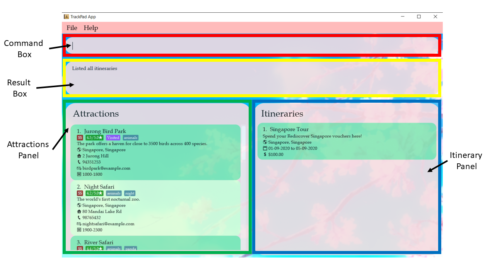
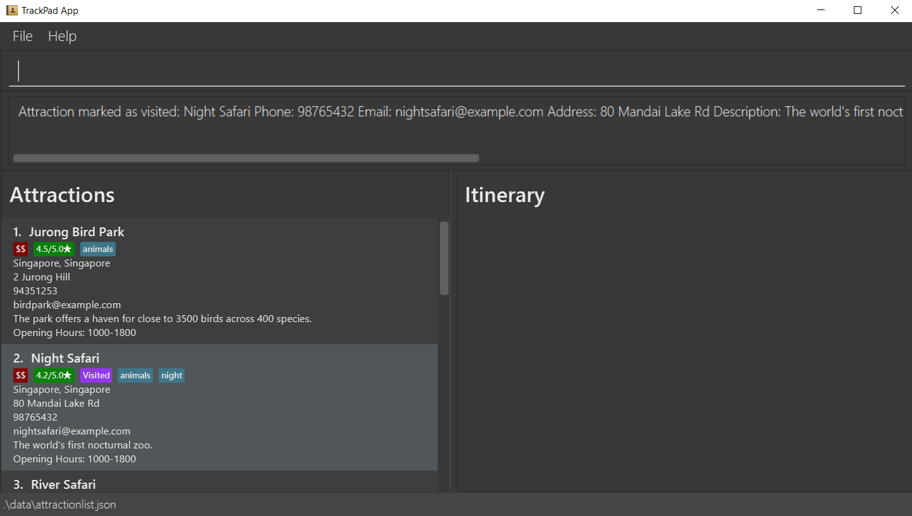
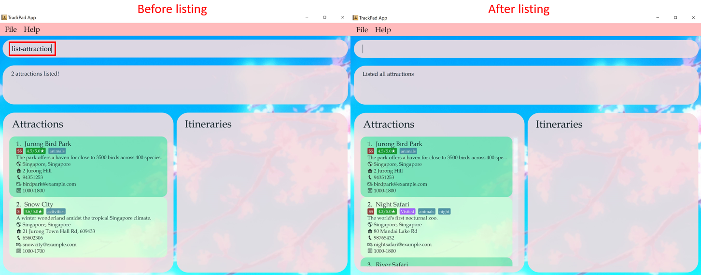
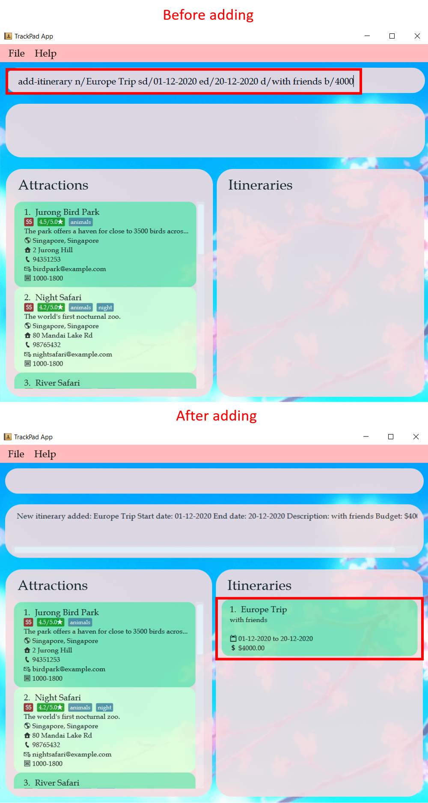
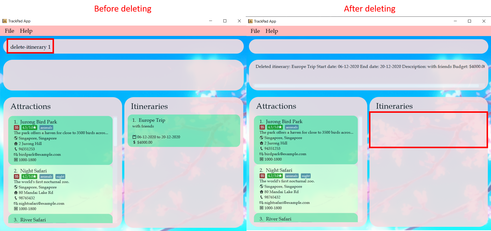
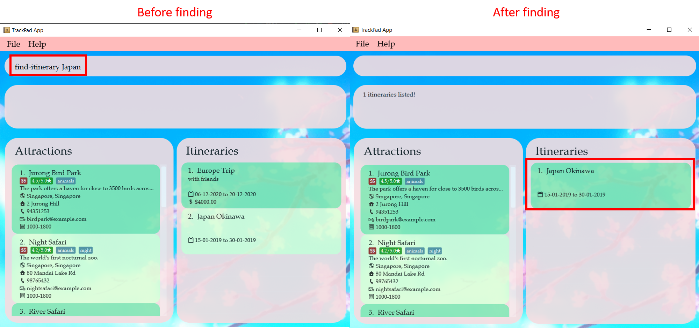
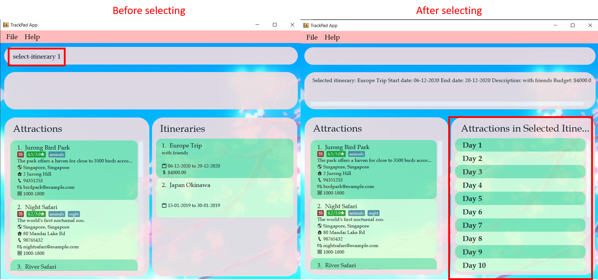
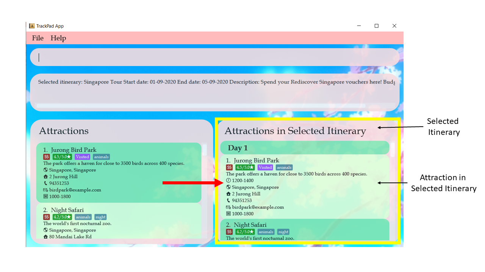
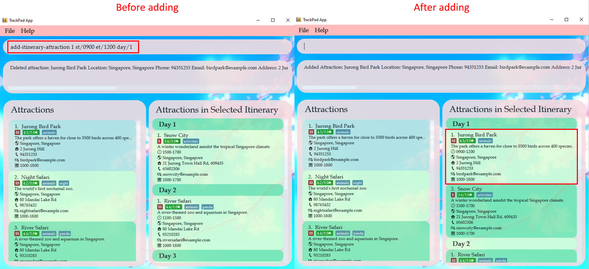
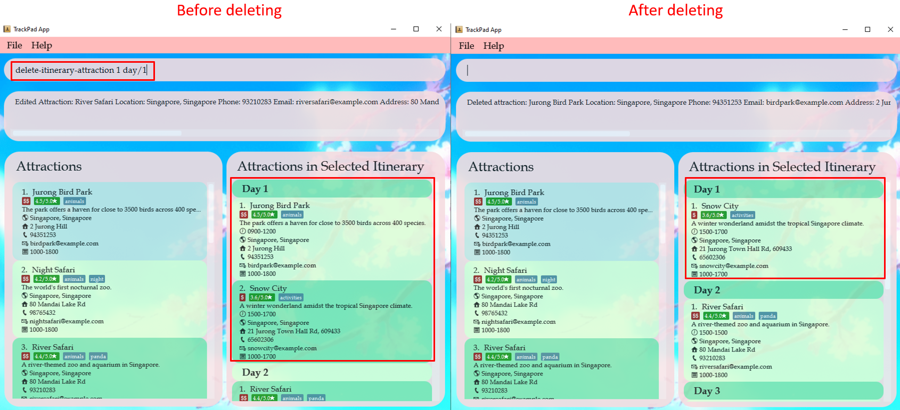

* Table of Contents
{:toc}

--------------------------------------------------------------------------------------------------------------------

## 1. Introduction
TrackPad (TP) is a **desktop app for planning your trips and tracking tourist attractions, optimized for use via a Command Line Interface** (CLI) while still having the benefits of a 
Graphical User Interface (GUI). Our command instructions utilise full words, they sound more natural and verbose than short forms, so it's easier for you to remember. If you can type fast, TP can get your itinerary planned faster than traditional GUI apps.

This user guide will show you how to use the commands and features available in TP. TP is built for people who love to travel, 
and want to collate and store all their itineraries in one single app. We welcome anyone who loves travelling to try out our app.

--------------------------------------------------------------------------------------------------------------------

## 2. About This Document
Welcome to the TrackPad User Guide!

We at TrackPad believe that tracking tourist attractions and planning your trips should be both **easy and fuss-free**. 
We understand how **messy** it can be when it comes to keeping track of your travel itineraries, which can get frustrating.

That's why here at TrackPad, we have come up with a simple yet useful guide to help you get started with using TrackPad.
Minimal prior technical knowledge is needed in order to use TrackPad and we hope to help you with your travel tracking and planning.

--------------------------------------------------------------------------------------------------------------------

## 3. Getting Started

Here are the steps to download TrackPad and start using it immediately!

1. Ensure you have Java `11` or above installed in your Computer.

1. Download the latest `trackpad.jar` from [here](https://github.com/AY2021S1-CS2103T-T09-3/tp/releases).

1. Copy the file to the folder you want to use as the _home folder_ for your TrackPad.

1. Double-click the file to start the app. The GUI similar to the following Figure 1 should appear in a few seconds. Here's how your app should look like!
    Note how the app contains data on Rediscover Singapore attractions.   
   
   
<i>Figure 1. The Ui of TrackPad</i>

1. Type the command in the command box and press Enter to execute it. 
    e.g. typing **`help`** and pressing Enter will open the help window. 
    Try out some of these commands!

   * **`list-attraction`** : Lists all tourist attractions added.

   * **`add-attraction`**` n/Singapore Discovery Center l/Singapore, Singapore p/67926188 t/educational a/510 Upper Jurong Rd, 38365` : 
   Adds an attraction named `Singapore Discovery Center` to TrackPad.

   * **`delete-attraction`**` 3` : Deletes the 3rd attraction shown in the current list.
   
   * **`edit-attraction`**` 3 pr/HIGH` : Edits the 3rd attraction shown in the current list, changing its original
    price range to HIGH.

   * **`clear-attraction`** : Deletes all attractions.

   * **`exit`** : Exits the app.

1. Refer to [Features](#4-features) below for details of each command.

--------------------------------------------------------------------------------------------------------------------

## 4. Features

In this section, we will go into the details of all the features available for you to use after
installing TrackPad. These features are split into 4 subsections, Attraction Features (4.2), 
Itinerary Features (4.3), Itinerary Attraction Features (4.4) and Miscellaneous Features (4.5).

### 4.1 Command Format

**:information_source: Notes about the command format:** 

* Words in `UPPER_CASE` are the fields to be supplied by you. 
  e.g. in `add-attraction n/ATTRACTION`, `ATTRACTION` is a field which can be used as `add-attraction n/USS`.

* Fields in square brackets are optional. 
  e.g `n/ATTRACTION [t/TAG]` can be used as `n/USS t/28 OCT` or as `n/USS`.

* Fields with `…`​ after them can be used multiple times or not used at all. 
  e.g. `[t/TAG]…​` can be used as ` ` (not used), `t/Singapore`, `t/friend t/family` etc.
  
* If a field cannot be used multiple times, and you supply 2 or more of the same field, the app takes only the last specified field. 
  e.g. if you type `add-attraction n/USS n/Marina Bay Sands l/Singapore, Singapore`, which contains 2 names, "USS" and "Marina Bay Sands", only "Marina Bay Sands" is taken.

* Parameters can be in any order. 
  e.g. if the command specifies `n/ATTRACTION p/PHONE_NUMBER`, `p/PHONE_NUMBER n/ATTRACTION` is also acceptable.  

### 4.2 Attraction Features

Attractions are the core building blocks of TrackPad and are required to populate your itineraries! 
The following features are tailored for attractions in TrackPad. 

#### 4.2.1 Adding a tourist attraction: `add-attraction`

Adds a tourist attraction to the current list of attractions. Each attraction must contain a name and a location. 
Additionally, use the optional fields (as listed below) to include more information for your attractions. 

Format (Minimal): `add-attraction n/ATTRACTION_NAME l/LOCATION`

Format (All fields): `add-attraction n/ATTRACTION_NAME l/LOCATION [d/DESCRIPTION] [p/PHONE_NUMBER] [e/EMAIL] [a/ADDRESS] 
[op/OPENING_HOURS] [pr/PRICE_RANGE] [r/RATING] [v/VISITED] [t/TAG]…​`

Compulsory fields:
* **ATTRACTION_NAME**: Name of the attraction. 
* **LOCATION**: Location of the attraction. While any value is possible, we recommend you use the format `CITY, COUNTRY` for a better in-app experience.

Optional fields:
* **DESCRIPTION**: Description of the attraction, can take in any value. Use this to give a brief summary of the attraction.
* **PHONE_NUMBER** 📞: Phone number of the attraction, can only contain numbers and be at least 3 digits long, no spaces.
* **EMAIL** 📧: Email of the attraction in the format `local-part@domain`.
* **ADDRESS** 🏠: Postal address of the attraction, can take in any value. Use this if the location field is not enough for locating the attraction.
* **OPENING_HOURS** 🈺: Opening hours of the attraction in the format `opening time - closing time` (both in 24h format).
* **PRICE_RANGE**: Price range of the attraction. Use `LOW`, `MEDIUM` or `HIGH` to indicate the range.
* **RATING**: Rating of the attraction. Use a number between `0.0` to `5.0` to indicate your experience of the attraction after visiting it.
* **VISITED**: Marks whether you have visited the attraction before. Use `TRUE` if you want to mark it as visited, and `FALSE` otherwise. 
* **TAG**: Adds tags to further describe the attraction. Tag names should only contain letters and numbers.

:information_source: **Note:**
The opening time of an attraction can be more than it's the closing time, for those
which operates overnight.

:bulb: **Tip:**
An attraction can have any number of tags.

Examples:
* `add-attraction n/USS a/8 Sentosa Gateway, 098269 l/Singapore, Singapore`
* `add-attraction n/Singapore Zoo p/62693411 t/hot a/80 Mandai Lake Rd, 729826 l/Singapore, Singapore e/singaporezoo@gmail.com 
op/1000-1800 pr/MEDIUM r/4.6 v/FALSE`  

<i>Figure 2. The result of <code>add-attraction n/Singapore Zoo p/62693411 t/hot a/80 Mandai Lake Rd, 729826 l/Singapore, Singapore e/singaporezoo@gmail.com 
op/1000-1800 pr/MEDIUM r/4.6 v/FALSE</code></i>

:information_source: **Note:**
Multiple attractions of the same name and location cannot be added into the current list of attractions.

:warning: **Warning:**
The names and locations of attractions are case sensitive.
`add-attraction n/Singapore Zoo l/Singapore` followed by 
`add-attraction n/singapore zoo l/singapore` will create two different attractions in the same list.

#### 4.2.2 Editing a tourist attraction: `edit-attraction`

Edits a tourist attraction in the current list of attractions.

Format: `edit-attraction INDEX [n/ATTRACTION_NAME] [l/LOCATION] [d/DESCRIPTION] [p/PHONE_NUMBER] [e/EMAIL] [a/ADDRESS]
[op/OPENING_HOURS] [pr/PRICE_RANGE] [r/RATING] [v/VISITED] [t/TAG]…​`
 
* Edits the attraction at the specified `INDEX` shown in the attractions panel.
* Field entries are the same as the `add-attraction` command.
* Any field can be changed by inputting its corresponding prefix in the command.
    * Example: `add-attraction n/MBS l/Singapore, Singapore r/4.3` in an attraction list followed by 
    `edit-attraction 1 r/4.6` changes the rating of the 1st attraction in the list from `4.3` to `4.6`.         
    
    
<i>Figure 3. The result of <code>edit-attraction 1 r/4.6</code></i>

* New fields can be added to current attractions.
    * Example: `edit-attraction 1 pr/MEDIUM t/hotel` adds the price range of MBS as `MEDIUM` and adds an `hotel` tag.  
    
    
<i>Figure 4. The result of <code>edit-attraction 1 pr/MEDIUM t/hotel</code></i>

:information_source: **Note:**
You can use `edit-attraction INDEX prefix/ ` to remove existing optional fields.

:warning: **Warning:**
Editing the tag of an attraction does not add on to its existing tags. Rather, it replaces all existing tags with the 
new tags you’re specifying.

#### 4.2.3 Deleting a tourist attraction : `delete-attraction`

Deletes a tourist attraction from the current list of attractions.

Format: `delete-attraction INDEX`

* Deletes the attraction at the specified `INDEX` shown in the attractions panel.

Examples:
* `list-attraction` followed by `delete-attraction 1` deletes the 1st attraction in the TrackPad.  

<i>Figure 5. The result of <code>delete-attraction 1</code></i>

* `find-attraction animals` followed by `delete-attraction 2` deletes the 2nd tourist attraction in the results of the `find-attraction` command.

#### 4.2.4 Marking a tourist attraction as visited: `markVisited-attraction`

Marks a tourist attraction in the current list of attractions as visited.

Format: `markVisited-attraction INDEX`
 
* Marks the attraction at the specified `INDEX` shown in the attractions panel as visited.
* Any attraction can be marked visited, even if the attraction was already visited.

Examples:
* `markVisited-attraction 2` marks the 2nd attraction in the TrackPad as visited.  

  
<i>Figure 6. The result of <code>markVisited-attraction 2</code></i>

* Typing `markVisited-attraction 2` again will show that the 2nd attraction in the TrackPad is visited.

#### 4.2.5 Finding a tourist attraction: `find-attraction`

Finds any tourist attraction which contains the keyword(s).

Format: `find-attraction KEYWORD [MORE_KEYWORDS]`

* The search is case-insensitive. e.g `singapore zoo` will match `Singapore Zoo`.
* The order of the keywords does not matter. e.g. `Zoo Singapore` will match `Singapore Zoo`.
* Only the attractions in the list of attractions will be searched.
* Only full words will be matched e.g. `Sento` will not match `Sentosa`.

Examples:
* `find-attraction jurong` returns `Jurong Bird Park` and `Snow City`  

<i>Figure 7. The result of <code>find-attraction jurong</code></i>

#### 4.2.6 Listing all tourist attractions : `list-attraction`

Shows a list of all the tourist attractions. Use this command to reset the view of the Attractions panel, as 
certain commands (`find-attraction`) can alter the view of the Attractions panel. 

Format: `list-attraction` 

<i>Figure 8. The result of <code>list-attraction</code></i>

:information_source: **Note:**
`list-attraction` will work even if there are extra characters behind the command.
Eg. `list-attraction abcd` will behave like `list-attraction`.

#### 4.2.7 Clearing all attractions : `clear-attraction`

Clears all tourist attractions.

Format: `clear-attraction`

:warning: **Warning:**
`clear-attraction` will remove all the attractions stored in TrackPad.
This action is irreversible and should be used with caution.

 

<i>Figure 9. The result of <code>clear-attraction</code></i>

### 4.3 Itinerary Features

Itineraries help track the details of your trip, as well as the attractions you plan on visiting.

#### 4.3.1 Adding a new itinerary: `add-itinerary`

Adds a new itinerary to the current list of itineraries.

Format: `add-itinerary n/ITINERARY_NAME sd/START_DATE ed/END_DATE [d/DESCRIPTION] [b/BUDGET]`

Compulsory fields:

|   |   |
|---|---|
| **ITINERARY_NAME** | Contains only letters and numbers and should not be blank |
| **START_DATE** 📆 | Takes the format `dd-mm-yyyy` and should not be after the end date |
| **END_DATE** 📆 | Takes the format `dd-mm-yyyy` and should not be before the start date |

Optional fields:

|   |   |
|---|---|
| **DESCRIPTION** | Can take any value |
| **BUDGET** 💵 | Can only be a non-negative number up to two decimal places |

:information_source: **Note:**
The budget for the trip should not exceed 1 trillion.

Examples:
* `add-itinerary n/Japan holiday sd/15-01-2019 ed/30-01-2019`
* `add-itinerary n/Europe Trip sd/01-12-2020 ed/20-12-2020 d/with friends b/4000` 

<i>Figure 10. The result of <code>add-itinerary n/Europe Trip sd/01-12-2020 ed/20-12-2020 d/with friends b/4000</code></i>

:warning: **Warning:**
The names of itineraries are case sensitive.
`add-itinerary n/japan trip sd/20-12-2020 ed/30-12-2020` followed by 
`add-itinerary n/Japan Trip sd/20-12-2020 ed/30-12-2020` will create two different itineraries in the same list.

:information_source: **Note:**
Multiple itineraries of the same name, start date and end date cannot be added into the list of itineraries.

#### 4.3.2 Editing an itinerary: `edit-itinerary`

Edits an itinerary from the current list of itineraries.

Format: `edit-itinerary INDEX [n/NAME] [sd/START_DATE] [ed/END_DATE] [d/DESCRIPTION] [b/BUDGET]`

* Edits the itinerary at the specified `INDEX` shown in the itinerary panel.
* Field entries are the same as the `add-itinerary` command.
* Any field can be changed by inputting its corresponding prefix in the command.

Examples: 
* `add-itinerary n/Europe Trip sd/01-12-2020 ed/20-12-2020 d/with friends b/4000` in an itinerary list followed by `edit-itinerary 1 sd/06-12-2020` changes the start date of the 1st itinerary in the list from `01-12-2020` to `06-12-2020`. 

<i>Figure 11. The result of <code>edit-itinerary 1 sd/06-12-2020</code></i>

:information_source: **Note:**
You can use `edit-itinerary INDEX prefix/ ` to remove existing optional fields.

#### 4.3.3 Deleting an itinerary: `delete-itinerary`

Deletes an itinerary from the current list of itineraries.

Format: `delete-itinerary INDEX`

* Deletes the itinerary at the specified `INDEX` shown in the itinerary panel.

Examples:
* `list-itinerary` followed by `delete-itinerary 1` deletes the 1st itinerary from the list. 

<i>Figure 12. The result of <code>delete-itinerary 1</code></i>

#### 4.3.4 Finding an itinerary: `find-itinerary`

Finds itineraries from the current list of itineraries which contain the keyword(s).

Format: `find-itinerary KEYWORD [MORE_KEYWORDS]`

* The search is case-insensitive. e.g `japan` will match `Japan`
* The order of the keywords does not matter. e.g. `Okinawa Japan` will match `Japan Okinawa`
* Only the name of the itinerary will be searched.
* Only full words will be matched e.g. `Jap` will not match `Japan`

Examples:
* `find-itinerary Japan` returns `Japan Okinawa` and `Japan Tokyo`, if such itineraries exist 

<i>Figure 13. The result of <code>find-itinerary Japan</code></i>

#### 4.3.5 Listing all itineraries: `list-itinerary`

Shows all itineraries. Use this command to reset the view of the Itineraries panel, as 
certain commands (`find-itinerary`, `select-itinerary`) can alter the view of the Itineraries panel. 

Format: `list-itinerary` 

<i>Figure 14. The result of <code>list-itinerary</code></i>

:information_source: **Note:**
`list-itinerary` will work even if there are extra characters behind the command.
Eg. `list-itinerary abcd` will behave like `list-itinerary`.

#### 4.3.6 Selecting an itinerary: `select-itinerary`

Selects an itinerary to be shown in detail, from the current list of itineraries.

Format: `select-itinerary INDEX`

* Selects the itinerary at the specified `INDEX` shown in the itinerary panel.

:bulb: **Tip:**
To go back to seeing the list of itineraries, use `list-itinerary`.

Examples:
* `select-itinerary 1` selects the 1st itinerary in the list of itineraries. 

<i>Figure 15. The result of <code>select-itinerary 1</code></i>

#### 4.3.7 Clearing all itineraries : `clear-itinerary`

Clears all itineraries.

Format: `clear-itinerary`

:warning: **Warning:**
`clear-itinerary` will remove all the itineraries stored in TrackPad.
This action is irreversible and should be used with caution.

<i>Figure 16. The result of <code>clear-itinerary</code></i>

### 4.4 Itinerary Attraction Features
Itinerary attractions are attractions added to an itinerary, but with additional start/end time fields.
These commands deal with attractions that are found in an itinerary.

The table below shows a summary of the commands in this section.

Action | Format, Examples
--------|------------------
**Add itinerary attraction** | `add-itinerary-attraction INDEX st/START_TIME et/END_TIME day/DAY_VISITING`   e.g. `add-itinerary-attraction 1 st/1400 et/1500 day/5`
**Edit itinerary attraction** | `edit-itinerary-attraction INDEX day/DAY_VISITING [st/START_TIME] [et/END_TIME]`   e.g. `edit-itinerary-attraction 1 day/2 st/0900 et/1000`
**Delete itinerary attraction** | `delete-itinerary-attraction INDEX`  e.g. `delete-itinerary-attraction 1`

<i>Figure 17. Diagram simulating the attractions found in an itinerary</i>
 

In Figure 16 above, Itinerary 1 has been selected with `select-itinerary 1` command, shown with a yellow border. 
Attraction 1A is an itinerary attraction. It has all the same fields as Attraction A, but with the additional start/end time field.

#### 4.4.1 Adding an attraction to the selected itinerary: `add-itinerary-attraction`
Adds an attraction to the selected itinerary.

Format: `add-itinerary-attraction INDEX st/START_TIME et/END_TIME day/DAY_VISITING`

| Compulsory fields | Description |
|---|---|
| **INDEX** | Index of attraction in the current list of attractions |
| **START_TIME** 🕖 | Start time to visit the attraction in the 24H format `HHMM` |
| **END_TIME** 🕖 | End time to visit the attraction in the 24H format `HHMM` |
| **DAY_VISITING** 📆 | Day in your itinerary when you plan to visit the attraction |

:bulb: **Tip:**
The start time and end time cannot overlap with other attractions in the selected itinerary. 
Also, the start and end time does not need to match the opening hours of the attraction, so that you can visit closed attractions.

:information_source: **Note:**
The attraction will be added into the selected itinerary.

Examples:
* `add-itinerary-attraction 2 st/1000 et/1600 day/3`
* `add-itinerary-attraction 1 st/0900 et/1200 day/1` adds `Jurong Bird Park` into day 1 of selected itinerary  

<i>Figure 18. The result of <code>add-itinerary-attraction 1 st/0900 et/1200 day/1</code></i>
 

#### 4.4.2 Editing an attraction from the selected itinerary : `edit-itinerary-attraction`
Edits an existing attraction in the selected itinerary.

Format: `edit-itinerary-attraction INDEX day/DAY_VISITING [st/START_TIME] [et/END_TIME][n/ATTRACTION_NAME] [l/LOCATION] [d/DESCRIPTION] [p/PHONE_NUMBER] [e/EMAIL] [a/ADDRESS][op/OPENING_HOURS] [pr/PRICE_RANGE] [r/RATING] [v/VISITED] [t/TAG]…​`

* Edits the attraction specified by the `INDEX` and `DAY_VISITING` shown in the itinerary panel.
* At least one of the optional fields must be provided.
* Existing values will be updated to the input values.

:bulb: **Tip:**
Some fields can be left empty to remove it. Example, <code>edit-itinerary-attraction 1 day/1 t/ </code> would remove the tag from the attraction.

Examples:
* `edit-itinerary-attraction 3 day/2 st/1500 et/1800` Edits the start time, end time of the third attraction on day 2 of the selected itinerary to  be `1500` and `1800` respectively.
* `edit-itinerary-attraction 1 day/1 st/1500` edits the starting time to visit the attraction`Jurong Bird Park`  

<i>Figure 19. The result of <code>edit-itinerary-attraction 1 day/1 st/1500</code></i>

:bulb: **Tip:**
Only the INDEX and day/DAY_VISITING is required to identify the field to edit.

#### 4.4.3 Deleting an attraction from the selected itinerary: `delete-itinerary-attraction`
Deletes an attraction from the selected itinerary.

Format: `delete-itinerary-attraction INDEX day/DAY_VISITING`

* Deletes the attraction specified by the `INDEX` and `DAY_VISITING` shown in the itinerary panel.

Examples:
* `delete-itinerary-attraction 1 day/1` removes `Jurong Bird Park from the itinerary`  

<i>Figure 20. The result of <code>delete-itinerary-attraction 1 day/1</code></i>

<!--how to comment in markdown-->

### 4.5 Miscellaneous Features

These basic features help TrackPad to run smoothly, as well as allow you to interact with TrackPad without the use of your mouse, perfect for fast typists!

#### 4.5.1 Viewing help : `help`

Shows a message with a link to this User Guide.

<i>Figure 21. The help window of TrackPad</i>

Format: `help`

#### 4.5.2 Exiting the program : `exit`

Exits the program.

Format: `exit`

#### 4.5.3 Saving the data

TrackPad data will be saved in the storage automatically after any command that changes the data. 
There is no need for you to save manually.
--------------------------------------------------------------------------------------------------------------------

<!--
## FAQ

**Q**: How do I transfer my data to another Computer? 
**A**: Install the app in the other computer and overwrite the empty data file it creates with the file that contains the data of your previous TrackPad home folder.

--------------------------------------------------------------------------------------------------------------------
-->

## 5. Glossary
* **Command Line Interface (CLI):** An interface that processes commands to a computer program in the form of lines of text.
* **Graphical User Interface (GUI):** An interface that allows users to interact with through visual indicator representations.
* **Prefix:** The letter(s) and '/' placed before the corresponding fields when typing the commands ('n/' for Name, 'op/' for Opening Hours etc).
* **INDEX:** The number shown in the displayed attractions/itinerary panel. Must be a positive number (1, 2, 3, ...)
* **DAY_VISITING:** The day in a selected itinerary which contains the attraction(s) planned to visit. Must be a positive number (1, 2, 3, ...)

## 6. Command summary

### 6.1 General Commands

Action | Format, Examples
--------|------------------
**Help** | `help`
**Exit** | `exit`

### 6.2 Attraction Commands

Action | Format, Examples
--------|------------------
**Add attraction** | `add-attraction n/ATTRACTION_NAME l/LOCATION [d/DESCRIPTION] [p/PHONE_NUMBER] [e/EMAIL] [a/ADDRESS] [op/OPENING_HOURS] [pr/PRICE_RANGE] [r/RATING] [v/VISITED] [t/TAG]…​`   e.g. `add n/Singapore Zoo p/62693411 t/hot a/80 Mandai Lake Rd, 729826`
**Edit attraction** | `edit-attraction INDEX [n/NAME] [p/PHONE_NUMBER] [e/EMAIL] [a/ADDRESS] [t/TAG]…​`  e.g. `edit 2 n/Singapore Zoo e/zoo@example.com`
**Delete attraction** | `delete-attraction INDEX`  e.g. `delete 3`
**Mark Visited attraction** | `markVisited-attraction INDEX`  e.g. `markVisited-attraction 2`
**Find attraction** | `find-attraction KEYWORD [MORE_KEYWORDS]`  e.g. `find Zoo`
**List attractions** | `list-attraction`
**Clear all attractions** | `clear-attraction`

### 6.3 Itinerary Commands

Action | Format, Examples
--------|------------------
**Add itinerary** | `add-itinerary n/ITINERARY sd/START_DATE ed/END_DATE [d/DESCRIPTION] [b/BUDGET]`   e.g. `add-itinerary n/Japan holiday sd/15-01-2019 ed/30-01-2019 d/with friends b/4000`
**Edit itinerary** | `edit-itinerary INDEX [n/NAME] [sd/START_DATE] [ed/END_DATE] [d/DESCRIPTION] [b/BUDGET]`  e.g. `edit-itinerary 2 n/Singapore journey sd/05-06-2019`
**Delete itinerary** | `delete-itinerary INDEX`  e.g. `delete-itinerary 3`
**Find itinerary** | `find-itinerary KEYWORD [MORE_KEYWORDS]`  e.g. `find-itinerary Korea`
**List itineraries** | `list-itinerary`
**Select itinerary** | `select-itinerary INDEX`  e.g. `select-itinerary 3`
**Clear all itineraries** | `clear-itinerary`

### 6.4 Itinerary attraction Commands

Action | Format, Examples
--------|------------------
**Add itinerary attraction** | `add-itinerary-attraction INDEX st/START_TIME et/END_TIME day/DAY_VISITING`   e.g. `add-itinerary-attraction 1 st/1400 et/1500 day/5`
**Edit itinerary attraction** | `edit-itinerary-attraction INDEX day/DAY_VISITING [st/START_TIME] [et/END_TIME]`   e.g. `edit-itinerary-attraction 1 day/2 st/0900 et/1000`
**Delete itinerary attraction** | `delete-itinerary-attraction INDEX`  e.g. `delete-itinerary-attraction 1`
