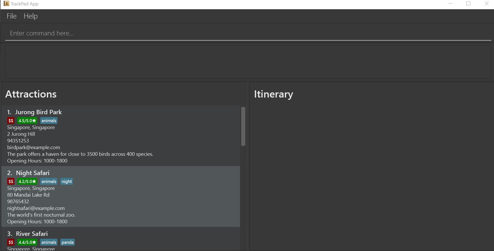
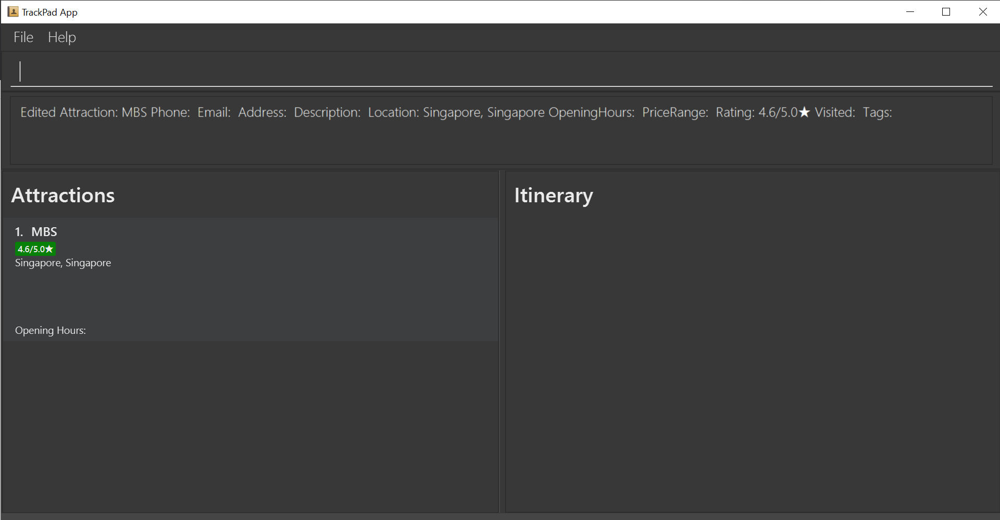
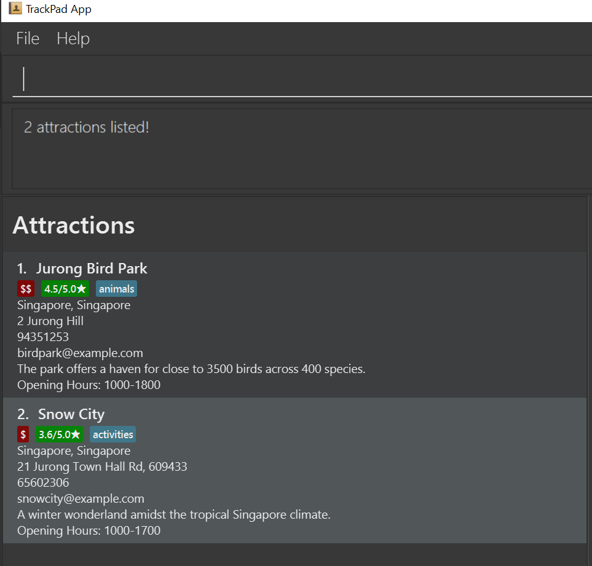

* Table of Contents
{:toc}

--------------------------------------------------------------------------------------------------------------------

## 1. Introduction
TrackPad (TP) is a **desktop app for planning your trips and tracking tourist attractions, optimized for use via a Command Line Interface** (CLI) while still having the benefits of a 
Graphical User Interface (GUI). If you can type fast, TP can get your itinerary planned faster than traditional GUI apps.

This user guide will show you how to use the commands and features available in TP. This app is built for people who would like to collate and store all their itineraries in one single app, 
and we welcome anyone who loves travelling to try out our app.

--------------------------------------------------------------------------------------------------------------------

## 2. Quick start

1. Ensure you have Java `11` or above installed in your Computer.

1. Download the latest `trackpad.jar` from [here](https://github.com/AY2021S1-CS2103T-T09-3/tp/releases).

1. Copy the file to the folder you want to use as the _home folder_ for your TrackPad.

1. Double-click the file to start the app. The GUI similar to the below should appear in a few seconds. 
    Note how the app contains some sample data.  
   
   
<i>Figure 1. The Ui of TrackPad</i>

1. Type the command in the command box and press Enter to execute it. 
    e.g. typing **`help`** and pressing Enter will open the help window. 
    Some example commands you can try:

   * **`list-attraction`** : Lists all tourist attractions added.

   * **`add-attraction`**`n/Singapore Zoo l/Singapore, Singapore p/62693411 t/hot a/80 Mandai Lake Rd, 729826` : 
   Adds an attraction named `Singapore Zoo` to TrackPad.

   * **`delete-attraction`**`3` : Deletes the 3rd attraction shown in the current list.
   
   * **`edit-attraction`**`3 pr/HIGH` : Edits the 3rd attraction shown in the current list, changing its original
    price range to HIGH.

   * **`clear-attraction`** : Deletes all attractions.

   * **`exit`** : Exits the app.

1. Refer to the [Features](#features) below for details of each command.

--------------------------------------------------------------------------------------------------------------------

## 3. Features

### 3.1 Command Formatting

**:information_source: Notes about the command formatting:** 

* Words in `UPPER_CASE` are the parameters to be supplied by the user. 
  e.g. in `add-attraction n/ATTRACTION`, `ATTRACTION` is a parameter which can be used as `add-attraction n/USS`.

* Items in square brackets are optional. 
  e.g `n/ATTRACTION [t/TAG]` can be used as `n/USS t/28 OCT` or as `n/USS`.

* Items with `…`​ after them can be used multiple times including zero times. 
  e.g. `[t/TAG]…​` can be used as ` ` (i.e. 0 times), `t/Singapore`, `t/friend t/family` etc.

* Parameters can be in any order. 
  e.g. if the command specifies `n/ATTRACTION p/PHONE_NUMBER`, `p/PHONE_NUMBER n/ATTRACTION` is also acceptable.

### 3.2 General

#### 3.2.1 Viewing help : `help`

Shows a message explaining how to access the help page.

<i>Figure 2. The help window of TrackPad</i>

Format: `help`

#### 3.2.2 Exiting the program : `exit`

Exits the program.

Format: `exit`

#### 3.2.3 Saving the data

TrackPad data will be saved in the storage automatically after any command that changes the data. 
There is no need to save manually.

### 3.3 Attraction Features

#### 3.3.1 Adding a tourist attraction: `add-attraction`

Adds a tourist attraction to the current list of attractions.

Format: `add-attraction n/ATTRACTION_NAME l/LOCATION [d/DESCRIPTION] [p/PHONE_NUMBER] [e/EMAIL] [a/ADDRESS] 
[op/OPENING_HOURS] [pr/PRICE_RANGE] [r/RATING] [v/VISITED] [t/TAG]…​`
 
* **ATTRACTION_NAME**: Name of Attraction. 
* **LOCATION**: City followed by Country.
* **DESCRIPTION**: Description of Attraction, can take in any value.
* **PHONE_NUMBER**: Phone number should only contain numbers and be at least 3 digits long, no spaces.
* **EMAIL**: Emails should be of the format: `local-part@domain`.
* **ADDRESS**: Address of Attraction, can take in any value.
* **OPENING_HOURS**: Opening Hours should be of the format: `opening time - closing time` (both in 24h format).
* **PRICE_RANGE**: Price Range can only take in 3 values: `LOW`, `MEDIUM` or `HIGH`.
* **RATING**: Rating should only contain a number between `0.0` to `5.0` (inclusive), to 1 decimal place.
* **VISITED**: Visited can only take in 2 values: `TRUE` or `FALSE`.
* **TAG**: Tag name should be alphanumeric.

:bulb: **Tip:**
An attraction can have any number of tags.

Examples:
* `add-attraction n/USS a/8 Sentosa Gateway, 098269 l/Singapore, Singapore`
* `add-attraction n/Singapore Zoo p/62693411 t/hot a/80 Mandai Lake Rd, 729826 l/Singapore, Singapore e/singaporezoo@gmail.com 
op/1000-1800 pr/MEDIUM r/4.6 v/FALSE`  

<i>Figure 3. The result of 'add-attraction'</i>

#### 3.3.2 Editing a tourist attraction: `edit-attraction`

Edits a tourist attraction in the current list of attractions.

Format: `edit-attraction INDEX [n/ATTRACTION_NAME] [l/LOCATION] [d/DESCRIPTION] [p/PHONE_NUMBER] [e/EMAIL] [a/ADDRESS]
[op/OPENING_HOURS] [pr/PRICE_RANGE] [r/RATING] [v/VISITED] [t/TAG]…​`
 
* Edits the attraction at the specified `INDEX`.
* The index refers to the index number shown in the displayed tourist attraction list.
* The index **must be a positive integer** 1, 2, 3, …​
* Field entries are the same as the `add-attraction` command.
* Any field can be changed by inputting its corresponding prefix in the command.
    * Example: `add-attraction n/MBS l/Singapore, Singapore r/4.3` in an attraction list followed by 
    `edit-attraction 1 r/4.6` changes the rating of the 1st attraction in the list from `4.3` to `4.6`.          
    
    
<i>Figure 4. The result of 'edit-attraction 1 r/4.6'</i>
 
* New fields can be added to current attractions.
    * Example: `edit-attraction 1 pr/MEDIUM t/hotel` adds the price range of MBS as `MEDIUM` and adds an `hotel` tag.  
    
    
<i>Figure 5. The result of 'edit-attraction 1 pr/MEDIUM t/hotel'</i>

:warning: **Warning:**
Editing the tag of an attraction does not add on to its existing tags. Rather, it replaces all existing tags with the 
new tags you’re specifying.

#### 3.3.3 Deleting a tourist attraction : `delete-attraction`

Deletes a tourist attraction from the current list of attractions.

Format: `delete-attraction INDEX`

* Deletes the attraction at the specified `INDEX`.
* The index refers to the index number shown in the displayed tourist attraction list.
* The index **must be a positive integer** 1, 2, 3, …​

Examples:
* `list-attraction` followed by `delete-attraction 1` deletes the 1st attraction in the TrackPad.  

<i>Figure 8. The result of 'delete-attraction 1'</i>

* `find-attraction animals` followed by `delete 2` deletes the 2nd tourist attraction in the results of the `find-attraction` command.

#### 3.3.4 Mark a tourist attraction as visited: `markVisited-attraction`

Marks a tourist attraction in the current list of attractions as visited.

Format: `markVisited-attraction INDEX`
 
* Marks the attraction at the specified `INDEX` as visited.
* The index refers to the index number shown in the displayed tourist attraction list.
* The index **must be a positive integer** 1, 2, 3, …​
* Any attraction can be marked visited, even if the attraction was already visited.

Examples:
* `markVisited-attraction 2` marks the 2nd attraction in the TrackPad as visited.

  
<i>Figure 6. The result of 'markVisited-attraction 2</i>

* Typing `markVisited-attraction 2` again will show that the 2nd attraction in the TrackPad is visited.

#### 3.3.5 Finding a tourist attraction: `find-attraction`

Finds any tourist attraction which contains the keyword(s).

Format: `find-attraction KEYWORD [MORE_KEYWORDS]`

* The search is case-insensitive. e.g `singapore zoo` will match `Singapore Zoo`.
* The order of the keywords does not matter. e.g. `Zoo Singapore` will match `Singapore Zoo`.
* Only the attractions in the list of attractions will be searched.
* Only full words will be matched e.g. `Sento` will not match `Sentosa`.

Examples:
* `find-attraction jurong` returns `Jurong Bird Park` and `Snow City`  

<i>Figure 7. The result of 'find-attraction jurong'</i>

#### 3.3.6 Listing all tourist attractions : `list-attraction`

Shows a list of all the tourist attractions. You can use this command to reset the view of the Attractions panel, as 
certain commands (`find`) can alter the view of the Attractions panel. 

Format: `list-attraction`
#### 3.3.7 Clearing all attractions : `clear-attraction`

Clears all tourist attractions.

Format: `clear-attraction`

:warning: **Warning:**
`clear-attraction` will remove all the attractions stored in TrackPad.
This action is irreversible and should be used with caution.

### 3.4 Itinerary Features

#### 3.4.1 Adding a new itinerary: `add-itinerary`

Adds a new itinerary to the current list of itineraries.

Format: `add-itinerary n/ITINERARY_NAME sd/START_DATE ed/END_DATE [d/DESCRIPTION]`

* **ITINERARY_NAME**: Name of the itinerary.
* **START_DATE**: Start date of the itinerary in the format `dd-mm-yyyy`.
* **END_DATE**: End date of the itinerary in the format `dd-mm-yyyy`.
* **DESCRIPTION**: Description of the itinerary, can take in any value.

Examples:
* `add-itinerary n/Europe Trip sd/01-12-2020 ed/20-12-2020`
* `add-itinerary n/Japan holiday d/with friends sd/15-01-2019 ed/30-01-2019`

#### 3.4.2 Editing an itinerary: `edit-itinerary`

Edits an itinerary from the current list of itineraries.

Format: `edit-itinerary INDEX [n/NAME] [d/DESCRIPTION] [sd/START_DATE] [ed/END_DATE]`

* Edits the itinerary at the specified `INDEX`.
* The index refers to the index number shown in the displayed itinerary list.
* The index **must be a positive integer** 1, 2, 3, …​
* Field entries are the same as the `add-itinerary` command.
* Any field can be changed by inputting its corresponding prefix in the command.

Example: 
* `add-itinerary n/Europe Trip sd/01-12-2020 ed/20-12-2020` in an itinerary list followed by `edit-itinerary 1 sd/06-12-2020` changes the start date of the 1st itinerary in the list from `01-12-2020` to `06-12-2020`

#### 3.4.3 Deleting an itinerary: `delete-itinerary`

Deletes an itinerary from the current list of itineraries.

Format: `delete-itinerary INDEX`

* Deletes the itinerary at the specified `INDEX`.
* The index refers to the index number shown in the displayed itinerary list.
* The index **must be a positive integer** 1, 2, 3, …​

Examples:
* `list-itinerary` followed by `delete 2` deletes the 2nd itinerary from the list.

#### 3.4.4 Finding an itinerary: `find-itinerary`

Finds itineraries from the current list of itineraries which contain the keyword(s).

Format: `find-itinerary KEYWORD [MORE_KEYWORDS]`

* The search is case-insensitive. e.g `japan` will match `Japan`
* The order of the keywords does not matter. e.g. `Okinawa Japan` will match `Japan Okinawa`
* Only the name of the itinerary will be searched.
* Only full words will be matched e.g. `Jap` will not match `Japan`

Examples:
* `find-itinerary Japan` returns `Japan Okinawa` and `Japan Tokyo` 

#### 3.4.5 Listing all itineraries: `list-itinerary`

Shows all itineraries.

Format: `list-itinerary`

#### 3.4.6 Clearing all itineraries : `clear-itinerary`

Clears all itineraries.

Format: `clear-itinerary`

#### 3.4.7 Showing an itinerary: `show-itinerary`

Selects an itinerary to be shown, from the current list of itineraries.

Format: `show-itinerary INDEX`

* Shows the itinerary at the specified `INDEX`.
* The index refers to the index number shown in the displayed itinerary list.
* The index **must be a positive integer** 1, 2, 3, …​

Examples:
* `show-itinerary 3` shows the 3rd itinerary in the list of itineraries.

### 3.5 Itinerary Attraction Features
Itinerary attractions are attractions added to an itinerary, but with the added start/end time field.
These commands deal with attractions that are found in an itinerary.

Figure X Diagram simulating the attractions found in an itinerary
 

In the figure X above, you have selected Itinerary 1 with `show-itinerary 1` command, shown with a yellow border. 
Attraction 1A is an itinerary attraction. It has all the same fields as Attraction A, but it has the additional field
of the start/end time.

#### 3.5.1 Adding an attraction to the selected itinerary: `add-itinerary-attraction`
Adds an attraction to the selected itinerary.

Format: `add-itinerary-attraction INDEX st/START_TIME et/END_TIME day/DAY_VISITING`

* **INDEX**: Index of attraction in the current list of attractions.
* **START_TIME**: Start time to visit the attraction, time fields take in time of the 24H format `HH-MM`.
* **END_TIME**: End time to visit the attraction, time fields take in time of the 24H format `HH-MM`.
* **DAY_VISITING**: The day you plan to visit the attraction in the itinerary.
* The start time and end time cannot overlap with other attractions in the selected itinerary.
* None of the fields can be left blank.

Examples:
* `add-itinerary-attraction 2 st/1000 et/1600 day/3`
* `add-itinerary-attraction 1 st/0900 et/1200 day/2`

:bulb: **Tip:**
The attraction will be added into the selected itinerary.

#### 3.5.2 Editing an attraction from the selected itinerary : `edit-itinerary-attraction`
Edits an existing attraction in the selected itinerary.

Format: `edit-itinerary-attraction INDEX [st/START_TIME] [et/END_TIME] [day/DAY_VISITING]`

* Edits the attraction specified by the `INDEX`.
* The index refers to the index number shown in the selected itinerary.
* The index **must be a positive integer** 1, 2, 3, …​
* At least one of the optional fields must be provided.
* Existing values will be updated to the input values.

Examples:
*  `edit-itinerary-attraction 3 day/2` Edits the day visiting to day 2 in the itinerary.
*  `edit-itinerary-attraction 1 st/1500 et/1800` Edits the start time and end time to be `1500` and `1800` respectively.

#### 3.5.3 Deleting an attraction from the selected itinerary: `delete-itinerary-attraction`
Deletes an attraction from the selected itinerary.

Format: `delete-itinerary-attraction INDEX`

* Deletes the attraction specified by the `INDEX`.
* The index refers to the index number shown in the selected itinerary.
* The index **must be a positive integer** 1, 2, 3, …​

<!--how to comment in markdown-->
--------------------------------------------------------------------------------------------------------------------

<!--
## FAQ

**Q**: How do I transfer my data to another Computer? 
**A**: Install the app in the other computer and overwrite the empty data file it creates with the file that contains the data of your previous TrackPad home folder.

--------------------------------------------------------------------------------------------------------------------
-->

## 4. Command summary

### 4.1 General Commands

Action | Format, Examples
--------|------------------
**Help** | `help`
**Exit** | `exit`

### 4.2 Attraction Commands

Action | Format, Examples
--------|------------------
**Add attraction** | `add-attraction n/ATTRACTION_NAME l/LOCATION [d/DESCRIPTION] [p/PHONE_NUMBER] [e/EMAIL] [a/ADDRESS] [op/OPENING_HOURS] [pr/PRICE_RANGE] [r/RATING] [v/VISITED] [t/TAG]…​`   e.g., `add n/Singapore Zoo p/62693411 t/hot a/80 Mandai Lake Rd, 729826`
**Edit attraction** | `edit-attraction INDEX [n/NAME] [p/PHONE_NUMBER] [e/EMAIL] [a/ADDRESS] [t/TAG]…​`  e.g.,`edit 2 n/Singapore Zoo e/zoo@example.com`
**Delete attraction** | `delete-attraction INDEX`  e.g., `delete 3`
**Mark Visited attraction** | `markVisited-attraction INDEX`  e.g., `markVisited-attraction 2`
**Find attraction** | `find-attration KEYWORD [MORE_KEYWORDS]`  e.g., `find Zoo`
**List attractions** | `list-attraction`
**Clear all attractions** | `clear-attraction`

### 4.3 Itinerary Commands

Action | Format, Examples
--------|------------------
**Add itinerary** | `add-itinerary n/ITINERARY sd/START_DATE ed/END_DATE [d/DESCRIPTION]`   e.g., `add-itinerary n/Japan holiday d/with friends sd/15-01-2019 ed/30-01-2019`
**Edit itinerary** | `edit-itinerary INDEX [n/NAME] [d/DESCRIPTION] [sd/START_DATE] [ed/END_DATE]`  e.g.,`edit-itinerary 2 n/Singapore journey sd/05-06-2019`
**Delete itinerary** | `delete-itinerary INDEX`  e.g., `delete-itinerary 3`
**Find itinerary** | `find-itinerary KEYWORD [MORE_KEYWORDS]`  e.g., `find-itinerary Korea`
**List itineraries** | `list-itinerary`
**Clear all itineraries** | `clear-itinerary`
**Show itinerary** | `show-itinerary INDEX`  e.g., `show-itinerary 3`

### 4.4 Itinerary attraction Commands

Action | Format, Examples
--------|------------------
**Add itinerary attraction** | `add-itinerary-attraction INDEX st/START_TIME et/END_TIME day/DAY_VISITING `   e.g., `add-itinerary-attraction 1 st/1400 et/1500 day/5`
**Edit itinerary attraction** | `edit-itinerary-attraction INDEX [st/START_TIME] [et/END_TIME] [day/DAY_VISITING] `   e.g.,`edit-itinerary-attraction 1 st/0900 et/1000 day/2`
**Delete itinerary attraction** | `delete-itinerary-attraction INDEX`  e.g., `delete-itinerary-attraction 1`

