

**Table of Contents**

* Table of Contents
{:toc}

## 1. Introduction (York Tat)
TrackPad is a **desktop app for planning your trips and tracking tourist attractions, optimized for use via a Command Line Interface** (CLI) while still having the benefits of a
Graphical User Interface (GUI). TrackPad is built for people who love to travel and want to collate all their itineraries neatly in one single app.
Our **intuitive** commands utilise words in full, making it **easy** for you to remember.
If you can type fast, TrackPad can get your itinerary planned **faster** than traditional GUI apps. Minimal prior technical knowledge is needed in order to 
use TrackPad so try out TrackPad now to make your travel planning **easier and faster**!

## 2. About This Document (York Tat)
Welcome to the TrackPad User Guide!

We at TrackPad know how **difficult and messy** it can get when it comes to keeping track of your travel itineraries and TrackPad
is a **fuss-free** app that helps you keep track of all your travel related information.

This simple guide provides a **comprehensive** description of the features in TrackPad and also includes a [Getting Started](#3-getting-started-robin) section
that helps you get started.

Here are some symbols we will be using in this guide to help you along:

:information_source: Boxes with the :information_source: icon contain
additional information.

:bulb: Boxes with the :bulb: icon contain useful tips.

:warning: Boxes with the :warning: icon contain
caution messages.

## 3. Getting Started (Robin)

Here are the steps to download TrackPad and start using it immediately!

**Step 1.** Ensure you have Java `11` or above installed in your Computer.

**Step 2.** Download the latest `trackpad.jar` from [here](https://github.com/AY2021S1-CS2103T-T09-3/tp/releases).

**Step 3.** Copy the file to the folder you want to use as the _home folder_ for your TrackPad.

**Step 4.** Double-click the file to start the app. An application similar to Figure 1 should appear in a few seconds. Here's how your app should look like!
    Note how the app contains data on Rediscover Singapore attractions.   
   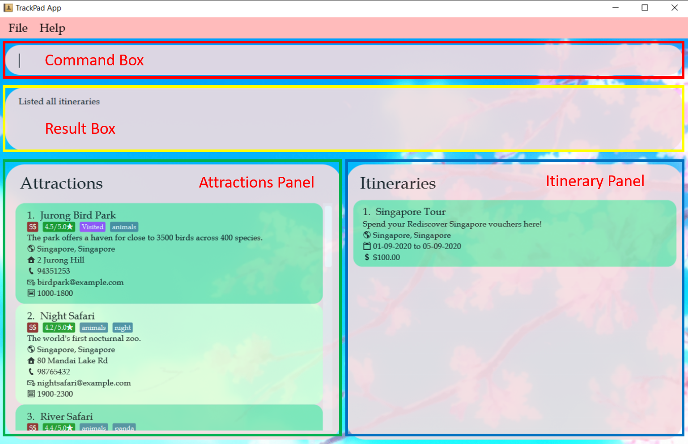
   
<i>Figure 1. The Ui of TrackPad</i>

**Step 5.** Type the command in the command box and press Enter to execute it. Let's try it out by adding Gardens by the Bay into the app.
   Type in `add-attraction n/Gardens by the Bay l/Singapore, Singapore a/18 Marina Gardens Dr, 018953 r/4.7`! Your application should
   look like this when you scroll to the bottom of the attractions list.
   
   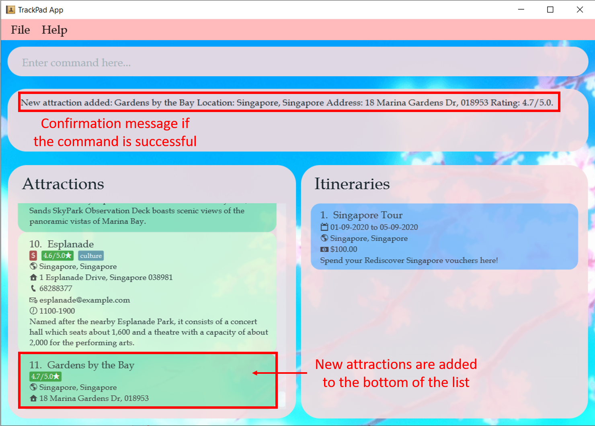
   
<i>Figure 2. Adding Gardens by the Bay</i>

**Step 6.** Oh no, you forgot to add the opening hours for Gardens by the Bay. No worries! By using the
   `edit-attraction 11 op/0500-0200`, we can edit the 11th attraction to add the opening hours from 5am to 2am.

   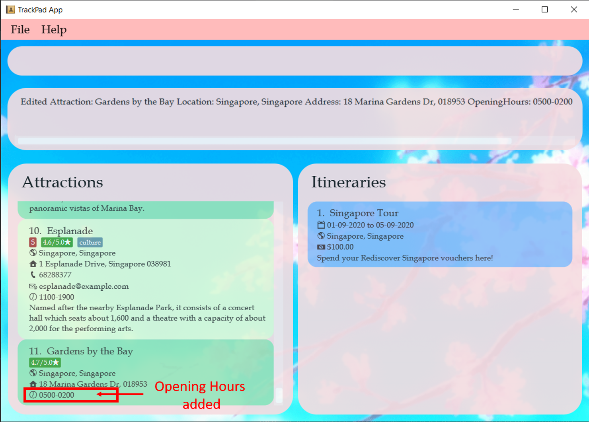
   
<i>Figure 3. Editing Gardens by the Bay to add Opening Hours</i>

**Step 7.** Now, you want to create a one day itinerary to visit the Gardens by the Bay. Easy! Just type in
   `add-itinerary n/Walk in the Park sd/01-01-2021 ed/01-01-2021 d/Appreciate Singapore's flora and fauna`.

   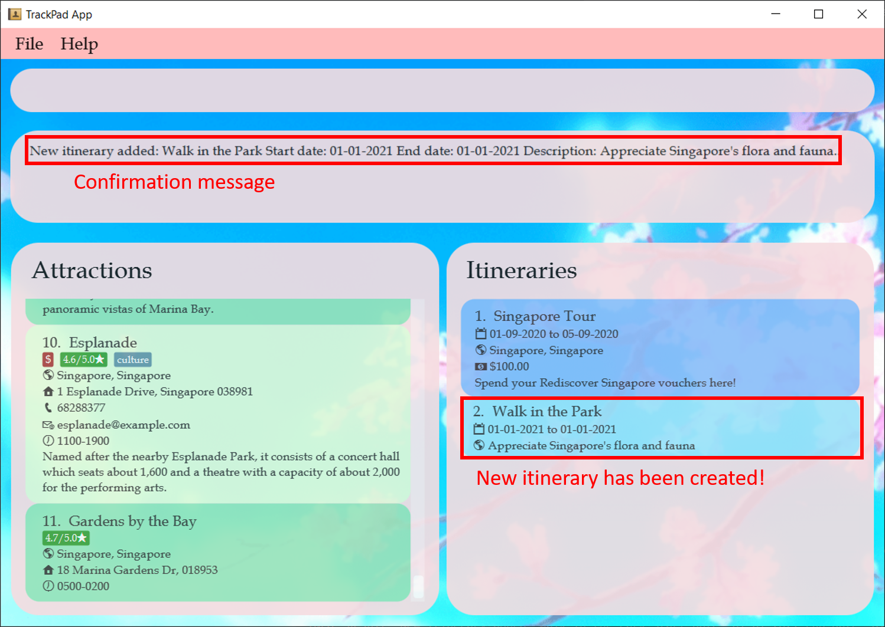
   
<i>Figure 4. Adding the new itinerary</i>

**Step 8.** To add Gardens by the Bay into the itinerary you just created, select the itinerary you want to add the attraction into,
   by `select-itinerary 2`.

   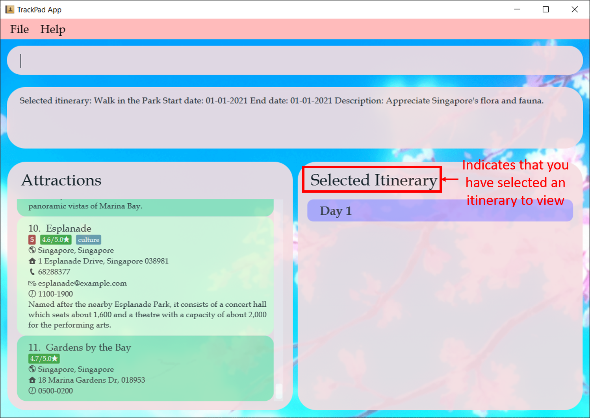
   
<i>Figure 5. Selecting the itinerary</i>

    

    
**Step 9.** If you want to visit Gardens by the Bay from 10am to 2pm on the first day of your trip, type
   `add-itinerary-attraction 11 day/1 st/1000 et/1400`.

   
   
<i>Figure 6. Adding Gardens by the Bay into the itinerary</i>

  
 
**Step 10.** You are done! Feel free to add more attractions into the itinerary, or read on to discover other commands that will
   give you more control over TrackPad, such as [`find-attraction`](#425-finding-a-tourist-attraction-find-attraction)
   and [`delete-attraction`](#423-deleting-a-tourist-attraction--delete-attraction)!

## 4. Features

In this section, we will go into the details of all the features available for you to use after
installing TrackPad. These features are split into 4 subsections, [Attraction Features](#42-attraction-features-york-tat),
[Itinerary Features](#43-itinerary-features-koon-kiat), [Itinerary Attraction Features](#44-itinerary-attraction-features-yeh-yu-chun) 
and [Miscellaneous Features](#45-miscellaneous-features-yuxuan).

### 4.1 Command Format (Yuxuan)

**Notes about the command format:**

* Words in `UPPER_CASE` are the fields to be supplied by you. 
  e.g. in `add-attraction n/ATTRACTION`, `ATTRACTION` is a field which can be used as `add-attraction n/USS`.

* Fields in square brackets are optional. 
  e.g `n/ATTRACTION [t/TAG]` can be used as `n/USS t/28 OCT` or as `n/USS`.

* Fields with `…`​ after them can be used multiple times or not used at all. 
  e.g. `[t/TAG]…​` can be used as ` ` (not used), `t/Singapore`, `t/friend t/family` etc.

* If a field cannot be used multiple times, and you supply 2 or more of the same field, the app takes only the last specified field. 
  e.g. if you type `add-attraction n/USS n/Marina Bay Sands l/Singapore, Singapore`, which contains 2 names, "USS" and "Marina Bay Sands", only "Marina Bay Sands" is taken.

* Fields can be in any order. 
  e.g. if the command specifies `n/ATTRACTION p/PHONE_NUMBER`, `p/PHONE_NUMBER n/ATTRACTION` is also acceptable.

* All fields are case sensitive unless stated otherwise.  
  e.g. `add-attraction n/Singapore Zoo l/Singapore` followed by `add-attraction n/singapore zoo l/singapore` will 
  create two different attractions in the same list.

### 4.2 Attraction Features (York Tat)

Attractions are the core building blocks of TrackPad and are required to populate your itineraries!

The figure below shows how an attraction looks like in the attractions panel. 

   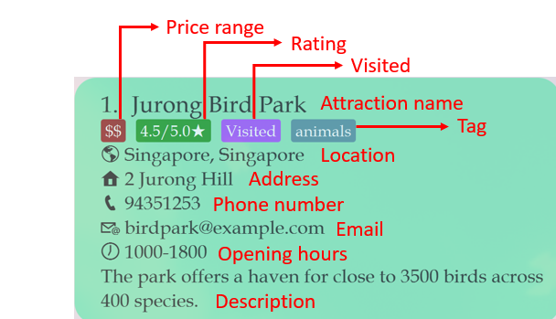
   
<i>Figure 7. Breakdown of an attraction</i>

 

The table below shows a summary of the commands in this section.

Action | Format, Examples
--------|------------------
**[Add attraction](#421-adding-a-tourist-attraction-add-attraction)** | `add-attraction n/ATTRACTION_NAME l/LOCATION [d/DESCRIPTION] [p/PHONE_NUMBER] [e/EMAIL] [a/ADDRESS] [op/OPENING_HOURS] [pr/PRICE_RANGE] [r/RATING] [v/VISITED] [t/TAG]…​`   e.g. `add n/Singapore Zoo p/62693411 t/hot a/80 Mandai Lake Rd, 729826`
**[Edit attraction](#422-editing-a-tourist-attraction-edit-attraction)** | `edit-attraction INDEX [n/NAME] [p/PHONE_NUMBER] [e/EMAIL] [a/ADDRESS] [t/TAG]…​`  e.g. `edit 2 n/Singapore Zoo e/zoo@example.com`
**[Delete attraction](#423-deleting-a-tourist-attraction--delete-attraction)** | `delete-attraction INDEX`  e.g. `delete 3`
**[Mark Visited attraction](#424-marking-a-tourist-attraction-as-visited-markvisited-attraction)** | `markVisited-attraction INDEX`  e.g. `markVisited-attraction 2`
**[Find attraction](#425-finding-a-tourist-attraction-find-attraction)** | `find-attraction KEYWORD [MORE_KEYWORDS]`  e.g. `find Zoo`
**[List attractions](#426-listing-all-tourist-attractions--list-attraction)** | `list-attraction`
**[Clear all attractions](#427-clearing-all-attractions--clear-attraction)** | `clear-attraction`

#### 4.2.1 Adding a tourist attraction: `add-attraction`

Adds a tourist attraction to the current list of attractions. Each attraction must contain a name and a location.
Additionally, use the optional fields (as listed below) to include more information for your attractions.

Format (Minimal): `add-attraction n/ATTRACTION_NAME l/LOCATION`

Format (All fields): `add-attraction n/ATTRACTION_NAME l/LOCATION [d/DESCRIPTION] [p/PHONE_NUMBER] [e/EMAIL] [a/ADDRESS]
[op/OPENING_HOURS] [pr/PRICE_RANGE] [r/RATING] [v/VISITED] [t/TAG]…​`

| Compulsory fields | Description |
|---|---|
| **ATTRACTION_NAME** | Takes only letters and numbers and should not be blank |
| **LOCATION** | Takes any value, we recommend the format: `CITY, COUNTRY` |

| Optional fields | Description |
|---|---|
| **DESCRIPTION** | Takes any value |
| **PHONE_NUMBER** | Takes only numbers and be at least 3 digits long with no spaces in between |
| **EMAIL** | Takes the format `local-part@domain` |
| **ADDRESS** | Takes the postal address of the attraction which can be any value |
| **OPENING_HOURS** | Takes the format `opening time - closing time`, both in the 24H format `HHMM-HHMM` |
| **PRICE_RANGE** | Takes one of the following ranges: `LOW`, `MEDIUM` or `HIGH` |
| **RATING** | Takes a number between `0.0` to `5.0` |
| **VISITED** | Takes either `TRUE` if visited or `FALSE` otherwise |
| **TAG** | Takes only letters and numbers |

:information_source: **Note:**
The opening time of an attraction can be later than it's the closing time as some attractions operate overnight.

:bulb: **Tip:**
An attraction can have any number of tags.

For example:

You plan on visiting Gardens by the Bay over the weekends.

1. Enter `add-attraction n/Gardens by the Bay a/18 Marina Gardens Dr, Singapore 018953 l/Singapore, Singapore t/sightseeing e/feedback@gardensbythebay.com.sg op/0500-0200 pr/LOW r/4.7 v/FALSE` into the command box. 

    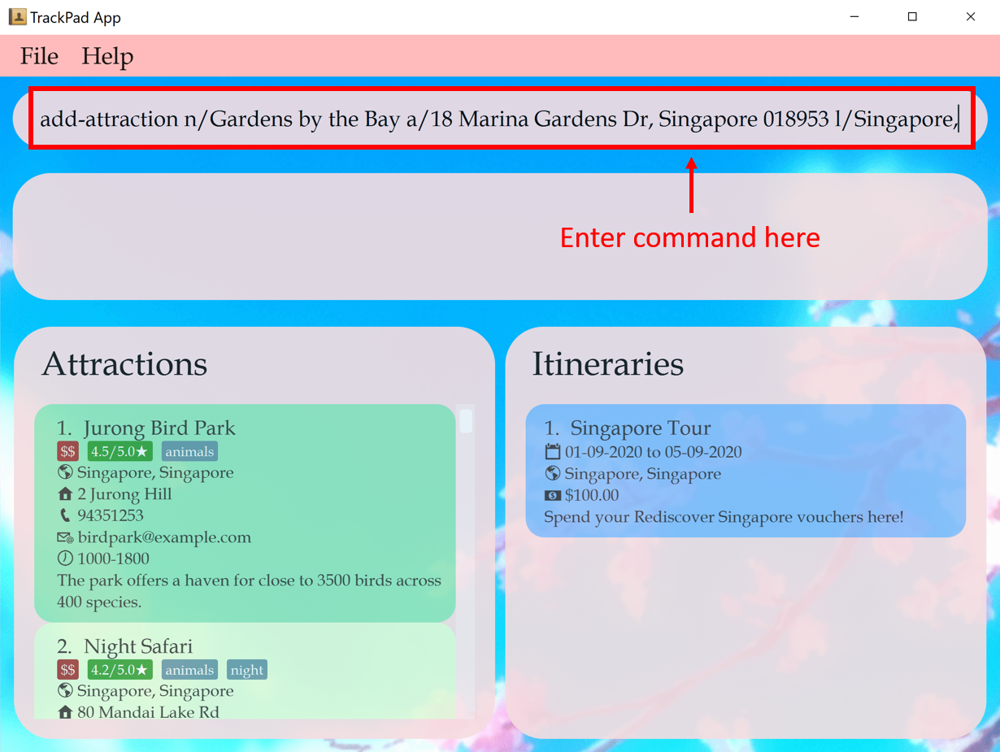
    
<i>Figure 8a. Before entering <code>add-attraction n/Gardens by the Bay a/18 Marina Gardens Dr, Singapore 018953 l/Singapore, Singapore t/sightseeing e/feedback@gardensbythebay.com.sg op/0500-0200 pr/LOW r/4.7 v/FALSE</code></i>

    

2. Note how `Gardens by the Bay` appears in the `Attractions` panel.

    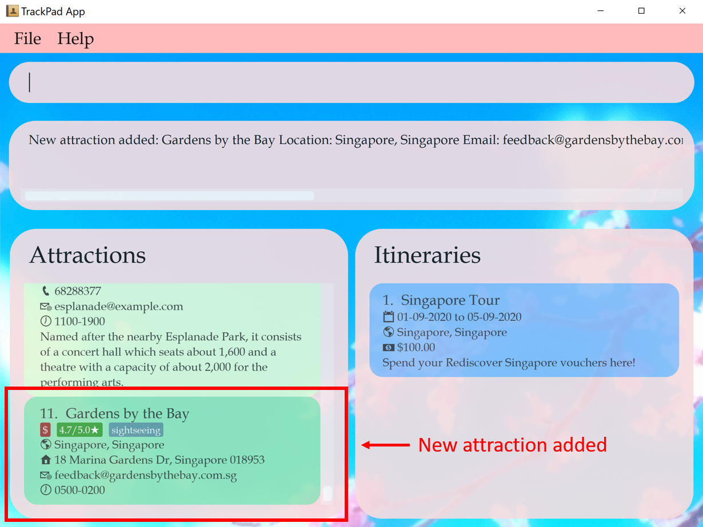
    
<i>Figure 8b. After entering <code>add-attraction n/Gardens by the Bay a/18 Marina Gardens Dr, Singapore 018953 l/Singapore, Singapore t/sightseeing e/feedback@gardensbythebay.com.sg op/0500-0200 pr/LOW r/4.7 v/FALSE</code></i>

Try these other examples too!
* `add-attraction n/Singapore Flyer a/30 Raffles Ave, Singapore 039803 l/Singapore, Singapore`
* `add-attraction n/Clarke Quay a/3 River Valley Rd, Singapore 179024 l/Singapore, Singapore t/drinking pr/MEDIUM r/4.5` 

:information_source: **Note:**
Multiple attractions of the same name and location cannot be added into the current list of attractions.

#### 4.2.2 Editing a tourist attraction: `edit-attraction`

Edits a tourist attraction in the current list of attractions.

Format: `edit-attraction INDEX [n/ATTRACTION_NAME] [l/LOCATION] [d/DESCRIPTION] [p/PHONE_NUMBER] [e/EMAIL] [a/ADDRESS]
[op/OPENING_HOURS] [pr/PRICE_RANGE] [r/RATING] [v/VISITED] [t/TAG]…​`

* Edits the attraction at the specified [`INDEX`](#6-glossary-yuxuan) shown in the attractions panel.
* Field entries are the same as the [`add-attraction`](#421-adding-a-tourist-attraction-add-attraction) command.
* Any field can be changed by inputting its corresponding [`PREFIX`](#6-glossary-yuxuan) in the command.
* New fields can be added to current attractions.

:information_source: **Note:**
You can use `edit-attraction INDEX PREFIX/ ` to remove existing optional fields.

For example:

You realise that the rating of `Gardens by the Bay` is wrongly reflected and want to add the price range for the attraction.

1. Enter `edit-attraction 11 r/4.4 pr/LOW` into the command box.

    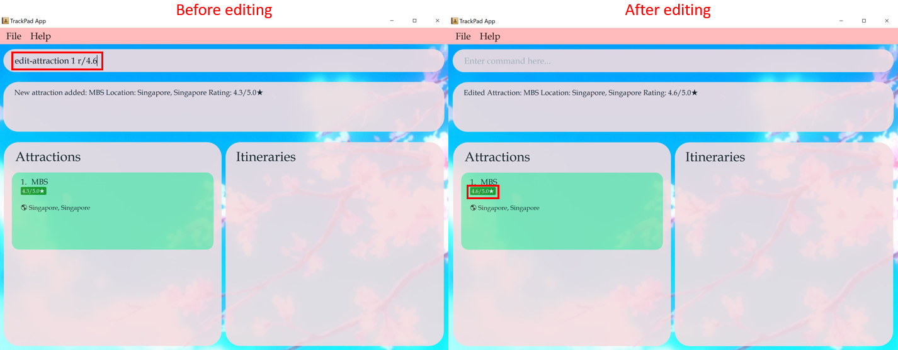
    
<i>Figure 9a. Before entering <code>edit-attraction 11 r/4.4 pr/LOW</code></i>

    

2. Note how `Gardens by the Bay` appears in the `Attractions` panel.

    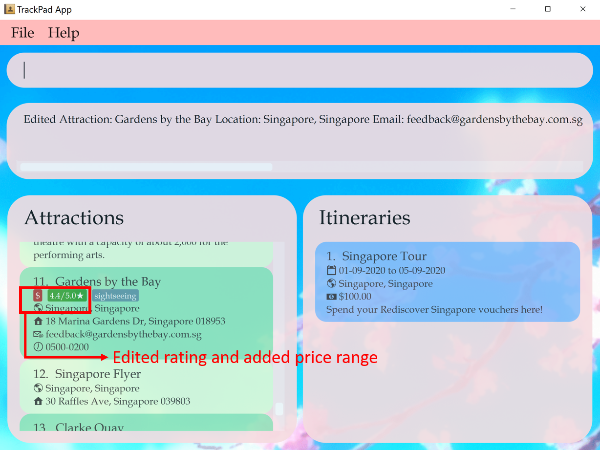
    
<i>Figure 9b. After entering <code>edit-attraction 11 r/4.4 pr/LOW</code></i>

:warning: **Warning:**
Editing the tag of an attraction does not add on to its existing tags. Rather, it replaces all existing tags with the
new tags you’re specifying.

#### 4.2.3 Deleting a tourist attraction : `delete-attraction`

Deletes a tourist attraction from the current list of attractions.

Format: `delete-attraction INDEX`

* Deletes the attraction at the specified [`INDEX`](#6-glossary-yuxuan) shown in the attractions panel.

For example:

You want to delete `Jurong Bird Park` from your list of attractions.

1. Enter `delete-attraction 1` into the command box. 

    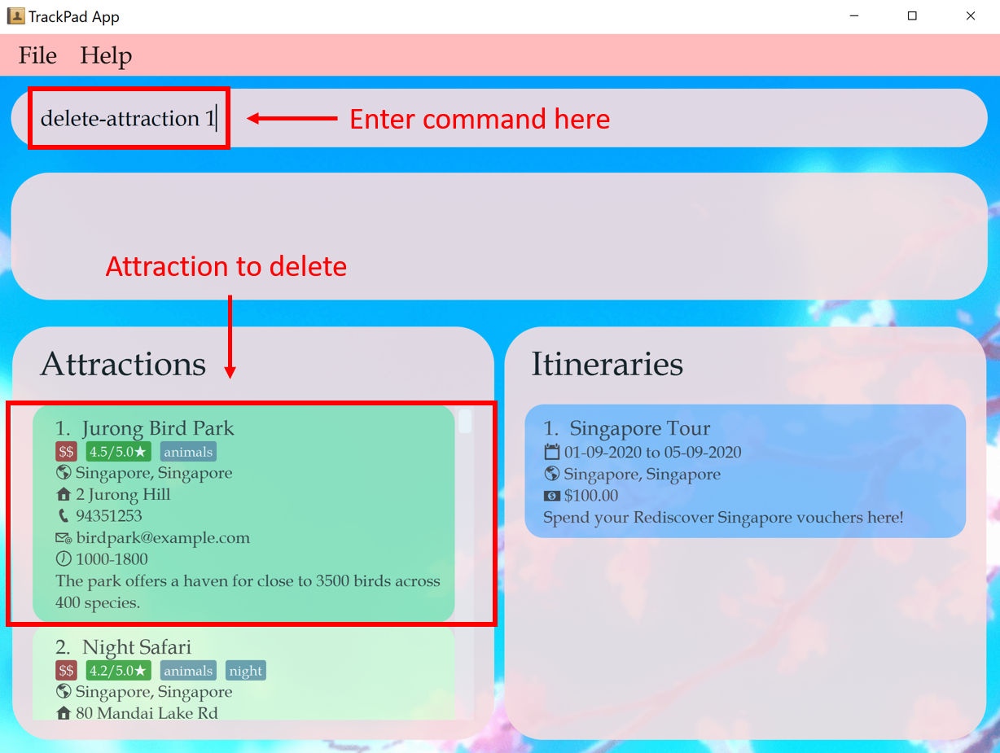
    
<i>Figure 10a. Before entering <code>delete-attraction 1</code></i>

    

2. First attraction in the list of attractions, `Jurong Bird Park`, is deleted.

    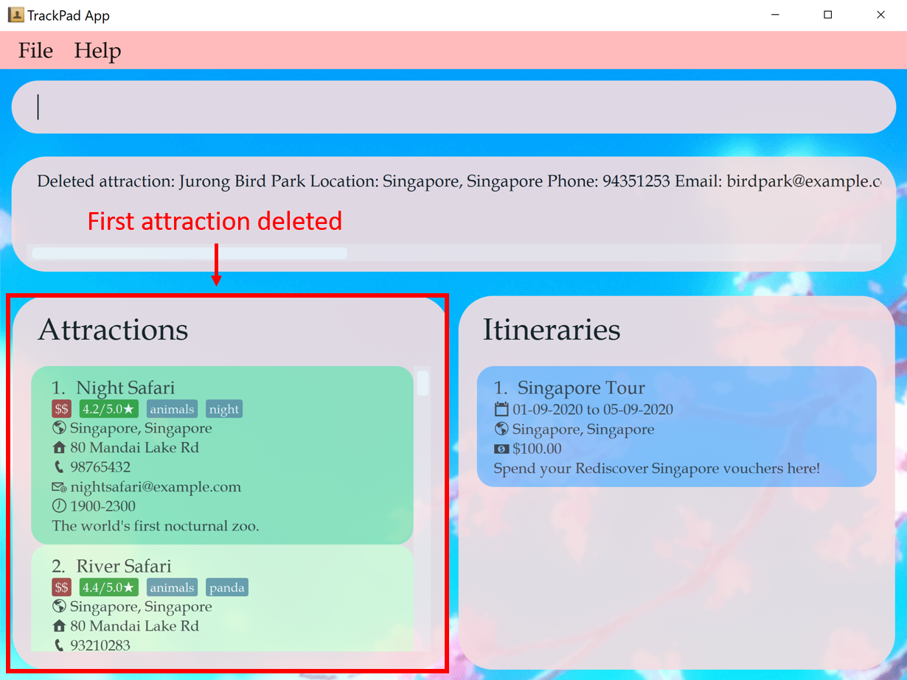
    
<i>Figure 10b. After entering <code>delete-attraction 1</code></i>

Try these other examples too!
* `find-attraction animals` followed by `delete-attraction 2` deletes the second attraction in the results of the [find-attraction](#425-finding-a-tourist-attraction-find-attraction)
command

#### 4.2.4 Marking a tourist attraction as visited: `markVisited-attraction`

Marks a tourist attraction in the current list of attractions as visited.

Format: `markVisited-attraction INDEX`

* Marks the attraction at the specified [`INDEX`](#6-glossary-yuxuan) shown in the attractions panel as visited.
* The attraction can only be marked visited if the attraction was not visited.

For example:

You have just visited `Night Safari` over the holidays. You want TrackPad to reflect that you have visited
`Night Safari`.

1. Enter `markVisited-attraction 2` into the command box. 

    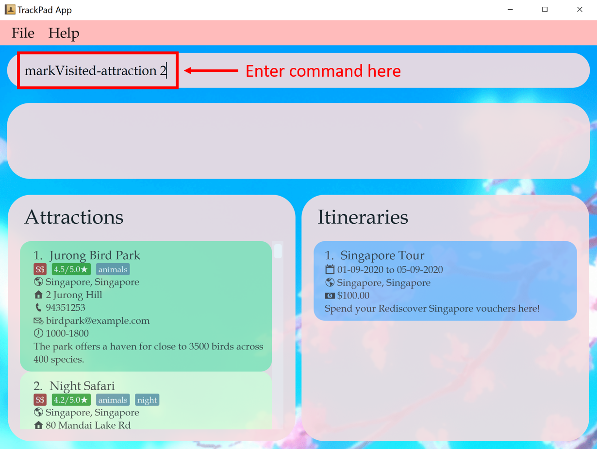
    
<i>Figure 11a. Before entering <code>markVisited-attraction 2</code></i>

    

2. Second attraction in the list of attractions, `Night Safari`, is marked as visited.

    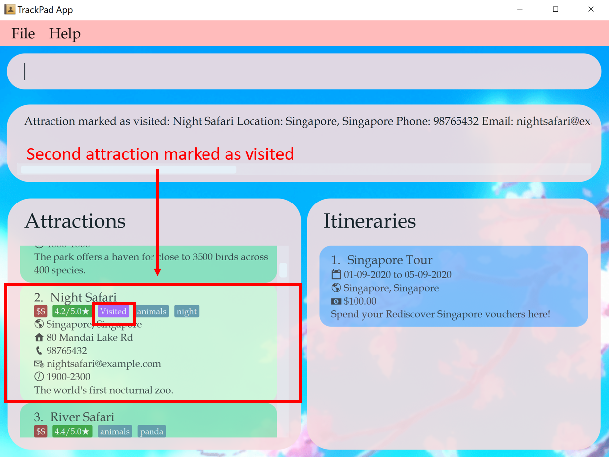
    
<i>Figure 11b. After entering <code>markVisited-attraction 2</code></i>

#### 4.2.5 Finding a tourist attraction: `find-attraction`

Finds tourist attractions from the current list of attractions which contain the keyword(s).

Format: `find-attraction KEYWORD [MORE_KEYWORDS]`

* The search is case-insensitive. e.g `singapore zoo` will match `Singapore Zoo`.
* The order of the keywords does not matter. e.g. `Zoo Singapore` will match `Singapore Zoo`.
* Only full words will be matched e.g. `Sento` will not match `Sentosa`.

For example:

You want to look for all the attractions that contain the keyword `jurong`.

1. Enter `find-attraction jurong` into the command box. 

    
    
<i>Figure 12a. Before entering <code>find-attraction jurong</code></i>

    

2. `Jurong Bird Park` and `Snow City` are displayed as they contain `jurong` in their fields.

    
    
<i>Figure 12b. After entering <code>find-attraction jurong</code></i>

#### 4.2.6 Listing all tourist attractions : `list-attraction`

Shows all tourist attractions. Use this command to reset the view of the Attractions panel, as
certain commands ([find-attraction](#425-finding-a-tourist-attraction-find-attraction)) can alter the view of the Attractions panel.

Format: `list-attraction` 

For example:

After finding an attraction, you want to switch back to seeing all your attractions.

1. Enter `list-attraction` into the command box. 

    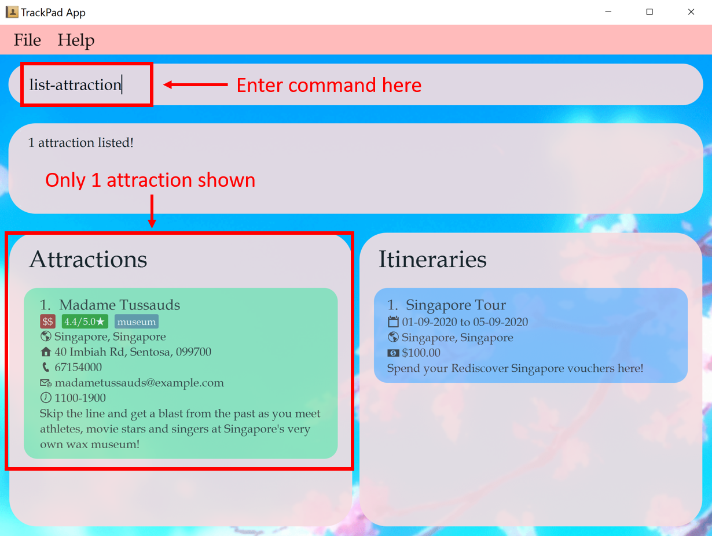
    
<i>Figure 13a. Before entering <code>list-attraction</code></i>

    

2. Note how all your attractions are displayed again.

    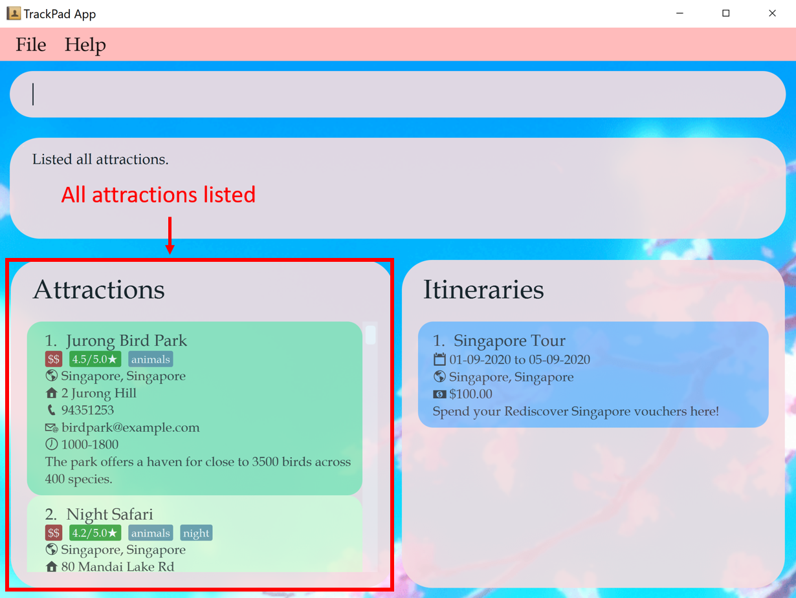
    
<i>Figure 13b. After entering <code>list-attraction</code></i>

:information_source: **Note:**
`list-attraction` will work even if there are extra characters after the command.
Eg. `list-attraction abcd` will behave like `list-attraction`.

#### 4.2.7 Clearing all attractions : `clear-attraction`

Clears all tourist attractions.

Format: `clear-attraction`

:warning: **Warning:**
`clear-attraction` will remove all the attractions stored in TrackPad.
This action is irreversible and should be used with caution.

For example:

You want to delete all your attractions and start with an empty list of attractions. 

1. Enter `clear-attraction` into the command box. 

    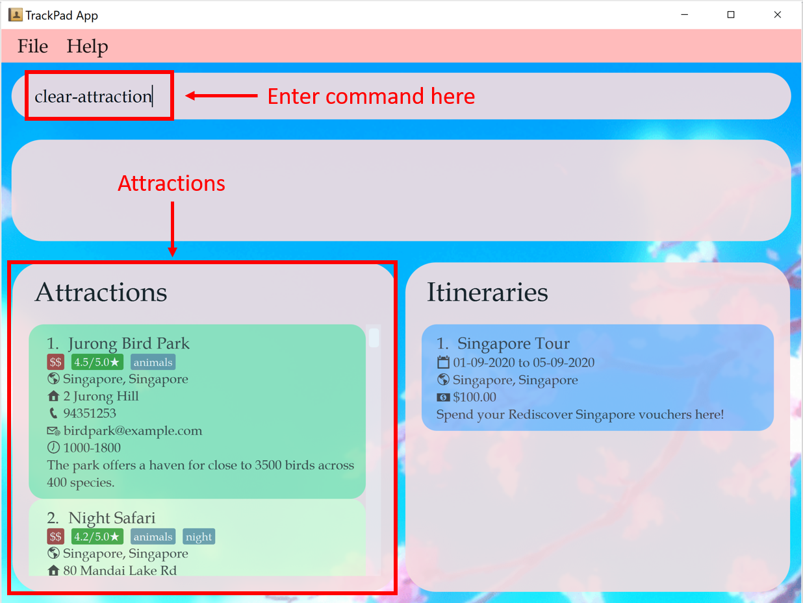
    
<i>Figure 14a. Before entering <code>clear-attraction</code></i>

    

2. Note how all your attractions are now deleted. 

    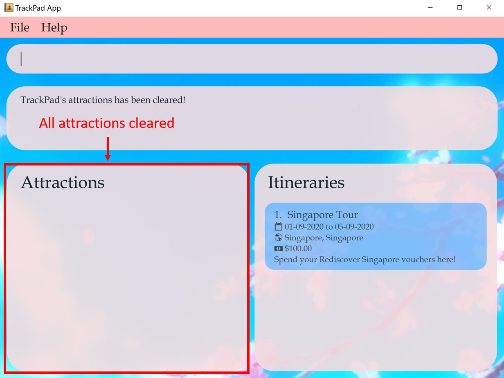
    
<i>Figure 14b. After entering <code>clear-attraction</code></i>

### 4.3 Itinerary Features (Koon Kiat)

Itineraries help track the details of your trip, as well as the attractions you plan on visiting. 
The figure below shows how an itinerary looks like in the itineraries panel. 

   
   
<i>Figure 15. Breakdown of an itinerary</i>

Notice that the itineraries panel only shows a simplified view of your itineraries. The attractions in each itinerary are not displayed. To view them in detail, see [selecting an itinerary](#436-selecting-an-itinerary-select-itinerary), or just read on!
To learn how to add, edit and delete attractions in your itineraries, see [Itinerary Attraction Features](#44-itinerary-attraction-features-yeh-yu-chun).

The table below shows a summary of the commands in this section.

Action | Format, Examples
--------|------------------
**[Add itinerary](#431-adding-a-new-itinerary-add-itinerary)** | `add-itinerary n/ITINERARY sd/START_DATE ed/END_DATE [d/DESCRIPTION] [b/BUDGET]`   e.g. `add-itinerary n/Japan holiday sd/15-01-2019 ed/30-01-2019 d/with friends b/4000`
**[Edit itinerary](#432-editing-an-itinerary-edit-itinerary)** | `edit-itinerary INDEX [n/NAME] [sd/START_DATE] [ed/END_DATE] [d/DESCRIPTION] [b/BUDGET]`  e.g. `edit-itinerary 2 n/Singapore journey sd/05-06-2019`
**[Delete itinerary](#433-deleting-an-itinerary-delete-itinerary)** | `delete-itinerary INDEX`  e.g. `delete-itinerary 3`
**[Find itinerary](#434-finding-an-itinerary-find-itinerary)** | `find-itinerary KEYWORD [MORE_KEYWORDS]`  e.g. `find-itinerary Korea`
**[List itineraries](#435-listing-all-itineraries-list-itinerary)** | `list-itinerary`
**[Select itinerary](#436-selecting-an-itinerary-select-itinerary)** | `select-itinerary INDEX`  e.g. `select-itinerary 3`
**[Clear all itineraries](#437-clearing-all-itineraries--clear-itinerary)** | `clear-itinerary`

#### 4.3.1 Adding a new itinerary: `add-itinerary`

Adds a new itinerary to the current list of itineraries.

Format: `add-itinerary n/ITINERARY_NAME sd/START_DATE ed/END_DATE [d/DESCRIPTION] [b/BUDGET]`

| Compulsory fields | Description |
|---|---|
| **ITINERARY_NAME** | Takes only letters and numbers and should not be blank |
| **START_DATE** | Takes the format `dd-mm-yyyy` and should not be after the end date |
| **END_DATE** | Takes the format `dd-mm-yyyy` and should not be before the start date |

| Optional fields | Description  |
|---|---|
| **DESCRIPTION** | Takes any value |
| **BUDGET** | Takes a non-negative number up to two decimal places, limited to 15 digits (including decimal places, if any) |

:bulb: **Tip:**
You do not have to specify itinerary locations as they are generated automatically from the itinerary attractions you have in your itineraries.

For example:

You want to add an itinerary for a trip to Europe with your friends. 
 
1. Enter `add-itinerary n/Europe Trip sd/01-12-2020 ed/20-12-2020 d/with friends b/4000` into the command box.

   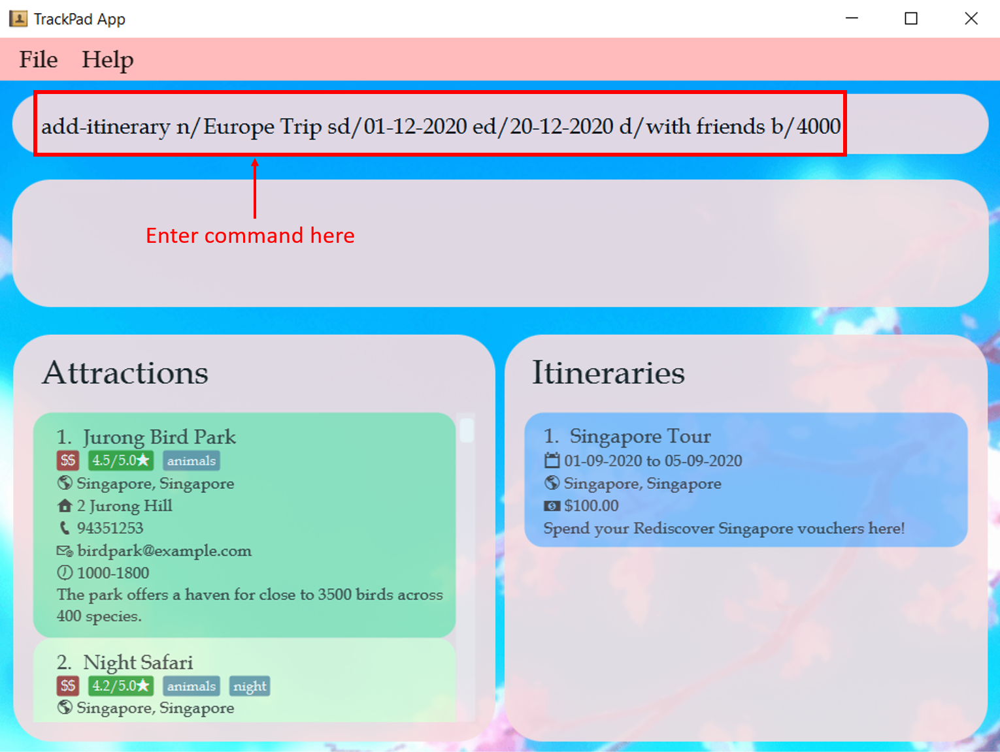
   
<i>Figure 16a. Before entering <code>add-itinerary n/Europe Trip sd/01-12-2020 ed/20-12-2020 d/with friends b/4000</code></i>
 

    

2. Note how your new itinerary appears in the itineraries panel.

   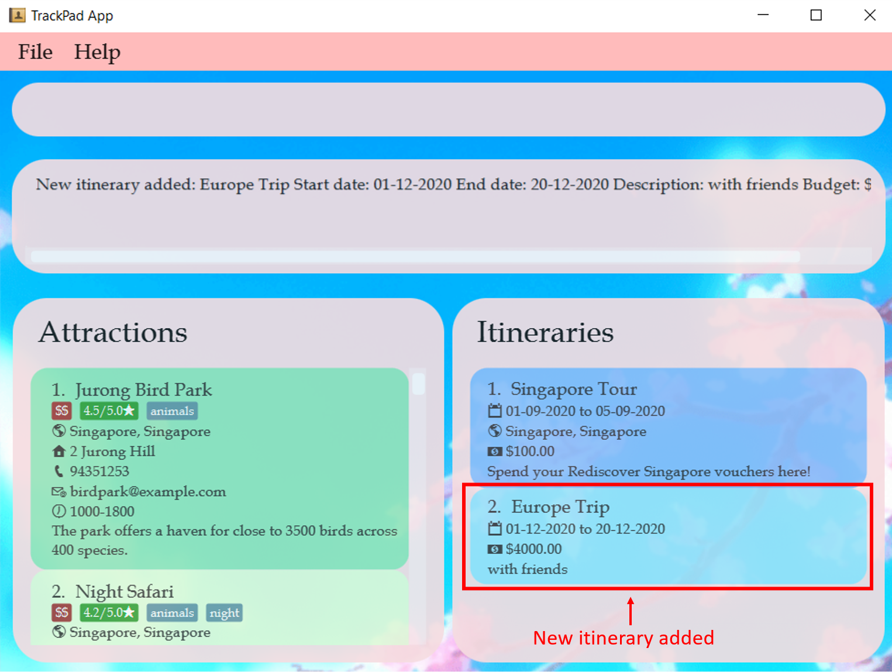
   
<i>Figure 16b. After entering <code>add-itinerary n/Europe Trip sd/01-12-2020 ed/20-12-2020 d/with friends b/4000</code></i>
 
 
Try these other examples too!
* `add-itinerary n/Japan holiday sd/15-01-2019 ed/30-01-2019`
* `add-itinerary n/Taiwan food tour sd/19-06-2021 ed/24-06-2021 d/explore night markets`

:information_source: **Note:**
Multiple itineraries of the same name, start date and end date cannot be added into the list of itineraries.

#### 4.3.2 Editing an itinerary: `edit-itinerary`

Edits an itinerary from the current list of itineraries.

Format: `edit-itinerary INDEX [n/NAME] [sd/START_DATE] [ed/END_DATE] [d/DESCRIPTION] [b/BUDGET]`

* Edits the itinerary at the specified [`INDEX`](#6-glossary-yuxuan) shown in the itineraries panel.
* Field entries are the same as the [`add-itinerary`](#431-adding-a-new-itinerary-add-itinerary) command.
* Any field can be changed by inputting its corresponding [`PREFIX`](#6-glossary-yuxuan) in the command.

:information_source: **Note:**
You can use `edit-itinerary INDEX PREFIX/ ` to remove existing optional fields.

For example:

After adding an itinerary for a trip to Europe that starts on `01-12-2020`, you want to change the start date to `06-12-2020`. 

1. Enter `edit-itinerary 2 sd/06-12-2020` into the command box.

    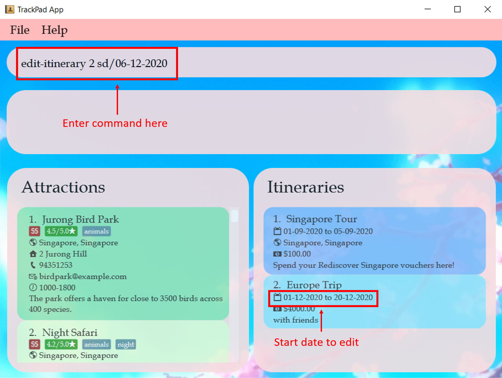
    
<i>Figure 17a. Before entering <code>edit-itinerary 2 sd/06-12-2020</code></i>
 

    

2. Note how the start date of the second itinerary has changed from `01-12-2020` to `06-12-2020`.

    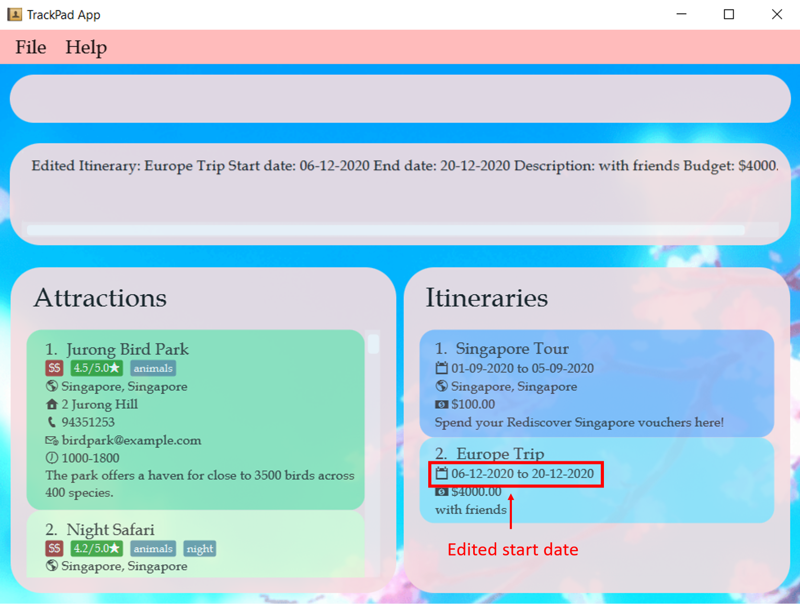
    
<i>Figure 17b. After entering <code>edit-itinerary 2 sd/06-12-2020</code></i>
 

Try these other examples too!
* `edit-itinerary 1 d/` to remove the description of your first itinerary
* `edit-itinerary 2 ed/15-12-2020 b/1000` to change the end date and budget of your second itinerary

#### 4.3.3 Deleting an itinerary: `delete-itinerary`

Deletes an itinerary from the current list of itineraries.

Format: `delete-itinerary INDEX`

* Deletes the itinerary at the specified [`INDEX`](#6-glossary-yuxuan) shown in the itineraries panel.

For example:

You do not want to store your first itinerary in the app anymore, and you want to delete it.

1. Enter `delete-itinerary 1` into the command box. 

    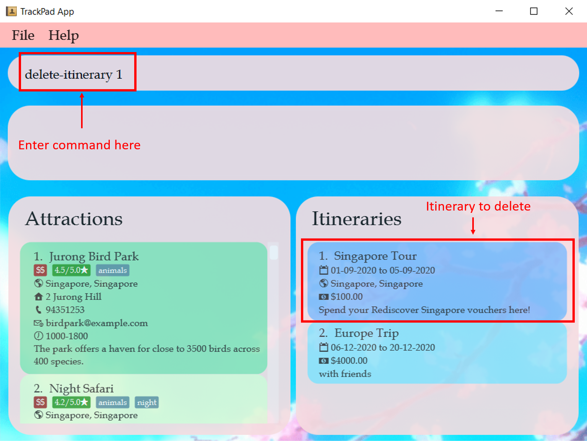
    
<i>Figure 18a. Before entering <code>delete-itinerary 1</code></i>
 

    

2. Note how your first itinerary has been deleted, and there is now one less itinerary. 

    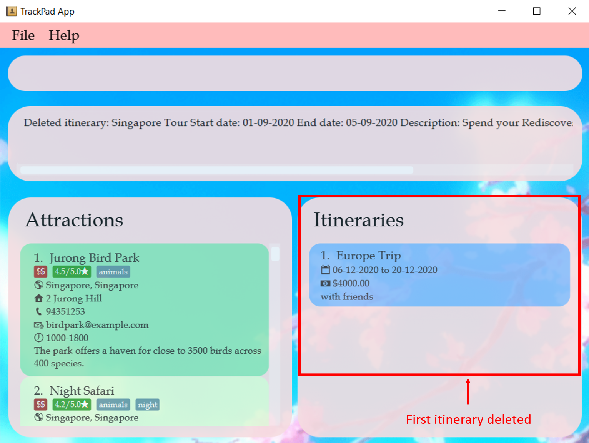
    
<i>Figure 18b. After entering <code>delete-itinerary 1</code></i>
 

#### 4.3.4 Finding an itinerary: `find-itinerary`

Finds itineraries from the current list of itineraries which contain the keyword(s).

Format: `find-itinerary KEYWORD [MORE_KEYWORDS]`

* The search is case-insensitive. e.g `japan` will match `Japan`
* The order of the keywords does not matter. e.g. `Okinawa Japan` will match `Japan Okinawa`
* Every [itinerary field](#431-adding-a-new-itinerary-add-itinerary) will be searched, as well as the fields of all the [itinerary attractions](#44-itinerary-attraction-features-yeh-yu-chun) in the itinerary.
* Only full words will be matched e.g. `Jap` will not match `Japan`

For example:

You want to look for all the itineraries that contain the keyword `Europe`.

1. Enter `find-itinerary Europe` into the command box.

    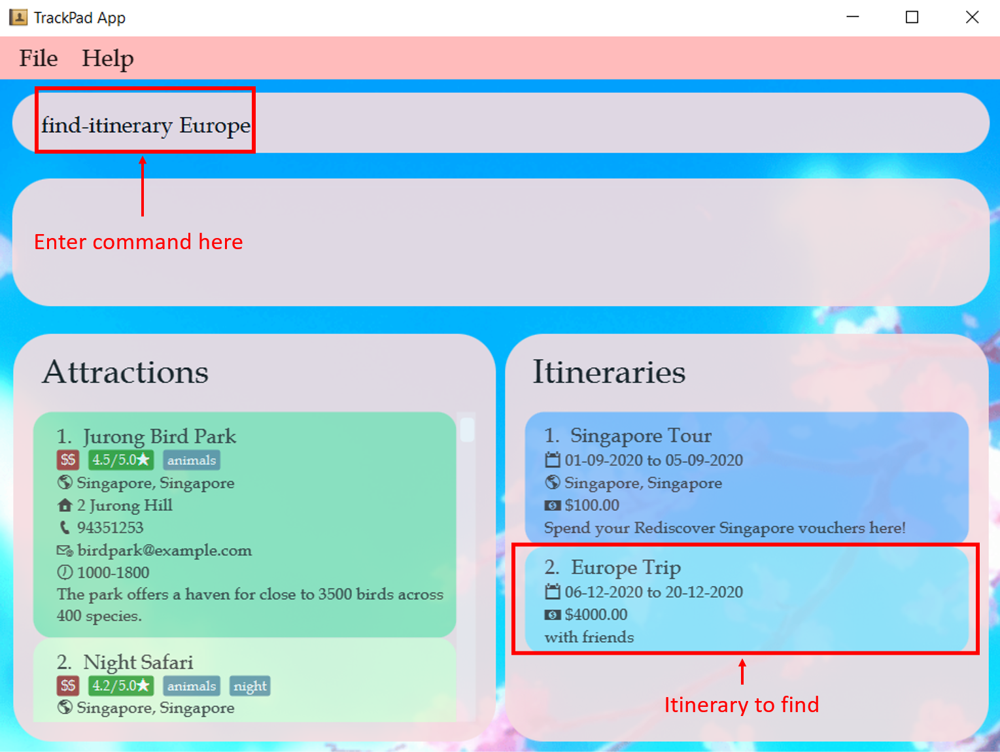
    
<i>Figure 19a. Before entering <code>find-itinerary Europe</code></i>
 

    

2. Note how only the itinerary containing the word `Europe` is displayed. 

    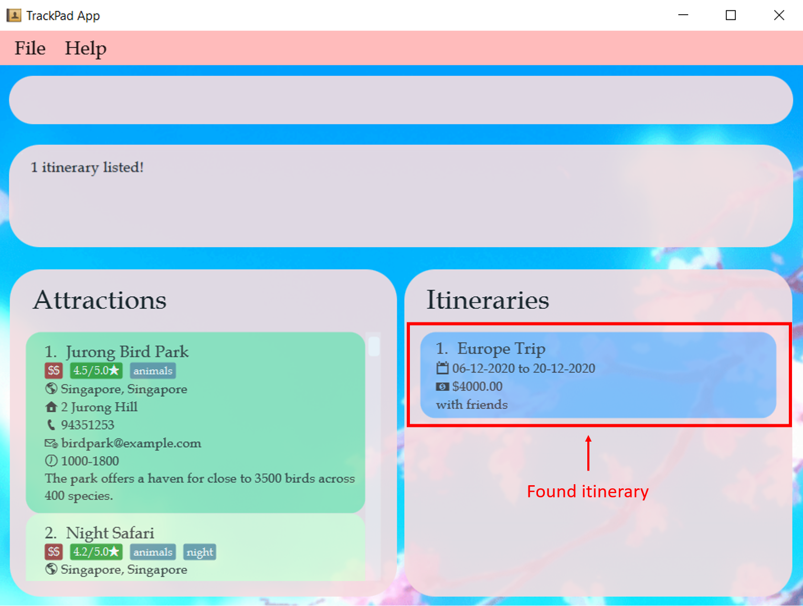
    
<i>Figure 19b. After entering <code>find-itinerary Europe</code></i>
 

Try these other examples too!
* `find-itinerary 01-09-2020` to find itineraries that have `01-09-2020` as their start or end date
* `find-itinerary Singapore` to find itineraries that take place in Singapore

#### 4.3.5 Listing all itineraries: `list-itinerary`

Shows all itineraries. Use this command to reset the view of the itineraries panel, as 
certain commands ([`find-itinerary`](#434-finding-an-itinerary-find-itinerary), [`select-itinerary`](#436-selecting-an-itinerary-select-itinerary)) can alter the view of the itineraries panel. 

Format: `list-itinerary`

For example: 

After finding an itinerary, you want to go back to seeing all your itineraries. 

1. Enter `list-itinerary` into the command box.

    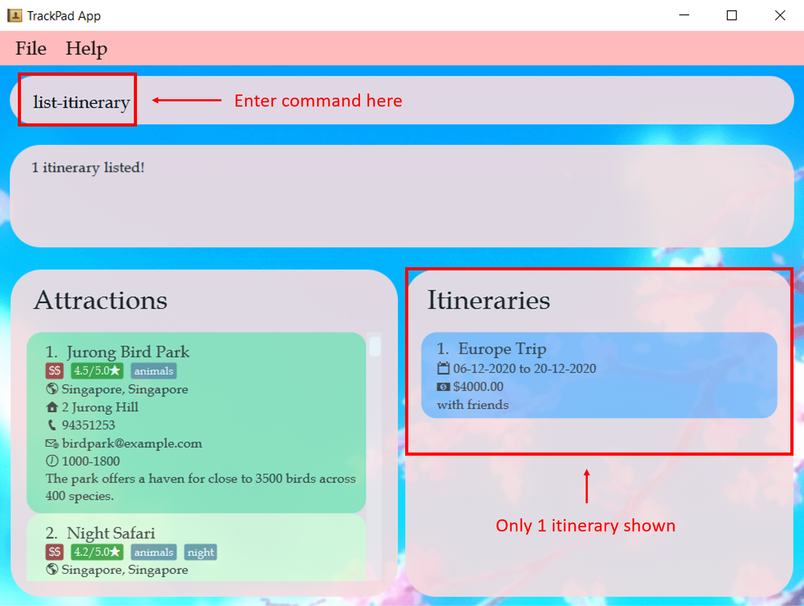
    
<i>Figure 20a. Before entering <code>list-itinerary</code></i>
 

    

2. Note how all your itineraries are displayed again.

    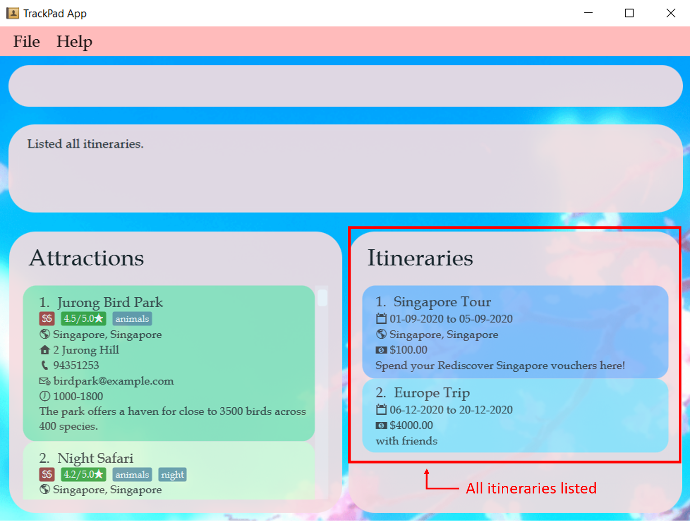
    
<i>Figure 20b. After entering <code>list-itinerary</code></i>
 

:information_source: **Note:**
`list-itinerary` will work even if there are extra characters after the command.
Eg. `list-itinerary abcd` will behave like `list-itinerary`.

#### 4.3.6 Selecting an itinerary: `select-itinerary`

Selects an itinerary to be shown in detail, from the current list of itineraries. 
In detailed view, you can see a timetable of the attractions in the itinerary. 
For more information on how to add, edit, and delete attractions in an itinerary, see [Itinerary Attraction Features](#44-itinerary-attraction-features-yeh-yu-chun).

Format: `select-itinerary INDEX`

* Selects the itinerary at the specified [`INDEX`](#6-glossary-yuxuan) shown in the itineraries panel.

:bulb: **Tip:**
To go back to seeing the list of itineraries, use `list-itinerary`.

For example:

You want to view in detail the attractions in your first itinerary. 

1. Enter `select-itinerary 1` into the command box.

    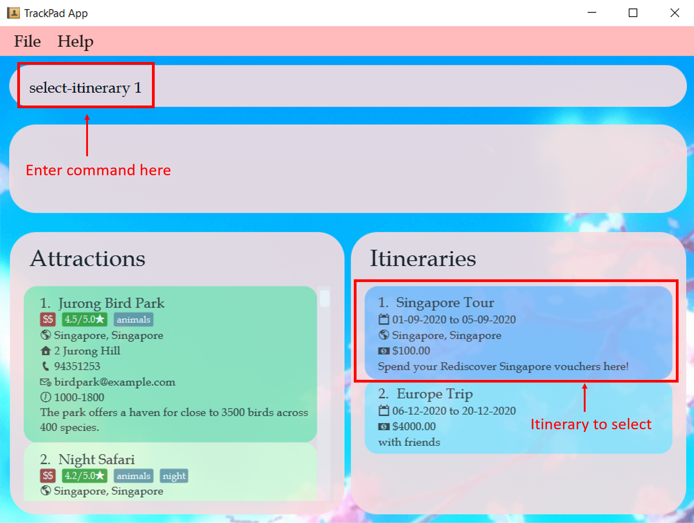
    
<i>Figure 21a. Before entering <code>select-itinerary 1</code></i>
 

    

2. Note how the itineraries panel has changed to show a detailed view of the attractions in the itinerary.

    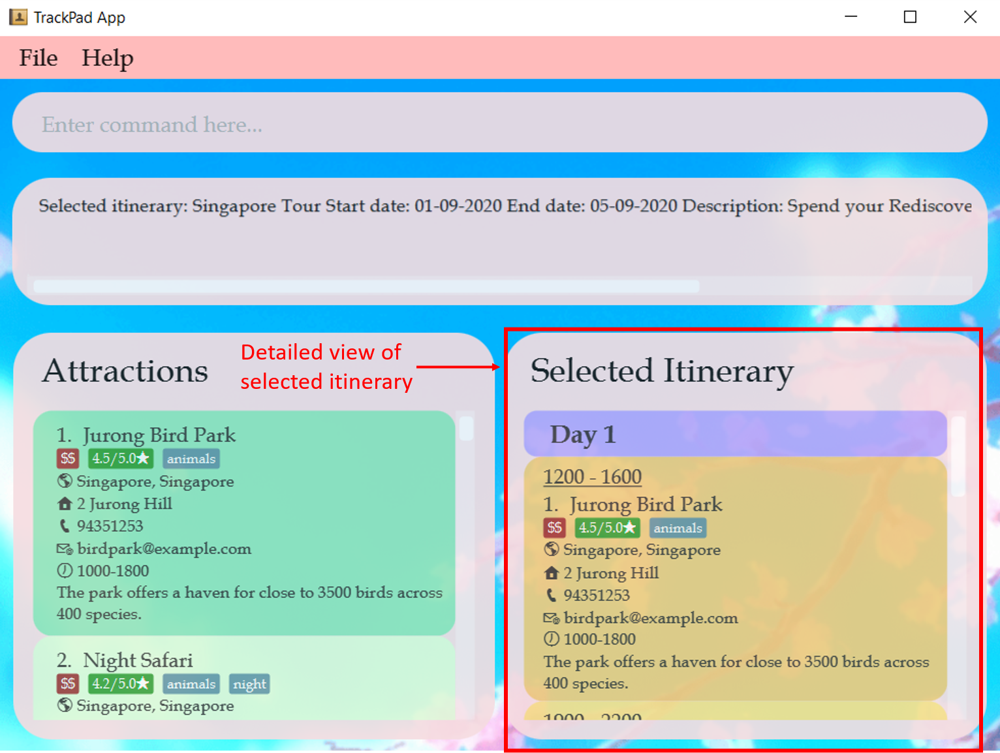
    
<i>Figure 21b. After entering <code>select-itinerary 1</code></i>
 
    

#### 4.3.7 Clearing all itineraries : `clear-itinerary`

Clears all itineraries.

Format: `clear-itinerary`

:warning: **Warning:**
`clear-itinerary` will remove all the itineraries stored in TrackPad.
This action is irreversible and should be used with caution.

For example:

You want to delete all your itineraries, and start over with an empty list of itineraries. 

1. Enter `clear-itinerary` into the command box. 

    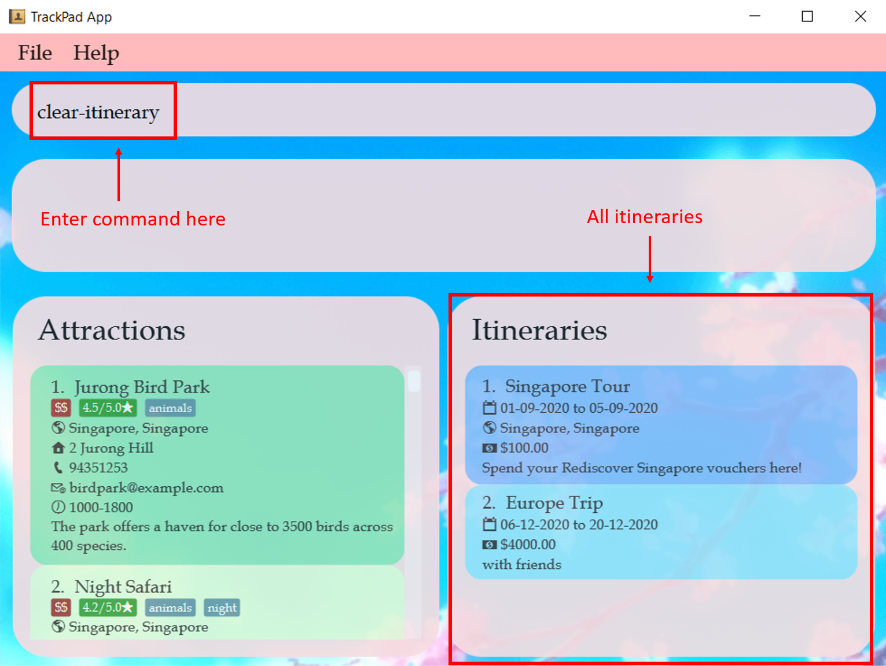
    
<i>Figure 22a. Before entering <code>clear-itinerary</code></i>
 

    

2. Note how all your itineraries are now deleted. 

    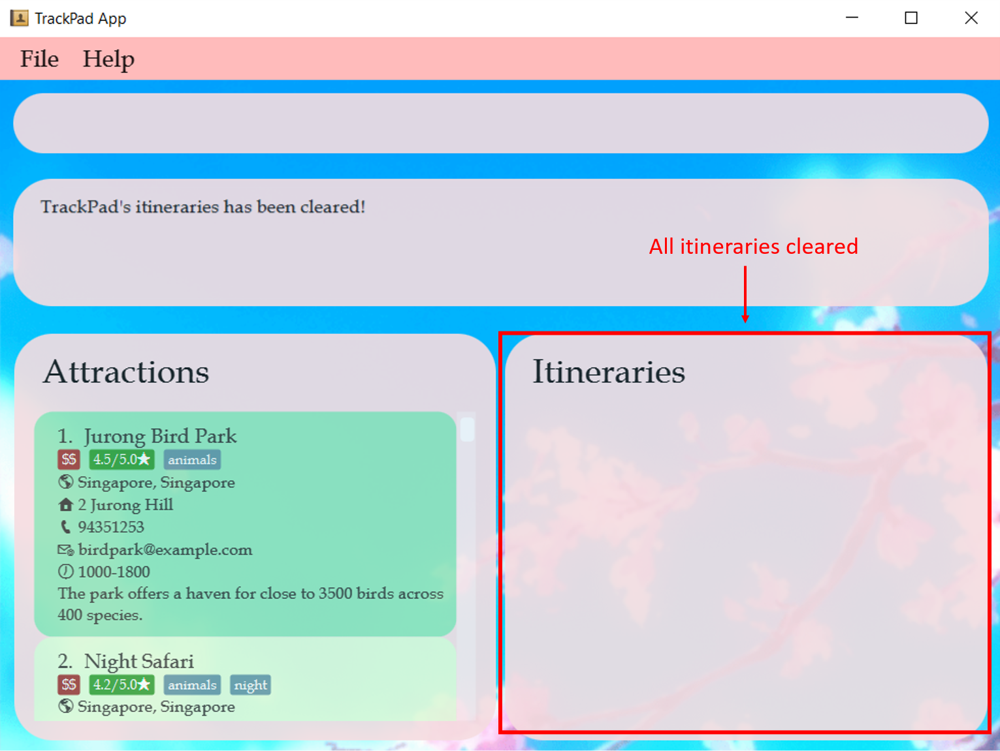
    
<i>Figure 22b. After entering <code>clear-itinerary</code></i>
 

### 4.4 Itinerary Attraction Features (Yeh Yu Chun)
Itinerary attractions are attractions added to an itinerary, but with additional start/end time fields. These commands deal with attractions that are found in an itinerary.

:information_source: **Note:**
Any command in this section requires an itinerary to be first selected. Refer to [Selecting an itinerary](#436-selecting-an-itinerary-select-itinerary) to select an Itinerary before proceeding.

The table below shows a summary of the commands in this section.

Action | Format, Examples
--------|------------------
[**Add itinerary attraction**](#441-adding-an-attraction-to-the-selected-itinerary-add-itinerary-attraction) | `add-itinerary-attraction INDEX st/START_TIME et/END_TIME day/DAY_VISITING`   e.g. `add-itinerary-attraction 1 st/1400 et/1500 day/5`
[**Edit itinerary attraction**](#442-editing-an-attraction-from-the-selected-itinerary--edit-itinerary-attraction) | `edit-itinerary-attraction INDEX day/DAY_VISITING [st/START_TIME] [et/END_TIME]`   e.g. `edit-itinerary-attraction 1 day/2 st/0900 et/1000`
[**Delete itinerary attraction**](#443-deleting-an-attraction-from-the-selected-itinerary-delete-itinerary-attraction) | `delete-itinerary-attraction INDEX`  e.g. `delete-itinerary-attraction 1`

<i>Figure 23. Diagram showing the attractions found in an itinerary</i>
 

In Figure 23 above, 
* The left side shows attractions you have added.
* The right side shows the itinerary currently selected.
* Notice the right copy of `Jurong Bird Park`'s name has the addition of a start and end time on top of it.

Let's start filling up your itinerary with attractions!

#### 4.4.1 Adding an attraction to the selected itinerary: `add-itinerary-attraction`
Adds an attraction to the selected itinerary.

Format: `add-itinerary-attraction INDEX st/START_TIME et/END_TIME day/DAY_VISITING`

| Compulsory fields | Description |
|---|---|
| [**INDEX**](#6-glossary-yuxuan) | Index of attraction in the current list of attractions |
| **START_TIME** | Start time to visit the attraction in the 24H format `HHMM` |
| **END_TIME** | End time to visit the attraction in the 24H format `HHMM` |
| [**DAY_VISITING**](#6-glossary-yuxuan) | Day in your itinerary when you plan to visit the attraction |

For example:

1. Look on the left side of the image below. You want to add `Night Safari` to your `Selected Itinerary`.

    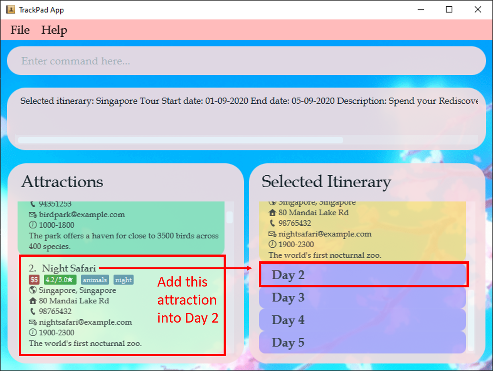
    
<i>Figure 24a. Diagram showing current state of selected itinerary</i>
 

    

2. You want to visit it on day 2, from `1000` to `1100`.
    Enter `add-itinerary-attraction 2 day/2 st/1000 et/1100` into the command box.

    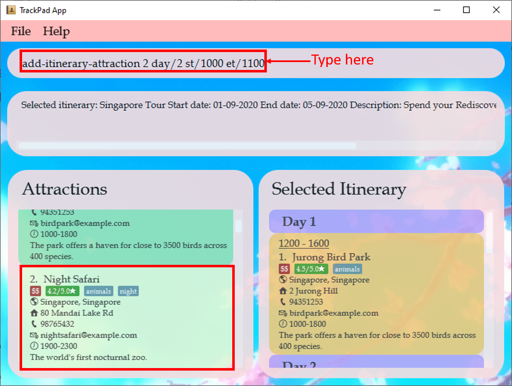
    
<i>Figure 24b. Before entering <code>add-itinerary-attraction 2 day/2 st/1000 et/1100</code></i>
 

    

    
3. `Night Safari` has been added into your `Selected Itinerary`.

    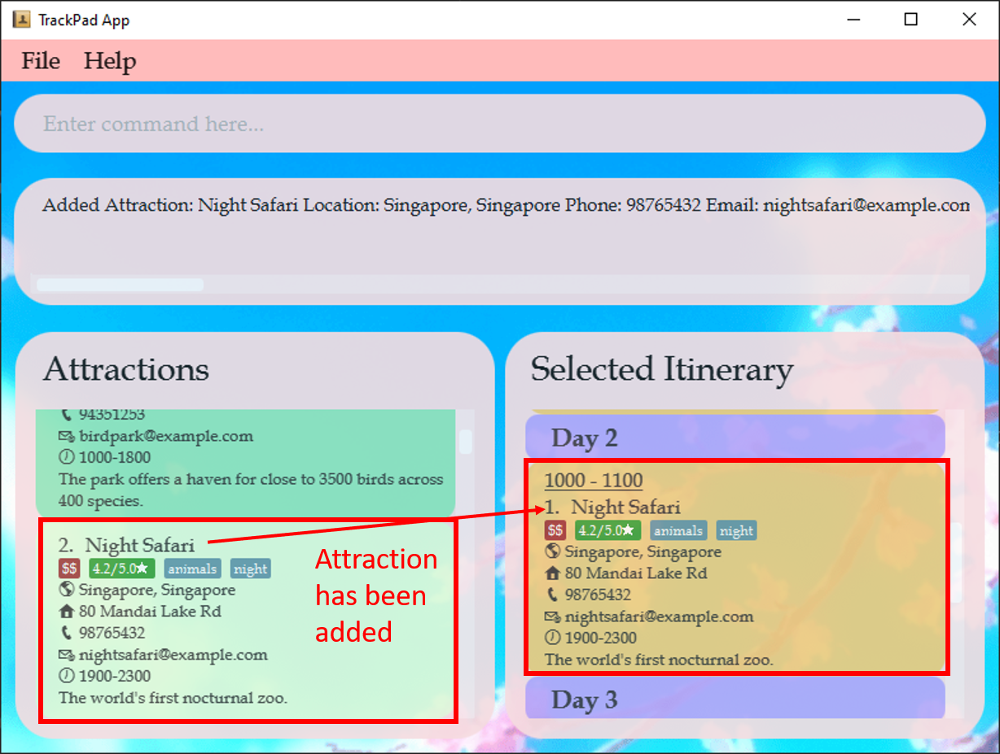
    
<i>Figure 24c. After entering <code>add-itinerary-attraction 2 day/2 st/1000 et/1100</code></i>
 

Try these other examples too!
* `add-itinerary-attraction 3 st/1000 et/1600 day/3` Adds the third item from attractions list into `Day 3` of the `Selected Itinerary`
* `add-itinerary-attraction 5 st/0900 et/1200 day/4` Adds the fifth item from attractions list into `Day 4` of the `Selected Itinerary`

:bulb: **Tip:** 
* The start and end time cannot overlap with other attractions on the same day of the selected itinerary. 
* The start and end time does not need to match the opening hours of the attraction, so that you can visit closed attractions. 

#### 4.4.2 Editing an attraction from the selected itinerary : `edit-itinerary-attraction`
Edits an existing attraction in the selected itinerary.

Format: `edit-itinerary-attraction INDEX day/DAY_VISITING [st/START_TIME] [et/END_TIME][n/ATTRACTION_NAME] [l/LOCATION] [d/DESCRIPTION] [p/PHONE_NUMBER] [e/EMAIL] [a/ADDRESS][op/OPENING_HOURS] [pr/PRICE_RANGE] [r/RATING] [v/VISITED] [t/TAG]…​`

* Edits the attraction specified by the [`INDEX`](#6-glossary-yuxuan) and [`DAY_VISITING`](#6-glossary-yuxuan) shown in the itineraries panel.
* At least one of the optional fields must be provided.
* Existing values will be updated to the input values.

:information_source: **Note:**
Some fields can be left empty to remove it. Example, <code>edit-itinerary-attraction 1 day/1 t/ </code> would remove the tag from the attraction.

For example:

1. You made a mistake by adding the `START_TIME` of `Night Safari` as `1000`, but it is not open in the day.

    
    
<i>Figure 25a. Diagram showing current state of selected itinerary</i>
 

    

2. Enter `edit-itinerary-attraction 1 day/2 st/1900 et/2300` into the command box.

    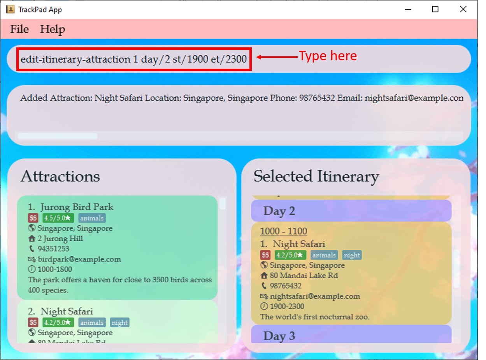
    
<i>Figure 25b. Before entering <code>edit-itinerary-attraction 1 day/2 st/1900 et/2300</code></i>
 

    

3. Scroll down the `Selected Itinerary` and notice the `START_TIME` of `Night Safari` has been changed to `1900 - 2300`.

    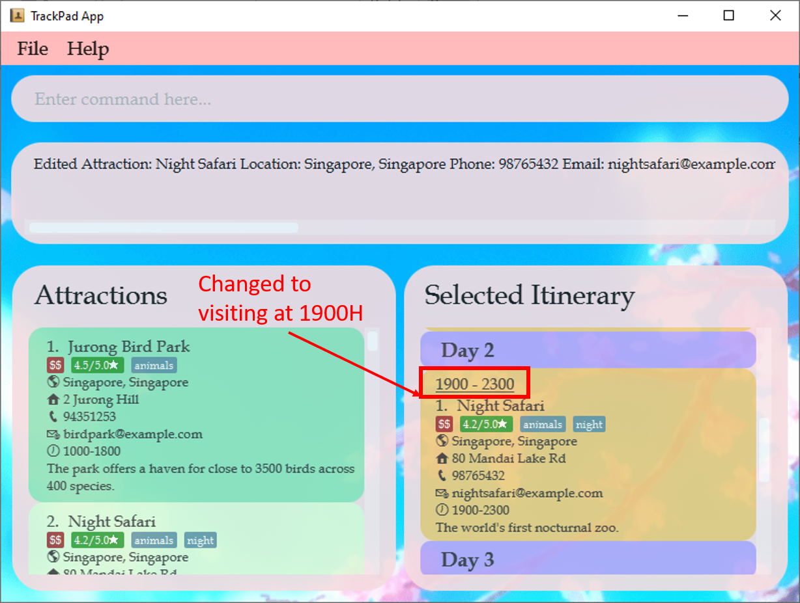
    
<i>Figure 25c. After entering <code>edit-itinerary-attraction 1 day/2 st/1900 et/2300</code></i>
 

Try these other examples too!
* `edit-itinerary-attraction 1 day/2 et/2200` Edits the `END_TIME` of the first attraction in `Day 2` to `2200`

:bulb: **Tip:**
Only the INDEX and day/DAY_VISITING is required to identify the field to edit.

#### 4.4.3 Deleting an attraction from the selected itinerary: `delete-itinerary-attraction`
Deletes an attraction from the selected itinerary.

Format: `delete-itinerary-attraction INDEX day/DAY_VISITING`

* Deletes the attraction specified by the [`INDEX`](#6-glossary-yuxuan) and [`DAY_VISITING`](#6-glossary-yuxuan) shown in the itineraries panel.

For example:

1. You no longer want to visit `Night Safari`.

2. You want to delete it from your `Selected Itinerary`.

3. Enter `delete-itinerary-attraction 1 day/2`, into the command box.

    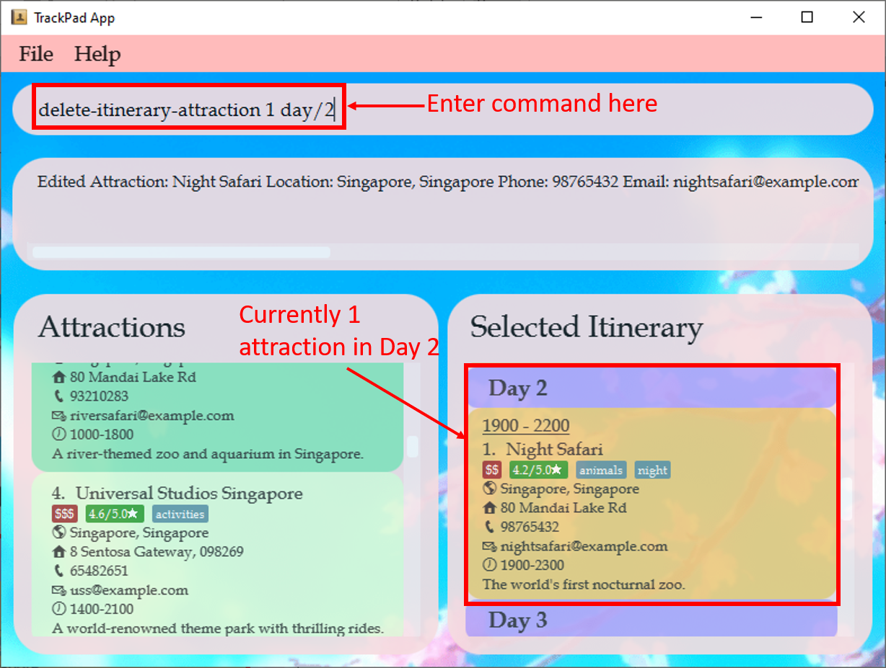
    
<i>Figure 26a. Before entering <code>delete-itinerary-attraction 1 day/2</code></i>
 
    
    

4. Scroll down the `Selected Itinerary` and notice `Day 2` is now empty.

    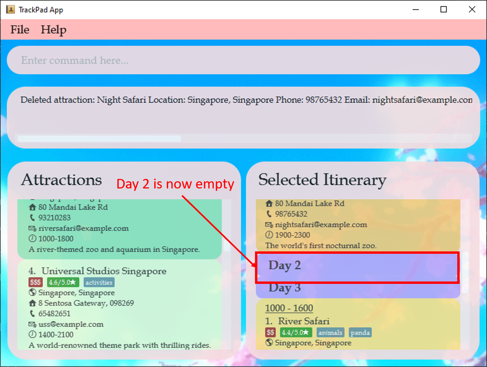
    
<i>Figure 26b. After <code>delete-itinerary-attraction 1 day/2</code></i>
 

Try these other examples too!
* `delete-itinerary-attraction 1 day/1` Deletes the first attraction from `Day 1` of `Selected Itinerary`

### 4.5 Miscellaneous Features (Yuxuan)

These basic features help TrackPad to run smoothly, as well as allow you to interact with TrackPad without the use of your mouse, perfect for fast typists!

#### 4.5.1 Viewing help : `help`

You can use this command whenever you are unsure about any features, and the link will lead you straight to our user guide which will help to clarify your doubts.

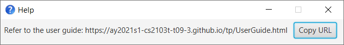

<i>Figure 27. The help window of TrackPad</i>

Format: `help`

#### 4.5.2 Exiting the program : `exit`

You can type this command into the command box to exit the program.

Format: `exit`

#### 4.5.3 Saving the data

Your data in TrackPad will be saved in the storage automatically after any command that changes the data. 
There is no need for you to save manually.

## 5. FAQ

**Q**: How do I transfer my data to another computer? 
**A**: After installing the app in the other computer, overwrite the empty `data` folder it creates in the home folder 
with the `data` folder of your previous TrackPad home folder.

**Q**: Where do I go to if I need help? 
**A**: Simply head to TrackPad's [issue page](https://github.com/AY2021S1-CS2103T-T09-3/tp/issues) and create an issue! Kindly allow us some time to reach back to you.

**Q**: What should I do if I want to recover the attractions after clearing them? 
**A**: Unfortunately, there is no way to recover the attractions you have added into TrackPad. However, you can delete the attractionlist.json file found in your data folder to get back those original attractions which are added into TrackPad beforehand.

## 6. Glossary (Yuxuan)

* **Command Line Interface (CLI):** An interface that processes commands to a computer program in the form of lines of text.
* **Graphical User Interface (GUI):** An interface that allows users to interact with through visual indicator representations.
* **Fields:** The details of an attraction/itinerary/itinerary attraction which you can add into TrackPad (`Address` is a field for Attraction, `Budget` is a field for Itinerary).
* **PREFIX:** The letter(s) and '/' placed before the corresponding fields when typing the commands ('n/' for Name, 'op/' for Opening Hours etc).
* **INDEX:** The number shown in the displayed attractions/itineraries panel. Must be a positive number (1, 2, 3, ...).
* **DAY_VISITING:** The day in a selected itinerary which contains the attraction(s) planned to visit. Must be a positive number (1, 2, 3, ...).

## 7. Command summary (Robin)

Below is a condensed table for all the commands currently supported in our app. Refer to this table whenever you want a quick refresher.

### 7.1 Attraction Commands

Action | Format, Examples
--------|------------------
**[Add attraction](#421-adding-a-tourist-attraction-add-attraction)** | `add-attraction n/ATTRACTION_NAME l/LOCATION [d/DESCRIPTION] [p/PHONE_NUMBER] [e/EMAIL] [a/ADDRESS] [op/OPENING_HOURS] [pr/PRICE_RANGE] [r/RATING] [v/VISITED] [t/TAG]…​`   e.g. `add n/Singapore Zoo p/62693411 t/hot a/80 Mandai Lake Rd, 729826`
**[Edit attraction](#422-editing-a-tourist-attraction-edit-attraction)** | `edit-attraction INDEX [n/NAME] [p/PHONE_NUMBER] [e/EMAIL] [a/ADDRESS] [t/TAG]…​`  e.g. `edit 2 n/Singapore Zoo e/zoo@example.com`
**[Delete attraction](#423-deleting-a-tourist-attraction--delete-attraction)** | `delete-attraction INDEX`  e.g. `delete 3`
**[Mark Visited attraction](#424-marking-a-tourist-attraction-as-visited-markvisited-attraction)** | `markVisited-attraction INDEX`  e.g. `markVisited-attraction 2`
**[Find attraction](#425-finding-a-tourist-attraction-find-attraction)** | `find-attraction KEYWORD [MORE_KEYWORDS]`  e.g. `find Zoo`
**[List attractions](#426-listing-all-tourist-attractions--list-attraction)** | `list-attraction`
**[Clear all attractions](#427-clearing-all-attractions--clear-attraction)** | `clear-attraction`

### 7.2 Itinerary Commands

Action | Format, Examples
--------|------------------
**[Add itinerary](#431-adding-a-new-itinerary-add-itinerary)** | `add-itinerary n/ITINERARY sd/START_DATE ed/END_DATE [d/DESCRIPTION] [b/BUDGET]`   e.g. `add-itinerary n/Japan holiday sd/15-01-2019 ed/30-01-2019 d/with friends b/4000`
**[Edit itinerary](#432-editing-an-itinerary-edit-itinerary)** | `edit-itinerary INDEX [n/NAME] [sd/START_DATE] [ed/END_DATE] [d/DESCRIPTION] [b/BUDGET]`  e.g. `edit-itinerary 2 n/Singapore journey sd/05-06-2019`
**[Delete itinerary](#433-deleting-an-itinerary-delete-itinerary)** | `delete-itinerary INDEX`  e.g. `delete-itinerary 3`
**[Find itinerary](#434-finding-an-itinerary-find-itinerary)** | `find-itinerary KEYWORD [MORE_KEYWORDS]`  e.g. `find-itinerary Korea`
**[List itineraries](#435-listing-all-itineraries-list-itinerary)** | `list-itinerary`
**[Select itinerary](#436-selecting-an-itinerary-select-itinerary)** | `select-itinerary INDEX`  e.g. `select-itinerary 3`
**[Clear all itineraries](#437-clearing-all-itineraries--clear-itinerary)** | `clear-itinerary`

### 7.3 Itinerary attraction Commands

Action | Format, Examples
--------|------------------
[**Add itinerary attraction**](#441-adding-an-attraction-to-the-selected-itinerary-add-itinerary-attraction) | `add-itinerary-attraction INDEX st/START_TIME et/END_TIME day/DAY_VISITING`   e.g. `add-itinerary-attraction 1 st/1400 et/1500 day/5`
[**Edit itinerary attraction**](#442-editing-an-attraction-from-the-selected-itinerary--edit-itinerary-attraction) | `edit-itinerary-attraction INDEX day/DAY_VISITING [st/START_TIME] [et/END_TIME]`   e.g. `edit-itinerary-attraction 1 day/2 st/0900 et/1000`
[**Delete itinerary attraction**](#443-deleting-an-attraction-from-the-selected-itinerary-delete-itinerary-attraction) | `delete-itinerary-attraction INDEX`  e.g. `delete-itinerary-attraction 1`

### 7.4 Miscellaneous Commands

Action | Format, Examples
--------|------------------
[**Help**](#451-viewing-help--help) | `help`
[**Exit**](#452-exiting-the-program--exit) | `exit`
